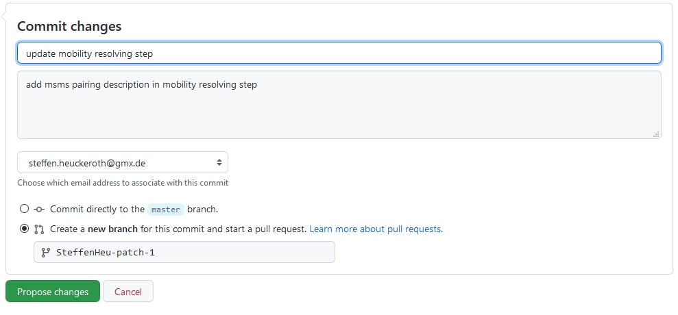

# How to contribute

## Contribute to the MZmine documentation

**1. Make a GitHub Account**

You'll need to make a [GitHub Account](https://github.com/join).

**2. Click Edit Button on Page You Want to Edit**

**3. Fork the Repository When Prompted (only the first time)**

**4. Make the Edits in MarkDown**

**5. Propose Changes**

Please describe the change you are making.

**6. Create Pull Request**

**7. Finalize Pull Request with Description**

## Creating a new page

**Follow steps 1 - 3.**

**Navigate to mzmine_documentation/docs in your fork and create a new file**

**Follow steps 4 - 7.**

## Page Contributors

{{ git_page_authors }}

This page was adapted from the [GNPS documentation](https://ccms-ucsd.github.io/GNPSDocumentation/gnps_community/).
