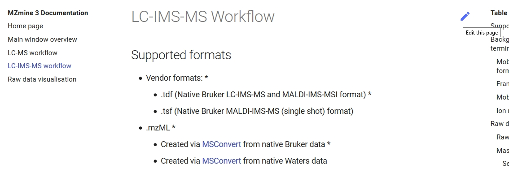
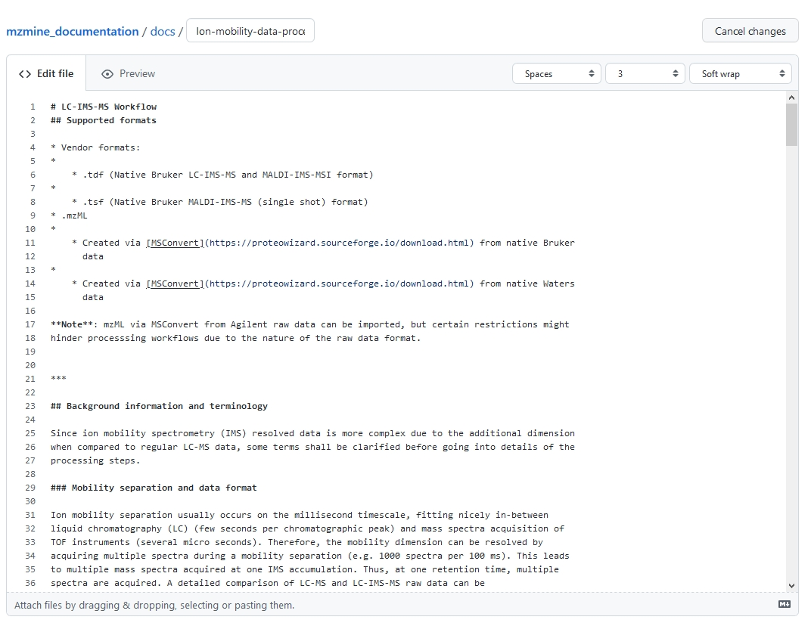
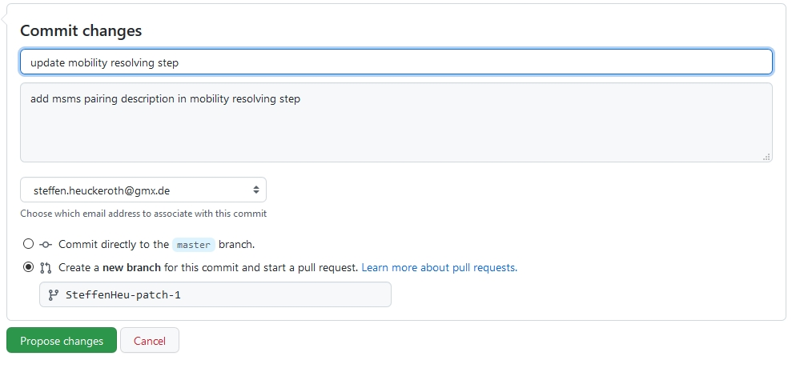
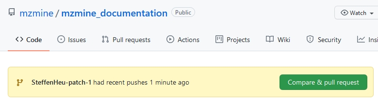
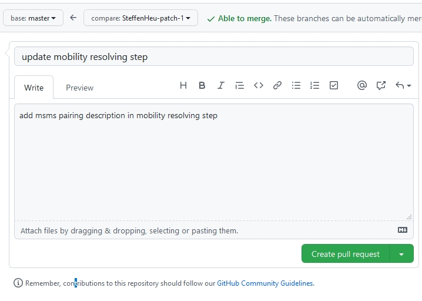
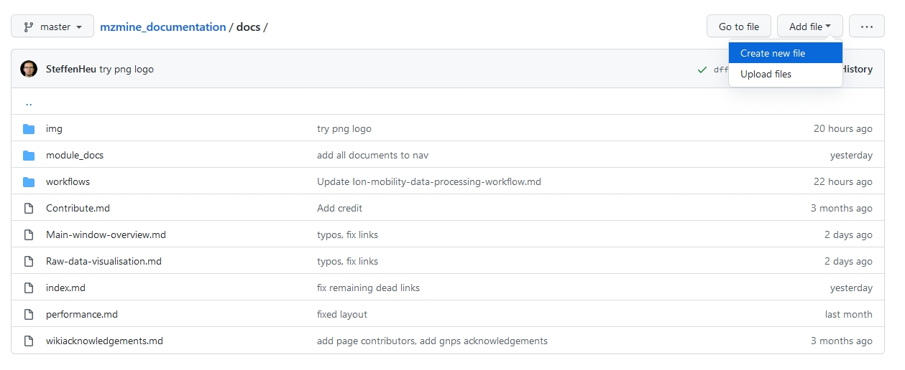

[](https://github.com/mzmine/mzmine_documentation/actions/workflows/autodeploy.yml)  [](https://github.com/mzmine/mzmine_documentation/actions/workflows/main.yml)

# How to contribute

## Local build on Windows

Create a repository-local Python environment and install the same dependencies as CI:

```powershell
py -3.12 -m venv .venv
.\.venv\Scripts\python -m pip install --upgrade pip
.\.venv\Scripts\python -m pip install -r requirements.txt
```

Run the strict documentation build, including internal file and anchor validation:

```powershell
.\.venv\Scripts\python -m mkdocs build --strict
```

The generated site is written to `site/`. Both `site/` and `.venv/` are ignored by Git.

## Documentation versions

The published site is versioned with [mike](https://github.com/jimporter/mike). Every version
lives in its own directory on the `gh-pages` branch and can be picked from the version selector
in the header:

| URL | content |
| --- | --- |
| [`/`](https://mzmine.github.io/mzmine_documentation/) | redirects to `latest` |
| [`/latest/`](https://mzmine.github.io/mzmine_documentation/latest/) | current `master`, rebuilt on every push |
| `/<version>/` | frozen docs of that mzmine release, e.g. `/4.8.0/` |

Old unversioned links such as `/getting_started.html` are forwarded to `/latest/getting_started.html`.
Every version other than `latest` shows a banner linking back to `latest`, and is excluded from
search engines so readers always find the current documentation.

Switching versions keeps the reader on the page they are on, as long as that page exists in the
version they switch to (otherwise they land on its start page). This works by comparing the
`sitemap.xml` of both versions, which means three things have to stay as they are:

* `site_url` in `mkdocs.yml` must match where the site is served,
* the mike `canonical_version` option must stay unset, and
* `hooks/sitemap_root_url.py` must stay registered — it is needed because this site uses
  `use_directory_urls: false`.

Each of those is explained where it is configured.

### Publishing a version for a new mzmine release

Either push a tag in this repository:

```bash
git tag v4.8.0 && git push origin v4.8.0
```

or run the **Release docs version** workflow from the GitHub Actions tab, pick the branch or tag
to snapshot and enter the version number. This only adds `/4.8.0/`; `latest` and the site root
keep tracking `master`.

The `latest` version is published automatically by the **Auto Deploy** workflow on every push to
`master`, no action needed.

### Previewing versions locally

```powershell
.\.venv\Scripts\python -m mkdocs serve   # just the current working copy
.\.venv\Scripts\mike serve               # all deployed versions from gh-pages
.\.venv\Scripts\mike list                # what is currently published
```

`mike serve` only reads the local `gh-pages` branch and never pushes. Do not run
`mkdocs gh-deploy`, it would replace the whole versioned site with a single unversioned build.

## Contribute to the MZmine documentation

**1. Make a GitHub Account**

You'll need to make a [GitHub Account](https://github.com/join).

**2. Click Edit Button on Page You Want to Edit**


**3. Fork the Repository When Prompted (only the first time)**


**4. Make the Edits in MarkDown**



**5. Propose Changes**

Please describe the change you are making.



**6. Create Pull Request**



**7. Finalize Pull Request with Description**



## Creating a new page

**Follow steps 1 - 3.**

**Navigate to mzmine_documentation/docs in your fork and create a new file**



**Follow steps 4 - 7.**

## Page Contributors

{{ git_page_authors }}

This page was adapted from the [GNPS documentation](https://ccms-ucsd.github.io/GNPSDocumentation/gnps_community/).
