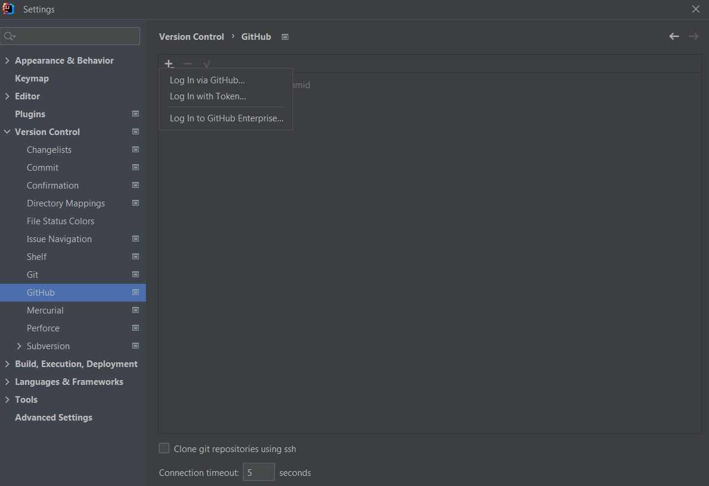
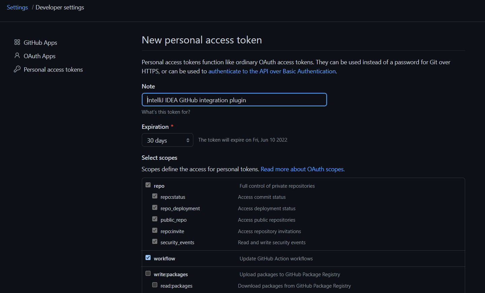
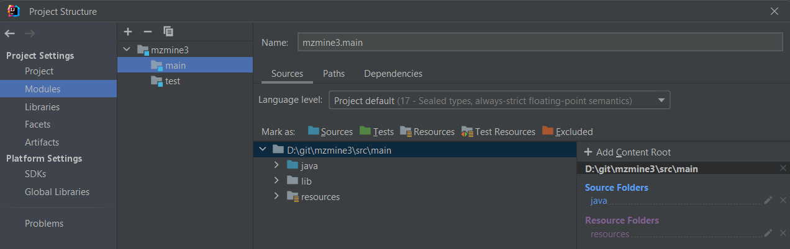
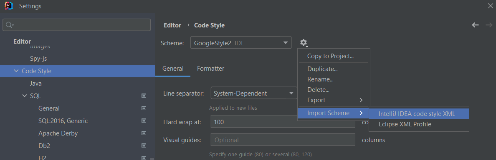
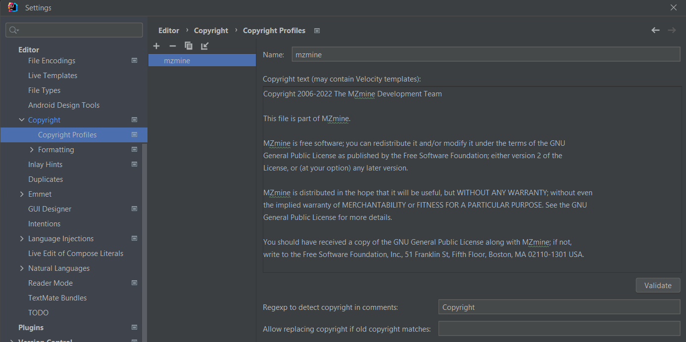
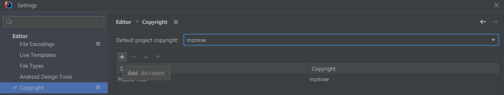
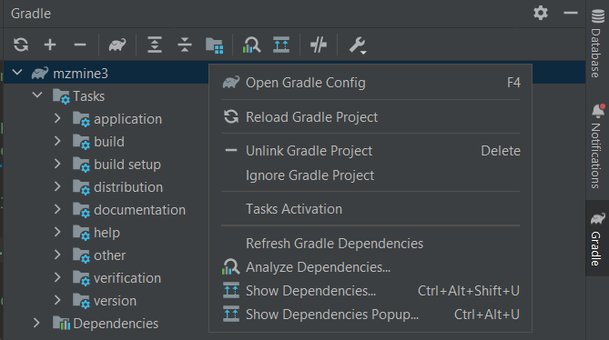

# Development in IntelliJ
## Set up
1. Fork the mzmine (https://github.com/mzmine/mzmine3) GitHub repository (needs free GitHub account) (See https://help.github.com/en/github/getting-started-with-github/fork-a-repo)
2. Download & Install IntelliJ IDEA (there is a free educational license for students and teachers) from https://www.jetbrains.com/idea/download/
3. Download & Install the current JDK. We recommend the OpenJDK. However, you can also use any other distribution, e.g., the Oracle JDK. This can be done from within IntelliJ. Open _File/Project Structure_ (CTRL+ALT+SHIFT+S) and select SDKs and add the latest JDK with the +button:


4. Add your GitHub account via **Settings/Version Control/GitHub** +button. Below exemplified with the Log in with Token... option:
    - Log in with Token… **Generate** - redirects to GitHub
    - Make sure to select the **Workflow** scope to avoid conflicts that arise from changing GitHub actions



5. Clone GitHub project via version control: **File/New/Project from version control** use your user name to get your fork: `https://github.com/YOUR USERNAME/mzmine3.git`


6. Make sure that gradle runs and updates the project. Otherwise, click on **Reload Gradle Project**. 
Now the project structure (CTRL+SHIFT+ALT+S) should show the source, test, and resource folders which are described in the build.gradle.




8. Click on Add a Configuration. Select “Application” from the template list). via the + button (don’t just edit the template):
    - Main class: `io.github.mzmine.main.MZmineCore`
    - Environment var: `-Djava.util.logging.config.class=io.github.mzmine.main.MZmineLoggingConfiguration -Xmx12G`

9. Run or debug with this configuration


## Code formatter 
The code formatter is important for contributions to the main version of MZmine and each java file should contain the license header.
1. Import the style format from `mzmine-intellij-code-formater.xml`
2. Apply format to any file with CTRL+ALT+L
3. Can also be applied on each file saved or each commited change (see below)
4. Better exclude specific file formats from being formatted (see below screenshot 2) (`.*{fxml,xml,htm,html,json,yml,css}`)




## Copyright header
1. Add the license header to each file - the easiest way is to add the copyright profile to intelliJ
2. Import the copyright from `mzmine_intellij_licence_header.xml` or create a new one with the exact text specified in `license_header.txt`
3. Add a new scope for all project files
4. Apply after file save or commit operation or run the **Update copyright...** action





## Useful settings
### Faster building
1. Activate auto building (consumes more resources)
2. Set **Settings/Gradle/build and run** to IntelliJ
3. Activate HotSwap to automatically load changed classes during debugging


### Save and commit actions: Apply copyright, format, etc
Select any actions to perform when a file is saved or committed.


### Live templates
Live templates are used to add custom entries to the code completion, e.g., to quickly create a class-specific logger.
Access **Settings/Editor/Live Templates** (CTRL+ALT+S on Windows) and add a new template (+ button). Define the
abbreviation to trigger autocompletion at this statement, define the template text, and change the target context
(“**Java**”) at the bottom. The template below generates a logger after typing log and pressing CTRL+SPACE. The variable
**$CLASS_NAME$** was set to represent the current className() under **Edit variable**.

The template:
```java
private static final java.util.logging.Logger logger = java.util.logging.Logger.getLogger($CLASSNAME$.class.getName());
```
Generates the output in class Scan:
```java
private static final Logger logger = Logger.getLogger(Scan.class.getName());
```


Another example to create Javadoc links for @l . The variable (here $target$) places the cursor.


## Troubleshooting
### Correct JDK selection
Make sure the correct JDK is set in these places:
1. File/Project Structure/SDKs
2. File/Settings/Build, Execution, Deployment/Build Tools → Gradle → Gradle JVM → “Project SDK” this will update
   automatically if the project SDK changes.
3. File/Settings/Build, Execution, Deployment/Java Compiler → Project Bytecode version → 17 (for JDK 17)
   Correct run configuration: Select Default JRE (this will update with the project sdk) or select the correct one manually.


### Could not target platform

[//]: # (<!-- markdown-link-check-disable -->)
Error: When building via gradlew: “Could not target platform: 'Java SE 17' using tool chain: 'JDK 13 (13)'”
Solution (Windows): Set the JAVA_HOME environment variable to the JDK 17 root directory.
See https://docs.oracle.com/cd/E19182-01/821-0917/inst_jdk_javahome_t/index.html 

[//]: # (<!-- markdown-link-check-enable -->)

### Gradle project not imported
If gradle tool window is not shown:
1. To import the Gradle project navigate to the build.gradle in the project tool window
   right click → import gradle project. The gradle tool window should now be visible.
2. To update the imports click the update gradle project button in the gradle tool window
 


{{ git_page_authors }}