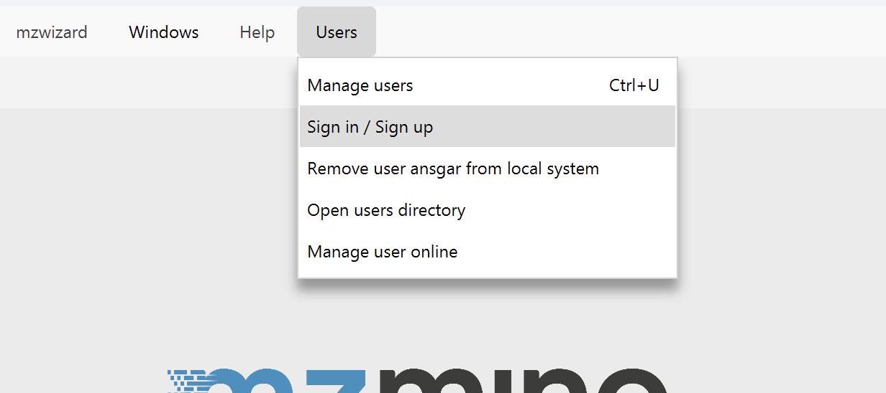
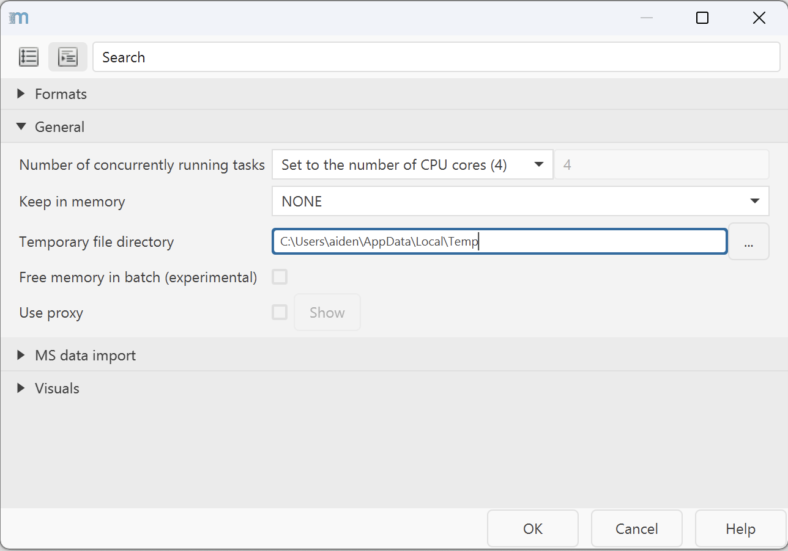

# Getting Started

## Download

Download mzmine portable versions or installers from [GitHub](https://github.com/mzmine/mzmine/releases/latest). The software follows semantic 
versioning (major.minor.patch like 4.8.0). The latest version is always available under:
[https://github.com/mzmine/mzmine/releases/latest](https://github.com/mzmine/mzmine/releases/latest)

## System requirements

**System requirements** are available [here](system_requirements.md)

## Install or update mzmine {#install-update}

Download your system-specific installer (e.g., .msi installer on Windows) and double-click to 
install mzmine. To update mzmine, download a new version installer and install it over the old 
installation. There is no need to remove the old version. 
Alternatively, portable versions are distributed as zip archives, which need to be 
unzipped to reveal the executables (e.g., .exe on Windows). See platform-specific install 
instructions:   

- Installation on [Windows](install_windows.md)
- Installation on [Linux](install_linux.md)
- Installation on [macOS](install_macos.md)

As standalone modern Java software, mzmine has **NO** further requirements and ships with its own 
specialized Java Runtime. This means the local Java installation has **no** impact on mzmine. 
Windows and macOS users might be warned that mzmine is not signed or from a trusted source and have
to click run anyway. 

## Running mzmine

mzmine provides a user-friendly graphical user interface (GUI) that facilitates data exploration, 
batch optimization, and results validation. If the batch processing is optimized and the goal is to 
solely produce the output files without the need for a GUI, we recommend running mzmine as a 
[command-line tool (CLI)](commandline_tool.md).

## Sign in / Sign up 

Open the **Users/User management** to sign in to an existing user or sign up for a free user account ([more details](services/users.md)).

## Set user preferences {#set-user-preferences}

Before creating your first project, we recommend setting up some things.

1. Set a temporary file directory. Go to _Project_ → _Set preferences_ → _Temporary file directory_.
   This requires a restart to take effect.
   1. We recommend setting the directory to an SSD other than your system drive with enough space for fast processing and visualizations.
       

2. mzmine 2 and mzmine 3 projects cannot be imported due to changes in the data structure.
3. mzmine 2 and mzmine 3 batch files cannot be imported due to parameter optimizations.

You can get familiar with the new GUI here: [Main window overview](main-window-overview.md)

## Quick workflows in the mzwizard

As a quick start you can use the [mzwizard](wizard.md) in the main menu or directly on the landing page. A good starting point is watching this [mzmine video tutorial on YouTube](https://www.youtube.com/watch?v=UnqVtZngzl0&list=PL0JAF-4UFc8NgyAOQhTKI9GZvSBcxe1AD).

## Introduction video
<iframe width="560" height="315" src="https://www.youtube.com/embed/UnqVtZngzl0?si=fLnLGapFBpyVXDtX" title="YouTube video player" frameborder="0" allow="accelerometer; autoplay; clipboard-write; encrypted-media; gyroscope; picture-in-picture; web-share" referrerpolicy="strict-origin-when-cross-origin" allowfullscreen></iframe>

## Workflow overviews
A quick insight to data processing workflows can be found here:

- [LC-MS workflow](workflows/lcmsworkflow/lcms-workflow.md)
- [LC-IMS-IMS workflow](workflows/imsworkflow/ion-mobility-data-processing-workflow.md)
- [Imaging workflows](workflows/imagingworkflow/imaging-workflow.md)

{{ git_page_authors }}
