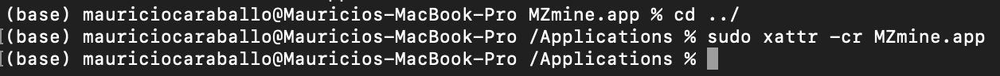

# Getting Started

## Download
Download MZmine 3 portable versions or installers from GitHub:

[https://github.com/mzmine/mzmine3/releases/latest](https://github.com/mzmine/mzmine3/releases/latest) 

## Installation
On Windows and Linux the installers and portable versions should function directly. Windows users might be warned that MZmine is not signed or from a trusted source and have to click run anyways.

### On macOS
Currently, MZmine 3 lacks a signature for macOS. While we are working on this, user can allow MZmine in the macOS Gatekeeper protection by running the following command in the terminal from the Applications folder.

- Download MZmine and click the MZmine.dmg installer - Drag and drop MZmine into the Applications folder 
- Open the Applciations folder, right click (CTRL click) anywhere, e.g., on the MZmine icon, and choose "New Terminal at folder" from the context menu
- Run the provided command to tell macOS to trust the installed version of MZmine. The terminal directory has to be the Applications folder. (Depending on the actual folder use or omit the `../` to jump to the parent directory).
- Approve command with user password
- Start MZmine

```
sudo xattr -cr ../MZmine.app

# if this fails try
sudo xattr -cr MZmine.app
```

{: style="height:50px} {: style="width:50px}

The Terminal does not output any log or message.


## Set User Preferences

Before creating your first project, we recommend setting up some things.

1. Set a temporary file directory. Go to _Project_ → _Set preferences_ → _Temporary file
   directory_. This requires a restart to take effect.
    2. We recommend setting the directory to an SSD with enough space for fast processing and
       visualizations.
    3. On Windows, old temporary files are deleted when a new session is started.
2. MZmine 2 projects cannot be imported due to changes in the data structure.
3. MZmine 2 batch files cannot be imported due to parameter optimizations.

You can get familiar with the new GUI here: [Main window overview](main-window-overview.md)

A quick insight to data processing workflows can be found
here: [LC-MS workflow](workflows/lcmsworkflow/lcms-workflow.md)
or [LC-IMS-IMS workflow](workflows/imsworkflow/ion-mobility-data-processing-workflow.md)

You can also check out the new processing wizard under _Processing wizard_ in the main menu. 
