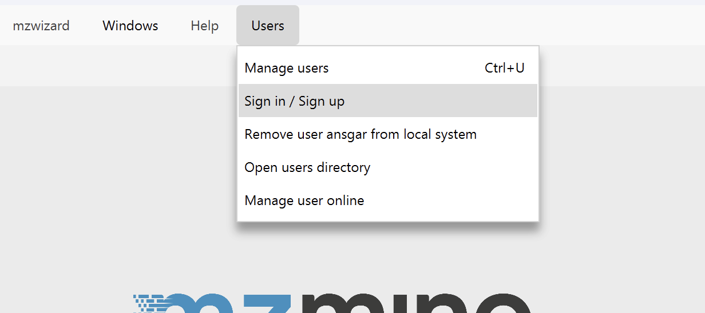
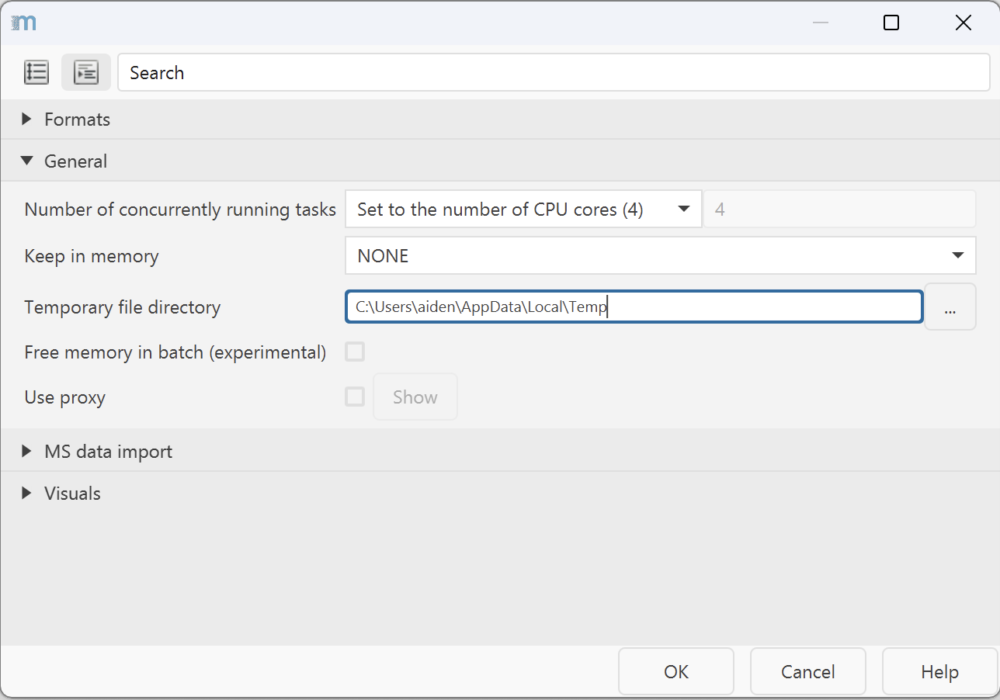

# Getting Started

mzmine is an open-source, cross-platform software for mass spectrometry (MS) data processing and
visualization. It supports LC-MS, LC-IMS-MS, GC-MS, MS imaging, MRM, and many more workflows - from raw data
import through feature detection, alignment, annotation, statistics, and export. This page walks you through
installation, initial setup, and your first steps toward data analysis.

If you prefer watching a quick mzmine introduction video, check out the [Learners corner](learners_corner.md) or one of the following videos: 

- [General introduction to mzmine with LC-MS Data & mzwizard: From Basics to Advanced Features](https://www.youtube.com/watch?v=tHC0brzQtG0&list=PL7kvpfzg8JkVGjhiGty5p-IDXgP9APx3b&index=1)
- [GC-EI-MS, Multimodal-MS Data Processing, MALDI-MS imaging, Lipidomics](https://www.youtube.com/watch?v=cGA5WIKcMpM&list=PL7kvpfzg8JkVGjhiGty5p-IDXgP9APx3b&index=2)
- [Ion Mobility-MS Data Processing, PFAS, Contaminants](https://www.youtube.com/watch?v=Xp-G1HSozgM&list=PL7kvpfzg8JkVGjhiGty5p-IDXgP9APx3b&index=3)
- [Streamlining MS Library Generation in mzmine](https://www.youtube.com/watch?v=SmEpFYV4_bY&list=PL7kvpfzg8JkVGjhiGty5p-IDXgP9APx3b&index=4) matching the [library building workflow](workflows/librarygeneration/library_generation.md)

<iframe width="560" height="315" src="https://www.youtube.com/embed/tHC0brzQtG0?si=kbtfh1IbumKeaDCu&amp;controls=0" title="YouTube video player" frameborder="0" allow="accelerometer; autoplay; clipboard-write; encrypted-media; gyroscope; picture-in-picture; web-share" referrerpolicy="strict-origin-when-cross-origin" allowfullscreen></iframe>

## Download & Installation / Updates {#install-update}

Download platform-specific installers or portable versions from
[GitHub Releases](https://github.com/mzmine/mzmine/releases/latest) (see [system requirements](system_requirements.md)).
mzmine uses semantic versioning (major.minor.patch, e.g., 4.9.0). The latest release is always at:

[https://github.com/mzmine/mzmine/releases/latest](https://github.com/mzmine/mzmine/releases/latest)

Install using the system-specific installer (e.g., `.msi` on Windows) by double-clicking it.
To update, install the newer version on top of the existing installation — no uninstall is required.
Portable versions are distributed as ZIP archives; extract them and run the executable directly.

Platform-specific installation guides:

- [Install on Windows](install_windows.md)
- [Install on Linux](install_linux.md)
- [Install on macOS](install_macos.md)

!!! info "No Java installation required"

    mzmine ships with its own specialized Java runtime. Your local Java installation has **no**
    impact on mzmine and does not need to be updated or installed.

!!! note "Security warnings on first launch"

    Windows and macOS users may see an "untrusted source" warning the first time they run mzmine.
    This is expected — click **Run anyway** (Windows) or **Open** (macOS) to continue.

## Running mzmine

mzmine provides a graphical user interface (GUI) designed for interactive data exploration, workflow
optimization, and results validation. Once a workflow is optimized and no interactive review is
needed, mzmine can be run headlessly as a
[command-line tool (CLI)](commandline_tool.md) for automated or server-side batch processing.

Familiarize yourself with the [main window overview](main-window-overview.md) to understand how
to navigate raw data files, processed feature lists, and visualization panels.

## Sign In / Sign Up

On first launch, open **Users → User Management** to sign in to an existing account or register a
free user account. [See support options](https://mzio.io/mzmine-news/#enterprise-packages).

[Learn more about user accounts](services/users.md)

## Configure Preferences {#set-user-preferences}

Before starting your first project, configure a few key settings:

1. Set a **temporary file directory**: go to _Project_ → _Set preferences_ → _Temporary file
   directory_ and restart mzmine to apply the change.
    - Use a fast SSD (not your system drive) with sufficient free space for best processing
      performance and visualizations.

   

!!! warning "Project compatibility"
    mzmine 2 and mzmine 3 project files and batch files **cannot** be imported due to fundamental
    changes in data structure and parameter formats. Start a new project in mzmine 4.

## Data Conversion

Many vendor-specific raw data formats are directly read into mzmine while other may require 
conversion to open formats. Supported open formats include **mzML**, **mzXML** (prefer mzML), and **imzML** (MS imaging).

See the [data conversion guide](data_conversion.md) for tools and step-by-step instructions. An 
option is to install msconvert and to let mzmine automatically decide to either load data natively
from vendor formats or to convert in the background. 

## Quick Start with the Processing Wizard (mzwizard)

The fastest way to get started is the **[processing wizard (mzwizard)](wizard.md)**, accessible
from the main menu or the mzmine landing page. The wizard guides you through instrument-type
selection, parameter configuration, and full workflow execution with minimal effort — ideal for
standard LC-MS, LC-IMS-MS, GC-MS, and MS imaging datasets.

## Workflows

Ready to process? Choose a workflow matching your instrument setup and analytical goals:

| Workflow                                                                    | Description |
|-----------------------------------------------------------------------------|---|
| [LC-MS](workflows/lcmsworkflow/lcms-workflow.md)                            | Untargeted liquid chromatography–MS |
| [LC-IMS-MS](workflows/imsworkflow/ion-mobility-data-processing-workflow.md) | Liquid chromatography–ion mobility–MS |
| [GC-EI-MS](workflows/gcmsworkflow/gcms-workflow.md)                         | Gas chromatography–MS (EI-based) |
| [MS Imaging](workflows/imagingworkflow/imaging-workflow.md)                 | MALDI and other MS imaging workflows |
| [MRM](workflows/mrmworkflow/mrm-workflow.md)                                | Multiple reaction monitoring (targeted quantitation) |
| [Library Generation](workflows/librarygeneration/library_generation.md)     | Build custom spectral libraries |

For automating and reproducing complete pipelines, see
**[batch processing](workflows/batch_processing/batch-processing.md)**.

## Learning Resources

New to mzmine or mass spectrometry data processing? These resources will help you get up to speed:

- [Learners corner](learners_corner.md) — curated video tutorials, webinars, and metabolomics courses
- [mzio YouTube channel](https://www.youtube.com/@mzioGmbH/playlists)
- [Workshops](workshops.md) — recorded and upcoming training events

{{ git_page_authors }}
