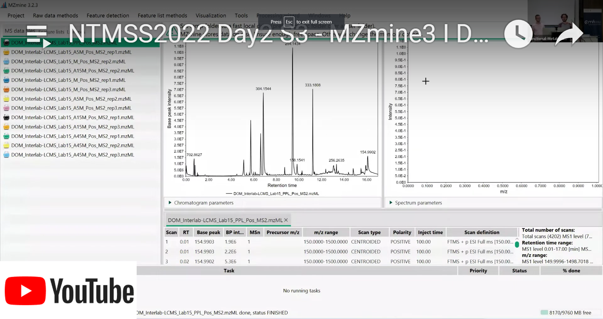

!!! info
    When using MZmine, please cite the corresponding paper:
    Robin Schmid, Steffen Heuckeroth, Ansgar Korf et al. Integrative analysis of multimodal mass spectrometry data in MZmine 3. Nature Biotechnology (2023), doi:10.1038/s41587-023-01690-2. 

# Welcome to the MZmine 3 wiki!

MZmine 3 is an open-source and platform-independent software for mass spectrometry (MS) data
processing and visualization. It enables large-scale metabolomics and lipidomics research by
spectral preprocessing, feature detection, and various options for compound identification,
including spectral library querying and creation.

Since the introduction of MZmine 2 in 2010, the project has matured into a community-driven, highly
collaborative platform and its functions continue to expand based on the users' needs and feedbacks.
This has also enabled the tight integration of the MZmine ecosystem with popular third-party
software for MS data analysis, such as
the [SIRIUS](https://bio.informatik.uni-jena.de/software/sirius/) suite for _in silico_ metabolite
annotation, the [GNPS](https://gnps.ucsd.edu/ProteoSAFe/static/gnps-splash.jsp?redirect=auth)
platform with Ion Identity Molecular Networking, the [MetaboAnalyst](https://www.metaboanalyst.ca/)
web app for univariate and multivariate statistical anlysis, _etc._

Such a great progress was made possible by the invaluable contribution of
many [developers](https://github.com/mzmine/mzmine3/graphs/contributors) from research labs
distributed all over the world!

## Want to get started with MZmine 3? 
 
Check out our **[getting started](getting_started.md)** page or **[MZmine video tutorials on YouTube](https://www.youtube.com/@mzmineproject/playlists)**!

 
---

## What's new compared to MZmine 2?

MZmine 3 comes with a redesigned and fully customizable [GUI](main-window-overview.md) based on the
JavaFX technology that allow an interactive visualization and validation of results from every
processing step.

A completely new data structure provides the flexibility to process any type of mass spectrometry,
including LC-MS, GC-MS and MS-imaging. Moreover, MZmine 3 now supports ion mobility, with a
dedicated [LC-IM-MS data visualization](visualization_modules/ims_raw_data_overview/IM-data-visualisation.md)
module and [feature detection](workflows/imsworkflow/ion-mobility-data-processing-workflow.md)
algorithms.

Finally, significant effort was devoted to trace memory issues and bottlenecks, resulting in an
unprecendent processing performance and scalability.

The latest changelog can be found [here](changelog.md)!

**COMING SOON!** We are implementing
the [Mass Spec Query Langauge](https://github.com/rformassspectrometry/SpectraQL) (MassQL) to
explore your MS data with human-readable, succinct queries! The project is suppported by
the [Google Summer of Code](https://summerofcode.withgoogle.com/) program.

---

## About this documentation

Here you can find documentation for both processing and visualization modules in MZmine 3. Moreover,
data processing pipelines for untargeted [LC-MS](workflows/lcmsworkflow/lcms-workflow.md)
and [LC-IMS-MS](workflows/imsworkflow/ion-mobility-data-processing-workflow.md) feature detection
are described and general recommendations are given.

**COMING SOON!** We are currently working on a series of short videotutorials to help get you
started with the main features of MZmine 3!

---

## How to contribute

The MZmine community is always welcoming new developers and contributions! You can contribute by
improving existing modules or even adding new featurs in MZmine 3! Please, check out our
brief [tutorial](http://mzmine.github.io/development.html).

You can also contribute to this wiki and help new users to get started with MZmine 3!
See [here](contribute.md) how to contribute to the documentation.

{{ git_page_authors }}
