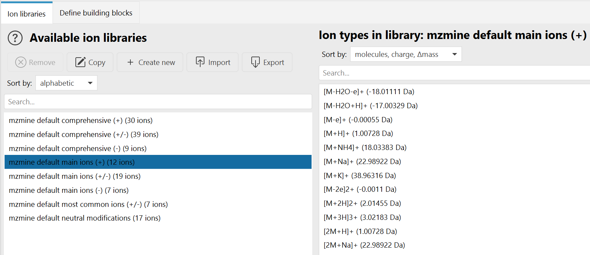
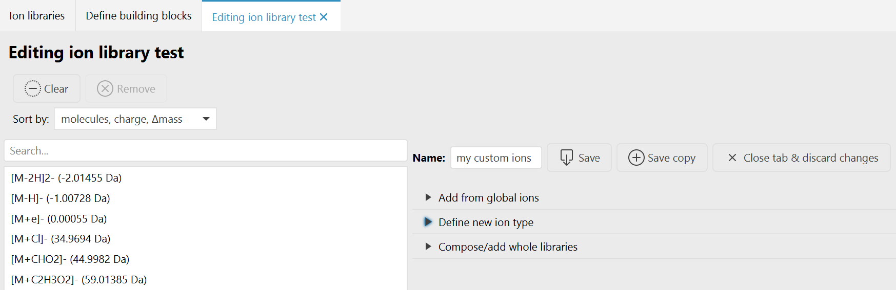
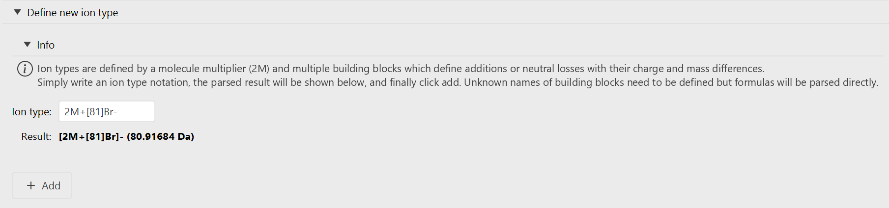
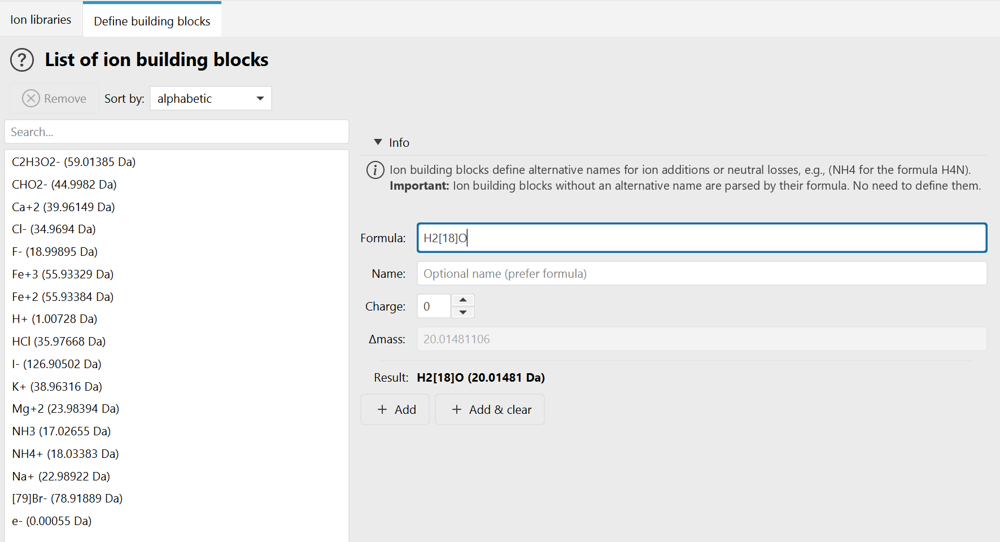
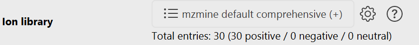
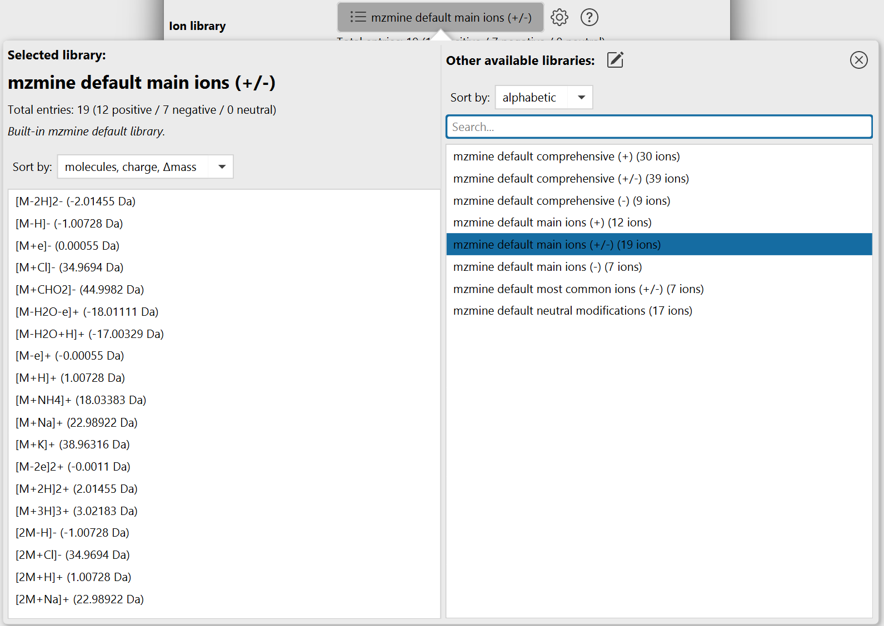

# Ion types & libraries

:material-menu-open: **Tools → Define global ions**

An **ion library** is a list of ion types, each describing what happened to a molecule from
ionization until detection. This includes:

1. The ionizing adducts, like `[M+H]+` or `[M+Na]+`
2. Multimers where multiple molecules stack, like `[2M+H]+`
3. Neutral losses (in-source fragments), like `[M-H2O+H]+`
4. Ion clusters, like `[M+ACN+H]+`

Ion libraries are used throughout mzmine to define which ion types a module should consider.
The main consumer is
[Ion Identity Networking (IIN)](../module_docs/id_ion_networking/iin/iin.md), where the ion library
defines the ions that are matched pairwise to explain the _m/z_ difference between two feature list
rows of the same molecule.

!!! info

    Ion libraries, ion types, and ion building blocks are all defined in the **Define global ions**
    tab (**Tools → Define global ions**). Everything defined there is available globally: it is used
    for parsing ion notation anywhere in mzmine and can be selected in any module that takes an
    [ion library parameter](#ion-library-parameter).

---

## Concepts

The three levels build on each other: **ion building blocks** → **ion types** → **ion libraries**.

### Ion building blocks {#building-blocks}

The smallest unit is an ion building block. It defines the molecular formula, charge, and mass
difference of a single modification, such as an adduct or a neutral loss. The formula is normally
used as the display name, but an alias name is possible.

A building block only needs to be **defined explicitly when you want an alternative name** for it
or to define potential charge states of an atom or molecule, for example:

- `NH4` for the formula that mzmine would otherwise write as `H4N`
- `ACN` for acetonitrile
- `MeOH` for methanol
- `Fe(II)` for `Fe+2`

!!! tip

    Building blocks that are written as a plain molecular formula do **not** need to be defined.
    They are parsed directly from the formula whenever you type them.

The formula itself is optional: a building block can also be declared by name, charge, and mass
alone, which allows more complex or unknown modifications to be described.

### Ion types {#ion-types}

An ion type describes the complete ionization, including any in-source modification of a molecule.
It combines building blocks into a total mass difference, a total charge, and the added/removed
formulas. Ion types also carry a multimer count that describes how many molecules `[xM]` cluster
together.

Examples: `[M+H]+`, `[M-H2O+H]+`, `[2M+Na]+`, `[M+2H]2+`, `[M-H]-`.

### Ion libraries {#libraries}

An ion library is a named list of ion types plus the building blocks those ion types use. Libraries
are the unit that modules select, that you export and share, and that batch files store.

### Molecular formula and ion notation {#notation}

In mzmine there are many fields to capture a molecular formula, often just named formula. The
following notations are supported:

- **Regular formula**: `C6H12O6` (will be harmonized and cleaned)
- **Charge state**: `(Fe+2)` to define charge precisely or `Fe+2`, but never `(Fe)2+`, as this describes
  2 × Fe with single charge
- **Isotopes**: `C4[13]C2H12O6` (hexose with 2 × ¹³C and 4 × ¹²C; there is no need to write the mass
  number on major isotopes)
- **Isotopes and charge combined**: `C[13]CH3O2-`

Ion types are parsed from a flexible notation. `M` (the molecule), the enclosing brackets, and the
total charge are all optional, so the following all describe the same ion type `[M+NH4]+`:

```
M+NH4      [M+NH4]     [M+NH4]+     [1M+NH4]1+     +(NH4+)
```

Further rules:

- Multiple building blocks are simply chained: `[M-H2O+H]+`, `[M-2H2O+H]+`, `[M-H2O-H+2Na]+`
- The total charge of the ion type must be enclosed in `()` or `[]`: `[M+H]+2` or `[M+H]2+`
- Charge of an individual building block is written in `()`: `[M+(Cu+2)-H]+`
- Names that contain `+`, `-`, or that start with `(` must be enclosed in `()`, for example
  `+(propan-2-ol)`

---

## The Define global ions tab

The tab has two permanent sub tabs - **Ion libraries** and **Define building blocks** - and a third
**editing** tab that appears while you create or edit a library.

!!! warning

    Changes made in this tab are held in the tab first. When the yellow notification bar at the top
    shows _"Ion definitions were changed in tab, apply?"_, click **Apply** to push the changes to
    the global ion definitions, or **Discard** to reset. Saving a library from the editing tab
    applies its changes immediately.
    If the global definitions were changed elsewhere in mzmine while the tab was open, the bar
    offers **Load** to pull those changes in.

### Manage ion libraries {#define-libraries}



The list on the left shows all available ion libraries: mzmine's built-in defaults and your own
locally saved libraries. Select one to view its ion types on the right. Both lists have a search
field and a **Sort by** selector. Libraries sort by *alphabetic* or *size*, ion types by
*molecules, charge, Δmass*, *charge, Δmass*, *Δmass*, or *alphabetic*.

| Button              | Action                                                                                                         |
|---------------------|------------------------------------------------------------------------------------------------------------------|
| **Remove**          | Deletes the selected library after a confirmation. Disabled for mzmine default libraries. The <kbd>Delete</kbd> key does the same. |
| **Edit** / **Copy** | Opens the selected library in the editing tab. The button is labelled *Copy* while an mzmine default library is selected, because those can only be duplicated: it opens a copy of the content under the placeholder name `unnamed library`. |
| **Create new**      | Opens an empty library in the editing tab.                                                                        |
| **Import**          | Imports libraries from `.mzpresets` files. The *Merge policy* decides what happens when an imported library is **older** than an existing one with the same ID: *Skip on older versions* (default), *Ask for older versions*, or *Overwrite all*. |
| **Export**          | Writes the selected libraries into a chosen directory, one `.mzpresets` file per library.                         |

mzmine ships eight default libraries: *comprehensive* and *main ions*, each in a positive, a
negative, and a dual polarity variant, plus *most common ions (+/-)* and *neutral modifications*.

!!! warning

    mzmine default libraries cannot be changed or deleted, and any name containing
    `mzmine default` is reserved. Use **Copy** to start from a default library and save it under
    your own name.

Your own libraries are stored as presets in `~/.mzmine/presets/libraries/ion_libraries/` as
`.mzpresets` files, so they are available in every mzmine session and can be shared by copying the
files.

### Create and edit a library {#define-types}



The editing tab shows the ion types of the library on the left and the controls on the right.

| Control                       | Action                                                                                                  |
|-------------------------------|---------------------------------------------------------------------------------------------------------|
| **Clear**                     | Removes all ion types that are **currently shown**. If a search filter is active, only the matching entries are cleared. |
| **Remove**                    | Removes the selected ion types.                                                                          |
| **Name**                      | The library name. A name is required, must not contain `mzmine default`, and must not contain characters that are illegal in file names. |
| **Save**                      | Overwrites the library that was opened (after a confirmation) and applies it to the global definitions. Disabled while nothing was changed or while the name is invalid. |
| **Save copy**                 | Saves the current content as a **new** library. Requires that you change the name first; the original library stays unchanged. |

Three collapsible sections add ion types to the library:

- **Add from global ions** - pick one or several ion types from the global pool of all known ion
  types and click *Add selected ions*.
- **Define new ion type** - write a new ion type in the notation described [above](#notation).
- **Compose/add whole libraries** - select one or more existing libraries and click *Add whole
  libraries* to merge all of their ion types into the library being edited.

Adding is duplicate-safe: ion types that are already in the library are not added twice.

#### Define new ion type



Type an ion type notation into the **Ion type** field. The **Result** line immediately shows the
parsed ion type with its total mass difference, and **Add** puts it into the library.

The **Add** button stays disabled while:

- the input cannot be parsed, or
- the ion type uses building blocks that mzmine does not know yet. Those are listed as
  *"n parts unknown: …"* and a **Define unknown part named: …** panel opens below, where you give
  the unknown block its charge and either a formula or a mass. After defining it, the ion type can
  be added.

!!! tip

    When the parsed ion type has a total charge of 0, the hint _"Check **neutral** definition: May
    be expected"_ appears next to the Add button. Neutral ion types can be saved to a library and
    are used as neutral modifications, but modules that match charged MS1 features - Ion Identity
    Networking among them - only use ion types whose polarity matches the row. Check whether you
    meant to add a charge.

### Define building blocks {#define-parts}



This tab lists all known ion building blocks and lets you define new ones. Remember that a building
block only needs an entry here if you want an **alternative name** for it; plain formulas are parsed
without any definition.

| Field       | Description                                                                                                       |
|-------------|--------------------------------------------------------------------------------------------------------------------|
| **Formula** | The molecular formula of a single unit, e.g. `H2[18]O`. Optional if a name and a mass are given.                    |
| **Name**    | Optional alternative name. If empty, the formula is used as the name.                                              |
| **Charge**  | The charge of a **single** unit. For example, `+2Cl-` has charge −1 because a single Cl carries a single charge.     |
| **Δmass**   | The absolute mass of a single unit. Only editable while the formula field is empty - otherwise the mass is calculated from the formula. |

Either a formula or a name plus a mass greater than 0 must be given. **Add** stores the block,
**Add & clear** stores it and empties the input fields for the next entry.

!!! warning

    Removing a building block cascades. mzmine collects every ion type and every library that uses
    the block and asks whether to remove those ion types everywhere. If the block is used by an
    mzmine default library, it cannot be removed at all.

---

## Selecting an ion library in a module {#ion-library-parameter}

Modules that need ion types expose an ion library parameter:



The line below the button summarizes the selected library: the total number of entries and how many
of them are positive, negative, and neutral.

| Button                     | Action                                                                                                       |
|----------------------------|--------------------------------------------------------------------------------------------------------------|
| **Library name** (list)    | Opens the library selection popover (see below).                                                              |
| **Gear**                   | Opens the **Define global ions** tab in the main window to create or modify libraries.                        |
| **Circular arrows**        | Only shown when the globally defined library with the same ID is **newer** than the one stored in this parameter. Replaces the parameter's library with the global version. |
| **Arrow into box**         | Only shown when the parameter's library is **missing** from the global definitions or is newer than the global version. Adds it to the global ion libraries. |

A red text below the button explains any mismatch between the parameter and the global definitions.

!!! info

    The parameter stores the **complete library** - its name, ion types, and building block
    definitions - inside the batch file, not just a reference to it. A batch therefore reproduces
    exactly the same ions later, even if the global library of the same name has changed in the
    meantime. The reload and save buttons exist to reconcile the two on purpose.

### The library selection popover



The popover shows the currently selected library on the left with its entry counts, its origin, and
a read-only preview of all of its ion types. The origin line tells you whether the library is a
built-in default, comes from the global list, is only present in this parameter, or is a local
variant that differs from the global library of the same name.

The list on the right offers all other available libraries:

- Type into the search field (focused when the popover opens) to filter, or use
  <kbd>↑</kbd>/<kbd>↓</kbd> to move the selection while typing.
- Click a library to select it.
- Double-click it, or press <kbd>Enter</kbd> twice, to select it and close the popover.
- The **pencil** button next to *Other available libraries* opens the **Define global ions** tab in
  the main window with an empty library ready to edit.
- The **x** button in the top right corner closes the popover.

!!! tip

    A newly created library is written to the global list when you save it in the editing tab. Open
    the popover again afterwards to select it for the parameter.

---

{{ git_page_authors }}
