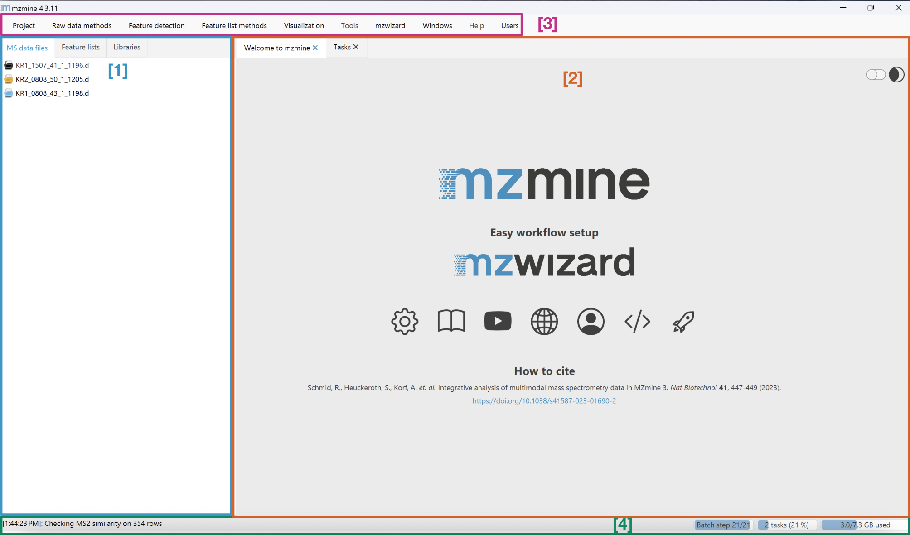

# Main window overview

The mzmine main window is made up of mainly four important building blocks.

## MS data files and feature lists tab

[1]: The (raw) ms data, Feature list, and Libraries tabs. Here you can find your imported raw data files, 
processed feature lists, and imported spectral libraries.
!!! tip

    You can also import files by dragging & dropping them to the ms data tab.

## Main content pane

[2]: Landing page and main content pane. Visualisations such as a raw data overview or a feature list can be
viewed here. This pane can also contain multiple tabs. Every tab can also be opened in a new
separate window by right-clicking on the header.
!!! tip

    The landing page has many short cuts to helpful tools e.g. the mzwizard.

## Main menu

[3]: The main menu. Here you can find methods to import and process your data files and feature
lists and visualise the results. Projects can be saved and preferences can be set. Furthermore, the user management as well as the documentation can be accessed.

## Task overview

[4]: The progress of the current tasks and batch are displayed and the latest logged activity is displayed. A detailed task overview can be found in the task tab in the main content pane.

## Page Contributors

{{ git_page_authors }}
