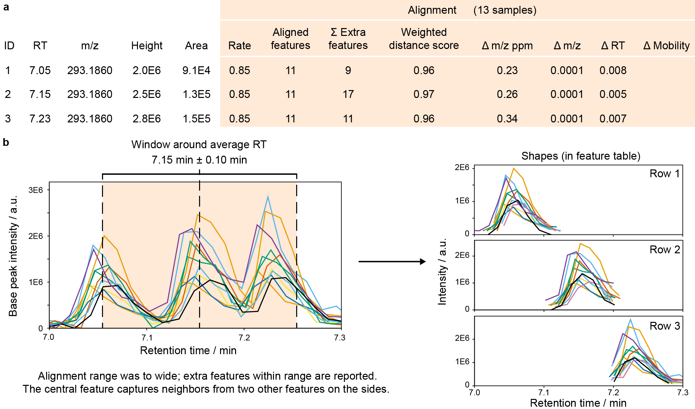
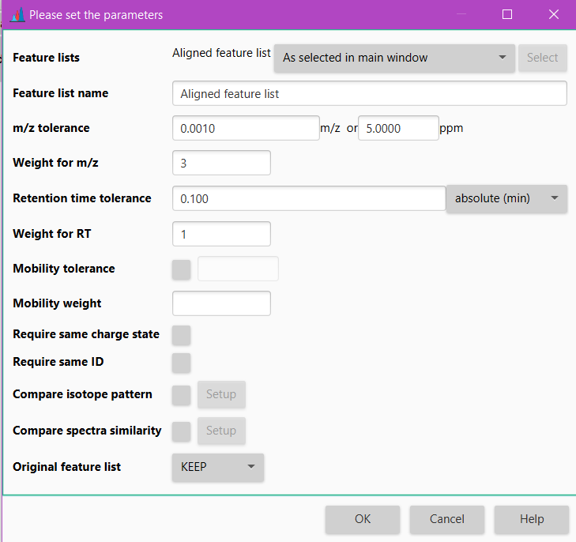

# **Join aligner**

## **Description**

:material-menu-open: **Feature list methods → Alignment → Join aligner**

This method aligns detected peaks in different samples through a **match score**. This score is calculated based on the mass
and retention time of each peak and ranges of tolerance specified in the parameter setup dialog.

 **Fig.** The alignment columns in feature tables (MZmine 3.3.0). **a**, After alignment, new columns provide results on the alignment, including the alignment rate (aligned/total samples) and mean differences between all samples to the mean m/z, RT, and mobility. The weighted distance score reflects the alignment score, calculated for the final aligned feature. The summed extra features counts all additional features that were found within the m/z, RT, and mobility tolerances. b, Show the LC-MS EICs of 13 samples extracted with the alignment m/z tolerance around feature ID2. With a wide RT tolerance, 17 additional LC-MS features were found that indicate closely eluting isomers or other ions that might interfere with the alignment.

### **Algorithm**

#### **Input**

The peak alignment algorithm uses:

1. A **master list of peaks** (L) against which every new **sample** (Sj) will be matched.

    When aligning peaks from multiple samples, the master list is initially set to the first sample. Subsequently, it becomes a combination of samples aligned this far.
     
     Master list contains the samples as the columns and the matching peaks as the rows.

2. For every row i in L, a two-dimensional window (a window size is selected by the user), called **Alignment window (AW)**, defines the ranges of m/z and RT. 
    
    The window is  centered around the average of m/z and RT of all the individual peaks in the row.

3. A score function is used to compute the similarity of peaks between L and the new sample Sj inside the alignment window. 

    The **score function** computes the similarity based on the similarities in m/z, retention time, and (optionally) on identification, and isotope patterns between the peaks to be matched. 
     
    The score is calculated as follows:
    
    $$score = \frac{1 - MZ_{difference}}{MZ_{tolerance}} × MZ_{weight} + \frac{1 - RT_{difference}}{RT_
   {tolerance}} × RT_{weight}$$

#### **Steps**

The algorithm works as follows:

- It iterates through the rows of L.
- For each row, it looks for peaks within the alignment window in Sj that has to be aligned with L. 
- A score is calculated for each possible match 
- The pair getting the best score will be aligned.

## **Parameters**

#### **Feature list name**

Name of the new aligned peak list.

#### **m/z tolerance**

 Maximum allowed difference between two m/z values in order for them to be considered the same and thus the peaks aligned. 
 
The value is specified both as absolute tolerance (in m/z) and relative tolerance (in ppm). 

 The tolerance range is calculated using maximum of the absolute and relative tolerances for possible peaks to be aligned. 

#### **Weight for m/z**

This is the assigned weight for m/z difference at the moment of match score calculation between peak rows, as can be seen in the aforementioned formula. Only in cases where there is a perfect match of m/z values, the score receives the complete m/z weight. 
Generally, higher weight is given to m/z values than to RT values. 

#### **Retention time tolerance** 

Maximum allowed difference between two retention times in order for them to be considered the same and thus peaks aligned.
Maximum RT difference can be defined either using absolute or relative value. 

#### **Weight for RT**

This is the assigned weight for RT difference at the moment of match score calculation between peak rows. 
Only in cases where there is a perfect match of RT values, the score receives the complete RT weight. 

#### **Mobility tolerance**

In case of IM data,the user can determine the mobility tolerance. If checked, this parameter specifies the tolerance range for matching the mobility values. 

#### **Mobility weight**

Score for perfectly matching mobility values. Only taken into account if "Mobility tolerance" is activated. Furthermore,
score calculation that is mentioned in the **Algorithm** is then modified to account for the mobility as well. Mobility tolerance and weight are accounted for
in the same manner as m/z and RT parameters.

#### **Require same charge state**

_Optional parameter_

If checked, only rows having same charge can be aligned. 

#### **Require same ID**

_Optional parameter_

If checked, only rows having same compound identities (or no identities) can be aligned.

#### **Compare isotope pattern**

_Optional parameter_

If both peaks represent an isotope pattern, checking this box will add isotope pattern score to the match score calculation. Additionally, the user can set up **isotope m/z tolerance** which defines what isotopes would be considered same when comparing two isotopic patterns, **minimum absolute intensity** below which isotopes will be ignored and **minimum score** % between isotope patterns that has to be satisfied in order for the match to not be discarded.

#### **Compare spectra similarity**

_Optional parameter_

Compare MS1 or MS2 scans similarity. Select the m/z tolerance, MS level and spectra similarity algorithm. 
Only features meeting this criteria will be aligned.  See [compare spectra similarity](spectra_similarity.md) for additional information.

#### **Original feature list**

The user can choose to either KEEP the original feature list and generate a new processed one, or REMOVE the original feature list with the processed one.
Generally, you would keep the original feature list, but opting for REMOVE will save memory.

{{ git_page_authors }}