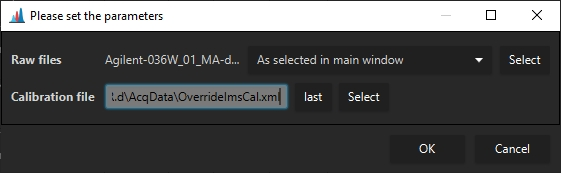
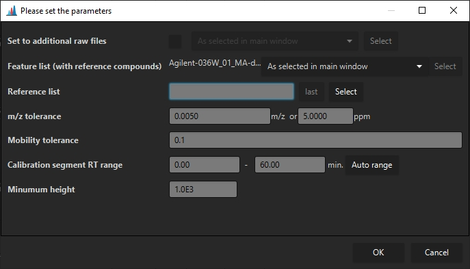
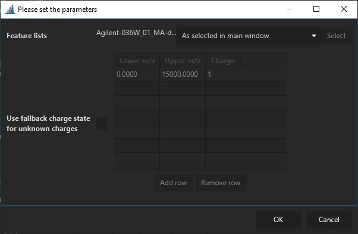

# CCS Calibration and calculation

Accurate determination of CCS values requires a valid CCS calibration and molecule charge states to
be detected.

- **timsTOF** raw data can be recalibrated using data analysis and imported in MZmine. The
  recalibrated data will be used by default. (see [Calculating CCS values](#calculating-ccs-values))
- **mzML** raw data requires the determination of a calibration function from the raw data (e.g. as
  detected features) or as import from an external file. (
  see [Creating or importing a CCS calibration](#creating-or-importing-a-ccs-calibration)

## Creating or importing a CCS calibration

### Importing a CCS calibration

Agilent calibration data can be imported from the "OverrideImsCal.xml" file in the Agilent raw data
folder.

The calibration import is accessed via **Feature list methods** -> **Processing** -> **External CCS
Calibration**. Then select the calibration "OverrideImsCal.xml" from the raw data folder, and select
the raw data files the calibration should be applied to.

### Reference CSS calibration

If a mobility calibrant is infused during an HPLC run of every sample, a CCS calibration can be
calculated on a per-raw file basis. Otherwise, a single run can be used to calibrate multiple files.

The calibration module can be accessed via **Feature list methods** -> **Processing** -> **Internal
reference calibration**.

**Set to additional raw files** If a calibration calculated from a single feature list shall be
applied to multiple other raw files, the raw files can be selected here. This requires only a single
raw file to be selected.

**Feature list (with reference compounds)** Specifies (a) feature list(s) that contains the
reference compounds. If multiple feature lists are selected, every feature list will be searched for
reference compounds, and the calibration will be used for the raw data files in the particular
feature list. This means that no raw data file may be selected. (Cannot set multiple calibrations to
a single raw file.)  
If a single feature list is selected, the calibration may be applied to additional raw data files
via the **Set to additional raw files** parameter.

**Reference list** Specifies a ".csv" reference list of for CCS calibrant ions. Must contain the
columns "
mz", "mobility", "ccs", "charge". Columns must be separated by ";". The ion mode may be specified
via the charge of the ion, e.g., as 1 or -1. Only the correct polarity will be used to calculate the
calibration.

**m/z tolerance** The m/z tolerance for the reference compounds.

**Mobility tolerance** the mobiltiy tolerance to detect the reference compounds.

**Calibration segment RT Range** Specifies the rt range that shall be searched for calibrant ions.
Usually either the beginning or end of a HPLC run.

**Minimum height** A minimum intensity for reference compounds to be used as calibrant signals for
determination of the calibration.

## Calculating CCS values

After a calibration as been set (Agilent/Waters/Bruker mzML) (Bruker tdf works out-of-the-box)
CCS values can be calculated via **Feature list methods** -> **Processing** -> **Calculate CCS
values**.

Here, a default charge state may be set, in case it could not be determined. Otherwise, the charge
state determined via the isotope pattern will be used.

