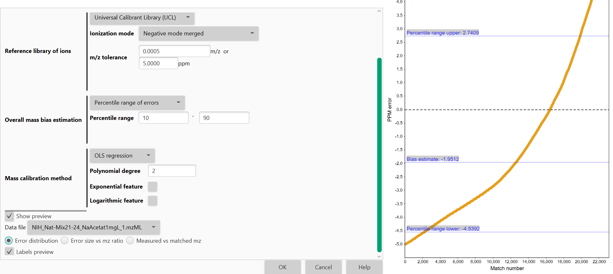

# **Mass calibration**

## **Description**

:warning: This module should be used after mass detection step is performed.

:material-menu-open: **Raw data methods → Mass detection → Mass calibration**

Mass calibration module estimates the measurement error of each detected mass and calibrates them using reference libraries of ions through three main processes:

1. Peak matching with library of reference and extraction of errors,
2. Estimation of overall mass bias, and 
3. Mass calibration of detected masses.

## **Parameters**

#### **Raw data files**

The raw datafiles to calibrate. Each selected datafile is calibrated independently in a separate task.

#### **Mass list name**

Name of the mass lists to be calibrated. The mass lists must be previously generated for each scan by the Mass detector module.

#### **Intensity threshold**

Determines the intensity of the peaks used for matching against the library of ions and subsequent mass calibration. Only mass peaks with intensity above this threshold will be considered for calibration. This is useful to avoid certain noise peaks that could have been picked in the Mass Detection module. To consider all peaks, the Intensity Threshold needs to be set with a value equal or lower than the previously used in the Mass Detection module.

#### **Duplicate Error Filter**

Removes duplicate ions with the same m/z value independently of their retention time. If enabled, for a specific detected exact mass present in different scans (not necessarily consecutive), only a single ion with that exact mass value will be considered for calibration. This filter performs for the full list of masses and does not consider RT difference between ions.

#### **Reference Library of ions**

Selects the library used for ion matching and determination of mass errors. SCL and UCL libraries are available.

* **SCL-only parameters**

    *Standard Calibrant Library file*

    File with a list of ion formulas and retention times (xls, xlsx and csv (tab, comma or semicolon delimited files are supported). This list should contain ions that are expected to be detected in the samples. Files need to contain a first column with the retention time in minutes and a second column with the ionic formula strings. Optionally, column 3 is used as a name of the standard and column 4 is used the m/z. If only a mz but no name shall be provided, column 3 must exist, but be empty. All rows in the file must have the same length. Sample standards list file:
  ```
  1.4,C3H7COO-,butyric acid,1337.1337
  1.4,C3H7COO-,,1337.1337
  1.4,C3H7COO-,,
  ```

    *Retention time tolerance (only for SCL)*

    Maximum difference in retention time between an actual measured ion and a calibrant to consider a match.

* **UCL-only parameters**

    **Ionization mode**

    Ionization mode for which an appropriate universal calibrants list is used.

#### **m/z tolerance**

Maximum allowed difference in m/z between an actual measured ion and a calibrant to consider a match.


#### **Overall Mass Bias Estimation**

Measurement mass errors are calculated based on the matching of detected ions against the library, a distribution of errors is built, and measurement bias is estimated. Because not all ion matches can be considered as correct, the calibration model will automatically identify the high-density mass error range (mass error range with larger number of matches) from the generated distribution of matching errors.

:material-lightbulb: If both parameters (*Primary High-Density Range of Errors size* and *Error range tolerance*) are set to zero, all errors obtained after matching against the reference library of ions are used for calibration of peaks.

* **High-Density Range of Errors**

    *Primary High-Density Range of Errors size*

    Determine the range (in PPM) containing most mass errors after matching the detected ions with the ion calibration library. Use zero to skip this step, in such case the distribution is split into subranges containing all the errors within the error tolerance and the largest subrange is used.

    *Error Range Tolerance*

    Maximum distance (in PPM error) between the maximum and minimum thresholds of the Primary High-Density Range of Errors and the consecutive error to allow the extension of the error range. Determines how far the distribution range of errors will be extended to extract the errors used for mass calibration. The module will include any consecutive matched error from the most populated error range found within the established error range tolerance (i.e., 0.1PPM).

    This process continues until the algorithm does not find any consecutive error within the Error Range Tolerance value. Use zero to skip this step and no extension will be computed.

* **Percentile Range of Errors**

    *Percentile range*

    The module calculates the Interquartile Range (IQR) from the overall distribution of errors to extract those errors to be used for mass calibration of peaks. IQR can be modified (by default determined at 25th and 75th percentiles). In such case, errors distributed below 25th or above 75th percentile will not be considered for mass calibration of peaks.

[//]: # (TODO Example:)

#### **Mass Calibration method**

Method used for mass calibration. Described in more details [below](#more-details-on-mass-calibration-method).

- **Arithmetic mean**
- **KNN regression**
    - *Nearest neighbors’ percentage*
  
        Percentage of nearest neighbors used for error prediction.

- **OLS regression**

    - *Polynomial degree*

        The degree of polynomial trend used, the summand powers of the polynomial will be the OLS regression features. Use 0 for constant component, 1 for linear, 2 for quadratic and so on.

    - *Exponential feature*

        When selected, an exponential feature $exp(x/10)$ is included.

    - *Logarithmic feature*

        When selected, logarithmic feature $ln(x)$ is included.

### **Reference library of ions**

First, mass lists (MS1) from raw data files are matched against a reference library and mass measurement errors are calculated.

This module can support two different matching strategies:

* **Standard Calibrant Library (SCL)** (recommended method): file needs to be provided by the user in xls, xlsx or csv format). The file needs to include retention time (RT) information and the ion formula of a collection of ions that are expected to appear in the samples analyzed with a known chromatographic method. Ion formulas format of the SCL will depend on the ionization method used to analyze the samples. See below in the “Parameters” section a detailed description for the library format.

    Using a SCL, the matching of measured peaks the matching of measured peaks against the library is performed using both RT and exact m/z. RT and m/z error tolerances are needed to be defined.

    :material-lightbulb: Note: To ignore RT parameter when using SCL for mass calibration, the parameter can be set with an equal or larger value of the chromatography length (i.e., 30 min).

* **Universal Calibrant Library (UCL)** include a collection of ions often found in mass spectrometry experiments. The module has two different lists in positive (+ve) and negative (-ve) ionization modes to be chosen by the user.

    Universal calibrant lists are based on ***Keller et al. 2008 Analytica Chimica Acta 627:71-81*** and ***Hawkes et al. 2020 Limnology and Oceanography Methods 18:235-258***. MZmine includes both those libraries.

    Matching of detected ions against the UCL library is performed using m/z values alone independently where the ions are appearing along the chromatography and only m/z error tolerance will be needed.

## **More details on mass calibration method**

:material-lightbulb: To estimate mass measurement bias more accurately, we can model the trend exhibited by the error size vs m/z value relation obtained by matching the mass peaks.
With the estimation model we can shift/calibrate the mass peaks at different particular m/z values more accurately.

The module supports two main modes for mass calibration:

* Arithmetic mean:

    This method uses the arithmetic mean of the extracted errors of the overall bias estimation.

    Calibration of peaks will be performed globally based on a single overall bias value. This method is especially recommended for datasets with low number of extracted errors (i.e., blank samples).

* Regression mode:

    This mode models a trend from the direct relationship of error size (in PPM) vs. measured m/z of detected peaks. Mass lists will be calibrated according to the estimated model. The mass calibration module supports two different methods of regression: **OLS** and **KNN**.

    - *OLS (ordinary least squares)* regression minimizes the mean squared error between the predicted trend and the datapoints in the dataset. Available features include power features (polynomial trend), logarithmic feature and exponential feature. **By default**, linear trend is fitted. This mode is suitable for datasets with enough data and exhibit a clear and strong trend (Error vs. m/z).

    - *KNN (K-Nearest Neighbors)* regression finds the average value of the K nearest neighbors. In this module, the number of neighbors is defined by a percentage set by the user of all the errors present in the dataset. The K closest neighbors are thus found by the absolute difference of the m/z values within such percentage. Then the arithmetic mean of the neighbors' errors is calculated for each individual error and will serve as an error estimate for a specific m/z. This method is suitable for datasets with enough data and a trend between mass error vs. m/z is not clear. Therefore, KNN regression allows the trend to match the dataset closely without introducing additional assumptions on how the variables are related.

  :warning: Overfitting problems at large m/z values (>800) can occur when modeling the errors with regression as those regions commonly have less matches against the reference libraries of ions. If regression is modelled mainly by matches with small m/z ions (<400), it is recommended to use the arithmetic mean for mass calibration. This also applies to blank samples were the number of matched ions is commonly low and regression can produce overfitting problems.

## **Examples**




`This module was intially created during a GSoC 2020 project with MZmine by Łukasz Fiszer and MZmine team.`

{{ git_page_authors }}
