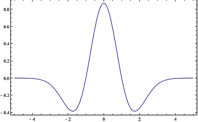

# **Mass detection algorithms**
Mass detection can be done with the following six algorithms:

- Centroid 
- Exact mass
- Local maxima
- Recursive threshold
- Wavelet transform
- Auto

## **Centroid**

Centroid algorithm assumes that each signal above a given noise level is a detected ion.
This mass detector is suitable for already centroided data. 

## **Exact mass** 

This mass detector first searches for all local maxima within the spectrum, which then form candidate ions. 

This method calculates the exact mass of a peak using the **FWHM** (full width at half maximum) concept and linear equation (*y = mx + b*). FWHM is the difference between the two values of the independent variable at which the dependent variable equals half of its maximum value. 

First, the method locates the data points located nearest to the peak center at half of the maximum intensity (P1, P2, P3, P4).
With these four points it calculates two points (cP1, cP2) that define the width of the peak. The exact mass is then obtained as the center of the width.

This method is suitable for high-resolution MS data, such as provided by FTMS instruments.

💡 **Tip**: The exact mass algorithm is highly recommended for profile MS data. 
💡 **Tip** If the continous data is too noisy, one can use recursive threshold algorithm.

## **Local maxima**:

This very simple mass detector detects all local maxima within the spectrum, except the signals below the given noise level. The practical usability of this method on real MS data is limited, but it is useful to demonstrate and understand the functionality of mass detection using the preview plot.

## **Recursive threshold**:

The algorithm finds all m/z ranges within the given limit in a recursive way. 

Initially, it looks at the whole range of data points. If the m/z width of this range is not within given limits, a minimum data point is found and used to split the range in two parts. The same algorithm is then applied recursively on each part. Recursion continues until all m/z ranges fitting into the given width limits are found. 

Final m/z values are determined as local maxima of the identified m/z ranges.

This mass detector is suitable for continuous data, which has too much noise for the Exact mass detector to be used, but which shows a consistent width of m/z peaks.

#### **Additional method parameters**

**Min m/z peak width**: Minimum acceptable peak width in m/z.

**Max m/z peak width**\: Maximum acceptable peak width in m/z.

💡 **Tip** Recursive threshold method can be used with the noisy continuous data that shows a consistent width of m/z peaks.

## **Wavelet transform**

 The method uses the **Mexican Hat wavelet model** of the continuous wavelet transform (**CWT**) algorithm. 
 
 The search of mass spectrum peaks is executed in three steps. First, the data point intesity is converted into wavelet domain. Second, all the local maxima of the calculated wavelet are found. Finally, m/z peaks (ions) are declared in those points, where the wavelet has a local maximum. The m/z peak is formed with the selected data point (mass and intensity) using the wavelet and all surrounding data points. The final m/z value of the ion is calculated as an average of m/z values of surrounding data points weighted by their intensity.

#### **Mathematical model**

In numerical analysis, the Mexican hat wavelet is the normalized second derivative of a Gaussian function.

$$\psi(t)=\frac{1}{\sqrt{2\pi}\sigma^3} \left( 1-\frac{t^2}{\sigma^2} \right)e^{-\frac{t^2}{2\sigma^2}}$$

  

The parameter $t$ is the intensity of each data point in the curve, and $\sigma$ corresponds to the standard deviation. 

To simplify the process of wavelet calculation, the original function is transformed into two parts, where $W_{c}$ is the wavelet coefficient and $y$ is the intensity of the wavelet at certain point. In the following formula, $t$ corresponds to the Wavelet window size (%) parameter.

$$W_{c}=\left[\frac{2}{\sqrt{3}\pi^\frac{1}{4}}\left(1-t^2\right)e^-\frac{t^2}{2}\right]$$
$$ y=\lim_{LL \to UL}(W_{c}x)$$ 

The lower (LL) and upper (UL) limits, where the Mexican Hat wavelet is evaluated, are from -5 until 5. The incremental step used in this range is the result of limits range division by 60,000.

#### **Additional method parameters**

**Scale level**

Number of wavelet coeficients to use in m/z feature detection. Serves as the scale factor that either dilates or compresses the wavelet signal. 

When the scale factor is relatively low, the signal is more contracted, which results in a more detailed resulting graph and more noisy peaks are detected. On the other hand, when the scale factor is high, the signal is stretched out, which means that the resulting graph will be less detailed with a smoothed signal.

**Wavelet window size (%)**
The size of the window used to calculated the wavelet signal. When the size of the window is small, more noisy peaks can be detected. The proper value of this parameter may help to avoid the undesired noise peaks.

💡 **Tip** The Wavelet transform mass detector is particularly suitable for low-resolution and noisy data.

## **Auto**

Auto mass detector recognizes if the spectrum is of profile or centroided data type and applies centroid or exact mass algorithms correspondingly.
