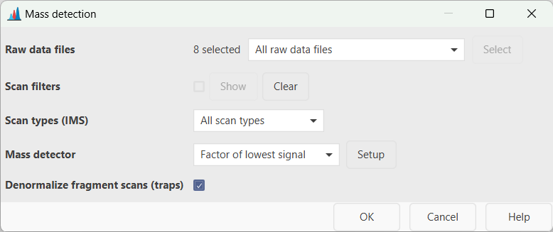
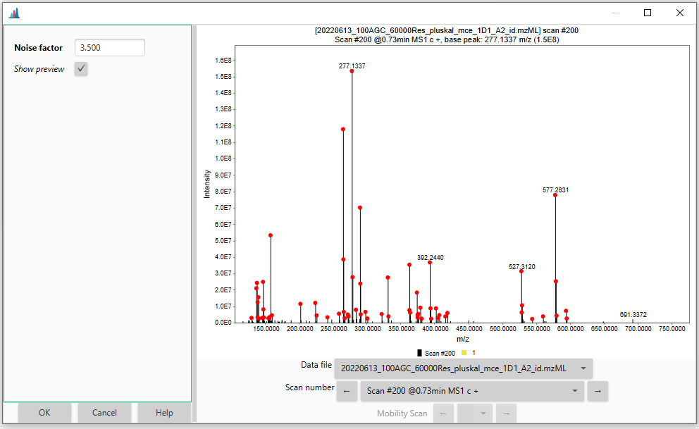

# **Mass detection**

## **Description**

:material-menu-open: **Raw data methods → Mass detection → Mass detection**

The mass detection module generates a [mass list](../../terminology/general-terminology.md#mass-list) (_i.e._ list of m/z values and corresponding signal intensities) for each scan, in each raw data file. During the mass detection, noise filtering is performed based on a user-defined threshold (see [Setting the noise level](#setting-the-noise-level)). Additionally, profile raw data are centroided.

The available algorithms are described [here](mass-detection-algorithms.md).

## **Parameters**

#### **Raw data files**
Select the input raw data files for the mass detection. All the imported data files can be processed in bulk (_i.e._ _All raw data files_), or a subset can be selected directly from the _MS data files_ panel (_i.e._ _As selected in the main window_) or based on the filename (_i.e._ _File name pattern_) As an alternative, the files' directory can be also specified (_i.e._ _Specific raw data files_). Finally, if the _Those created by previous batch step_ option is selected, MZmine takes the output of the last processing step as input. This option is only available for [batch processing](../../workflows/batch_processing/batch-processing.md).

#### **Scans**
Select (or filter out) the MS scans to be processed. Several filters are available (_Select filters_ button). A scan number, RT and mobility range can be set (_i.e_ _Scan number_, _Retention time_ and _Mobility_ options); only the scans belonging to the defined range(s) will be processed. The _Base Filtering Integer_ option allows to prcesses one every-_N_ scans. The _Scan definition_ field can be used to filter scans based on the scan's description normally included in the raw file's metadata (_e.g._ FTMS). Scans can also be filtered by _MS level_ (_i.e._ 1, 2, ..., _N_), polarity and spectrum type (_i.e._ Centroided, Profile and Thresholded).

#### **Scan types (IMS)**
This parameter applies only to IM data and determines if _mobility scans_, _frame scans_ or both (_i.e._ _All scan types_) are processed. For more details about _mobility_ and _frame scans_, see [here](../../terminology/ion-mobility-terminology.md#accumulations-mobility-scans-and-frames). 
:octicons-light-bulb-16: **Tip**. Since _frame scans_ are obtained by merging multiple _mobility scans_, the noise thresholds will likely be different. However, only one noise level can be set per processing step. Therefore, if one wants to run the mass detection for _mobility_ and _frame scans_ using different noise cutoffs, two module calls are required. As an alternative, mass detection can be performed only on the _mobility scans_ by selecteing the appropriate noise level. _Mobility scans_ can then be merged into _frame scans_ with a [dedicated module](../featdet_mobility_scan_merging/mobility-scan-merging.md). 

#### **Mass detector**
Select the algorithm to be used for the mass detection. Several mass detection algorithms are available and can be selected in the drop-down menu. The choice depends on the raw data characteristics (profile/centroided, mass resolution, etc.). The _Centroid_ algorithm must be used for already-centroided data. A step-by-step guide to convert profile into centroided data is provided in the [GNPS documentation](https://ccms-ucsd.github.io/GNPSDocumentation/fileconversion/) Other algorithms are available for profile raw data and are described in more details [here](mass-detection-algorithms.md). The _Exact mass_ algorithm is highly recommended for profile HRMS data. When _Auto_ is selected, the _Centroid_ and _Exact mass_ algorithms are used by default for centroided and profile data, respectively.

#### **Setting the noise level**
All the mass detection algorithms allow to set a threshold for the noise filtering (_i.e._ _Noise level_) by hitting the _Setup_ button next to the _Mass detector_ field. A dialog box like the following will open up:

The noise threshold can be entered either in standard or scientific notation. By checking the _Show preview_ box, an interactive visualization panel will open to help the user to adjust the noise level (see also [How do I determine the noise level in my data?](#how-do-i-determine-the-noise-level-in-my-data)). The red dots denotes the mass signals retained in the mass list according to the set threshold. Different data files and scan numbers can be visualized using the corresponding drop-down menus.

#### **Denormalize fragment scans (traps)**
This option denormalizes scans with MS level > 1, acquired with trap instruments, including Orbitrap or trapped ion mobility
spectrometry (TIMS). When enabled, each scan is multiplied with the injection time resulting in "raw" intensities. If the injection time is missing in the data file, 
the scans remain unprocessed. This option is encouraged before spectral merging to reduce the intensity differences between
scans acquired with different injection times. 

## **How do I determine the noise level in my data?**
The background noise level largely depends on the mass spectrometer and detector type. For example, Orbitrap instruments normally provides higher signal intensities than TOF devices. To provide some numbers, while 1.0E2 - 1.0E3 could be an appropriate noise level for TOF analyzers, the same would be overly low for Orbitrap instruments (which normally require 1.0E4 - 1.0E5).

The best way to determine the instrumental noise level is undoubtedly by looking at the raw data. The background noise (often referred to as "grass" in technical jargon) is characterized by several signals having the same intensity and no clear pattern among them (see Figure). 

Since these signals are produced by electrical and/or mechanical noise, rather than actual ions, they should be excluded from the mass detection and downstream data processing. The red dashed line in the figure corresponds to a hypothetical noise level (1.0E4 in this case) that would filter out most of the "grass"-type noise from the mass detection.

Another way, more relevant for the feature detection, to determine the noise level consists of picking a mid-intensity LC peak and extract the EICs of its 13C isotopes. When the chromatographic peak shape starts to deteriorate, it means we are approaching the instrument detection limit (see Figure).

Such approach can also be useful to determine other parameters in the feature detection such as the **Group intensity threshold** and **Min highest intensity** parameters in the [Chromatogram builder](../lc-ms_featdet/featdet_adap_chromatogram_builder/adap-chromatogram-builder.md#parameters) module.

{{ git_page_authors }}
