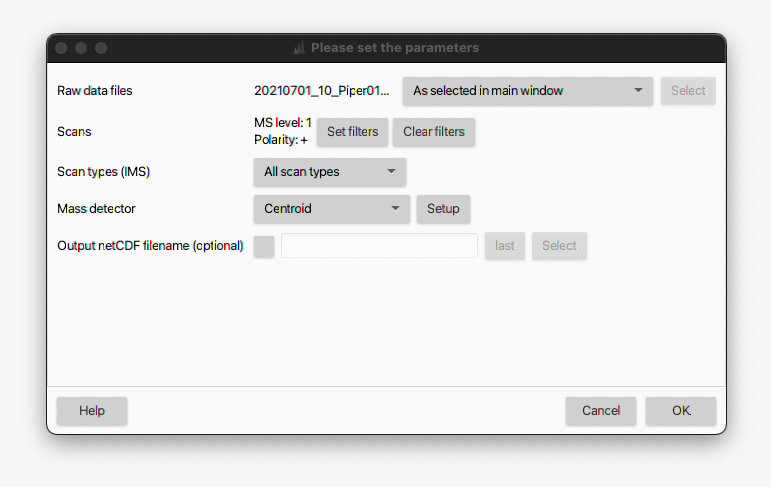
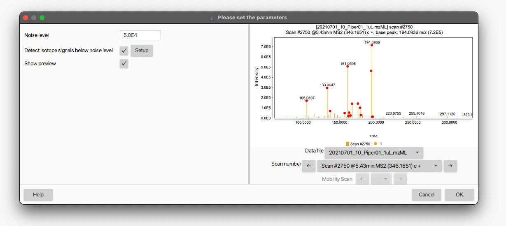
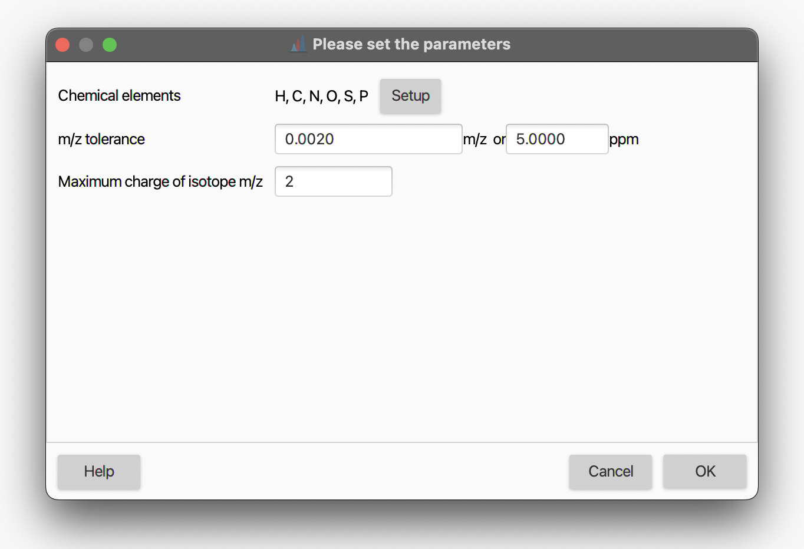

# **Mass detection**
The mass detection module generates a [mass list](../../terminology/general-terminology.md#mass-list) (_i.e._ list of m/z values and correspoinding signal intensities) for each scan, in each raw data file. During the mass detection, profile raw data are centroided and a noise filtering is performed based on a user-defined threshold (see [Setting the noise level](#setting-the-noise-level)).

---
## **Parameters settings**
:material-menu-open: Raw data methods → Mass detection → Mass detection

#### **Raw data files**
Select the input raw data files for the mass detection. All the imported data files can be processed in bulk (_i.e._ _All raw data files_), or a subset can be selected directly from the _MS data files_ panel (_i.e._ _As selected in the main window_) or based on the filename (_i.e._ _File name pattern_) As an alternative, the files' directory can be also specified (_i.e._ _Specific raw data files_). Finally, if the _Those created by previous batch step_ option is selected, MZmine takes the output of the last processing step as input (particularly useful for [batch processing](../../workflows/batch_processing/batch-processing.md)

#### **Scans**
Select (or filter out) the MS scans to be processed. Several filters are avialble (_Select filters_ button). A scan number, RT and mobility range can be set (_i.e_ _Scan rnumber_, _Retention time_ and _Mobility_ options); only the scans belonging to the defined range(s) will be processed. The _Base Filtering Integer_ option allows to prcesses one every-_N_ scans. The _Scan definition_ field can be used to filter scans based on the scan's description normally included in the raw file's metadata (_e.g._ FTMS). Scans can also be filtered by _MS level_ (_i.e._ 1, 2, ..., _N_), polarity and spectrum type (_i.e._ Centroided, Profile and Thresholded).

#### **Scan types (IMS)**
This parameter applies only to IM data and determines if _mobility scans_, _frame scans_ or both (_i.e._ _All scan types_) are processed. For more details about _mobility_ and _frame scans_ see [here](../../terminology/ion-mobility-terminology.md#accumulations-mobility-scans-and-frames) for more details. 
:octicons-light-bulb-16: **Tip**. Since _frame scans_ are obtained by merging multiple _mobility scans_, the noise thresholds will likely be different. However, only one noise level can be set. Therefore, it might be advisable to perform the mass detection only on the _mobility scans_ and select the appropriate noise level. _Mobility scans_ can then be merged into _frame scans_ with a dedicated module (CREATE MODULE DOC). 

#### **Mass detector**
Select the algorithm to be used for the mass detection. Several mass detection algorithms are available and can be selected in the drop-down menu. The choice will depends on the raw data characteristics (profile/centroided, mass resolution, etc.). The _Centroid_ algorithm must be used for already-centroided data. A step-by-step guide to convert profile into centroided data is provided in the [GNPS documentation](https://ccms-ucsd.github.io/GNPSDocumentation/fileconversion/) Other algorithms are available for profile raw data and are described in more details [here](mass-detection-algorithms.md). The _Exact mass_ algorithm is highly recommended for profile HRMS data. When _Auto_ is selected, the _Centroid_ and _Exact mass_ algorithms are used by default for centroided and profile data, respectively.

### **Setting the noise level**
All the mass detection algorithms allow to set a threshold for the noise filtering (_i.e._ _Noise level_) by hitting thee _Setup_ button next to the _Mass detector_ field. A dialog box like the following will open up:

The noise threshold can be entered either in standard or scientific notation. By checking the _Show preview_ box, an interactive visualization panel will open to help the user to adjust the noise level (see also [How do I determine the noise level in my data?](#how-do-i-determine-the-instrumental-noise-level-in-my-data)). The red dots denotes the mass signals retained in the mass list according to the set threshold. Different data files and scan numbers can be visualized using the corresponding drop-down menus. 

### **Detect isotope signals below noise level**
The _Centroid_ and _Exact mass_ algorithms provide the option to retain signals that are below the noise level (and would be otherwise discarded), but correspond to isotopes of the detected masses. Theoretical isotopic distributions are calculated for each mass detected in the _mass list_ based on the speciefied chemical elements. If a signal below the noise threshold that matches a theoretical isotopic mass is found in the raw data, it will be included in the final mass list.

:octicons-light-bulb-16: **Tip**. In the case of LC-MS data processing, the low-intensity isotope signals included in the final mass list will undergo the whole feature detection workflow (see, for example, [LC-MS data processing workflow](../../workflows/lcmsworkflow/lcms-workflow.md). Due to the low intensity, these masses often produce LC peaks with poor peak shape during the chromatogram building step and might be discarded if they do not meet the user-defined parameters (_e.g._ minimum number of data points and intensity, see [ADAP chromatogram builder](../featdet_adap_chromatogram_builder/adap-chromatogram-builder.md) for more details). Therefore, it might be advisable not to use this option during the mass detection, but rather use the Isotope finder module (CREATE DOC)

By ticking the corresponding checkbox and hitting the _Setup_ button, the following dialog box opens up:

#### **Chemical elements**
Elements considered when generating the isotopic distributions. Select the elements from the periodic table by hitting the _Setup_ button.

#### **_m/z_ tolerance**
Maximum allowed difference between measured and theoretical isotope _m/z_. It is an [intra-scan _m/z_ tolerance](../../terminology/general-terminology.md#intra--and-inter-scan-tolerances). The tolerance can be set in _m/z_, ppm or both. Since mass deviations expressed in ppm are dependent on the _m/z_ (_e.g._ higher at low _m/z_ and lower at high _m/z_), MZmine automatically uses the largest tolerance.

#### **Maximum charge of isotope _m/z_**
Maximum allowed charge state of the isotope to be retained in the mass list. Default value is 1.

### **How do I determine the instrumental noise level in my data?**
To-do.
The detector noise is usually determined by a lot of signals of the same intensity.

