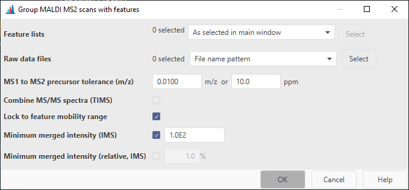

# **Assign MALDI MS2s to features**

## **Description**

:material-menu-open: **Feature list methods → Processing → Assign MALDI MS2s to features**

This module allows to pair MS2 scans with features. It uses the spot information stored in the MS1
feature list and the MS2 spectra, the precursor m/z, and the ion mobility windows to pair the MS2s.
Be careful when processing multiple imaging datasets with different geometries (multiple flexImaging
run files). Among different geometries, multiple spots can have the same coordinate, as they are
just stored as a location. This can lead to wrong assignments for abundant species. Make sure to
only select the correct MS2 files, e.g., with a more specific name pattern.

## **Parameters**

#### Feature lists

Select the feature lists to pair the MS2s to

#### Raw data files

The raw data files containing the MS2 spectra. By default, "File name pattern" with the pattern
"\*_MSMS\*" is selected, due to the naming of the MS2 files. More specific patterns, such as "
\*RUN1\*_MSMS*" can be used.

#### **MS1 to MS2 precursor tolerance (m/z)**

Describes the tolerance between the precursor ion in a MS1 scan and the precursor m/z assigned to
the MS2 scan.

#### **Combine MS/MS spectra (TIMS)**

If checked, all MS/MS spectra assigned to a feature will be merged into a single spectrum.
Individual spectra are retained. Usually this is not required, because MS2s can be merged during
library matching.

#### **Lock to feature mobility range**

If checked, only mobility scans from the mobility range of the feature will be merged.

:warning: This is usually not needed. However, if isomers/isobars elute at the same retention time
and are close in mobility, the MS/MS window might be larger than the peak in mobility dimension and
thus cause chimeric MS/MS spectra.

#### **Minimum merged intensity**

If an ion mobility spectrometry (IMS) feature is processed, this parameter can be used to filter low
abundant peaks in the MS2 spectrum, since multiple MS/MS mobility scans need to be merged
together.

{{ git_page_authors }}
