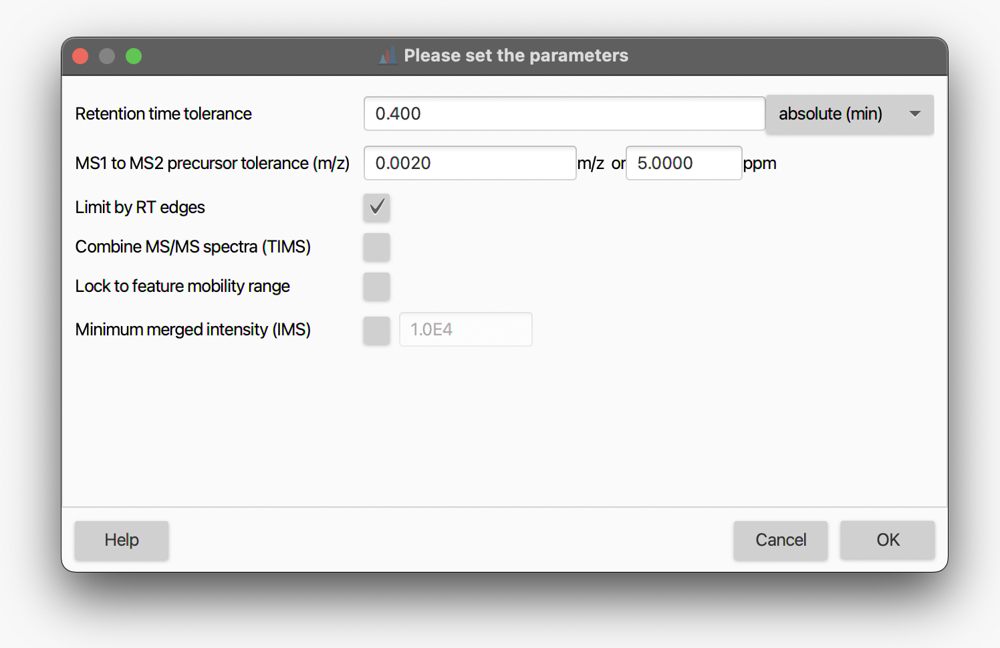

# MS2 Scan Pairing

## Description

:material-menu-open: **Feature list methods → Processing → Assign MS2 to feature**

This module pairs MS2 (fragmentation) scans with features in a feature list. For each feature,
all MS2 scans whose precursor m/z and retention time fall within the configured tolerances are
assigned. One MS2 scan can be assigned to multiple features when they overlap in m/z and RT.

For **ion mobility (TIMS/PASEF)** data, mobility scans within each PASEF frame are merged into a
single MS/MS spectrum per frame rather than assigned individually. An optional second merge step
can further combine spectra across frames and collision energies.

After pairing, the distance between each feature's apex RT and its closest MS2 scan is stored as
metadata (`RT MS2 apex distance`).

## Parameters

#### Feature lists

The feature list(s) to process.

#### MS1 to MS2 precursor tolerance (m/z)

The m/z tolerance used to match a feature's m/z to the precursor m/z recorded in each MS2 scan.
Default: ±0.01 Da or ±10 ppm (whichever is larger).

#### Retention time filter

Controls which MS2 scans are eligible based on retention time. Two modes are available:

- **Use feature edges** — only MS2 scans acquired within the chromatographic peak boundaries
  (RT start to RT end) are accepted. This is the recommended default.
- **Use RT tolerance** — MS2 scans within a fixed RT window around the feature apex are accepted.
  Default tolerance when this mode is selected: ±0.2 min.

#### Minimum relative feature height _(Optional, enabled by default)_

When one MS2 scan matches multiple features, this filter removes assignments to features whose
height is less than X % of the tallest feature sharing that MS2. This prevents low-intensity
co-eluting features from claiming MS2 spectra that clearly belong to a dominant peak.
Default: 25 %.

#### Minimum required signals _(Optional, enabled by default)_

Only assign an MS2 scan to a feature if the scan's mass list contains at least this many signals
after mass detection. Requires that mass detection has been run before this module.
Default: 1.

!!! warning

    Mass detection must be run before this module if **Minimum required signals** is active,
    because the filter reads from the processed mass list, not raw intensities.

#### Limit by ion mobility edges _(TIMS)_

If enabled, only mobility scans whose mobility value falls within the feature's mobility range are
included when merging PASEF spectra. Disabled by default.

!!! tip

    Enable this option only when isobars or isomers co-elute at the same RT and overlap in the
    mobility dimension, causing chimeric MS/MS spectra. Investigate with the **All MS/MS** viewer
    before enabling.

#### Merge MS/MS spectra (TIMS)

If enabled, all assigned MS/MS spectra for a feature that share the same collision energy are
merged into a single spectrum, and those are further merged into a consensus spectrum across
all collision energies. Disabled by default.

#### Minimum detections in IMS dimension _(TIMS)_

During PASEF acquisition, multiple mobility scans are recorded per precursor within one IMS ramp.
This filter requires a fragment signal to appear in at least N consecutive mobility scans before
it is retained in the merged spectrum. Random electrical noise is typically detected only once
per m/z bin, so this effectively suppresses noise while preserving real fragment ions detected
repeatedly.

Default: 2. Typical range: 1–4. Higher values reduce noise but may discard real low-intensity
fragments.

!!! tip

    Set to 1 to reproduce the behavior of mzmine ≤ 4.4.

#### Advanced parameters _(Optional, collapsed by default)_

Additional parameters for special acquisition modes. Expand the section to configure them.

##### Minimum signal intensity (absolute, TIMS) _(Optional, disabled by default)_

After merging PASEF mobility scans, discard any merged fragment signal below this absolute
intensity threshold. Useful when merged spectra still contain low-level noise after the IMS
detection filter. Default value when enabled: 250.

##### Minimum signal intensity (relative, TIMS) _(Optional, enabled by default)_

After merging PASEF mobility scans, discard any merged fragment signal below this fraction of
the base peak intensity. Default: 1 % (0.01).

!!! note

    Both TIMS noise filters were moved from the main parameter panel to **Advanced parameters**
    in mzmine ≥ 4.4.3 and are disabled by default (relative filter is enabled). Use the advanced
    section to restore the previous behavior.

##### Group iterative MS2s _(Optional)_

Enables pairing of MS2 scans from separate MS2-only raw data files (e.g., iterative exclusion or
AcquireX experiments) to features detected in a corresponding MS1 quantification file.

Requires a project metadata column that maps each MS2-only file to the name of its paired
MS1 quantification file. The default expected column name is `mainQuantFile`.

**Example:** For files `A_main` (MS1 + MS2), `B_MS2` (MS2 only), and `C_MS2` (MS2 only),
the metadata column `mainQuantFile` in rows for `B_MS2` and `C_MS2` should contain `A_main`.
The module will then pair MS2 scans from `B_MS2` and `C_MS2` to features detected in `A_main`.

---

## Algorithm {#algorithm}

For each feature list row, the processor iterates over every feature:

1. **Candidate MS2 lookup** — All DDA MS2 scan infos for the raw data file are indexed by
   precursor m/z. A binary search retrieves candidates within the configured m/z tolerance.
2. **RT and polarity filtering** — Candidates are filtered by the RT filter (feature edges or
   fixed tolerance) and must match the feature's polarity.
3. **Minimum signals filter** — Scans below the minimum signal count in their mass list are
   removed.
4. **TIMS path** — For TIMS/PASEF data, eligible PASEF MS/MS info objects are identified per
   PASEF frame. Mobility scans within each frame are merged using summed intensity merging
   (`SpectraMerging.getMergedMsMsSpectrumForPASEF`), applying the absolute and relative noise
   thresholds and the IMS detection count filter. If **Merge MS/MS spectra (TIMS)** is enabled,
   spectra from different frames and collision energies are further merged into a consensus spectrum.
5. **Relative height refinement** — After all features are processed, assignments where the
   feature's height is below the configured fraction of the maximum co-assigned feature are removed
   by `GroupedMs2RefinementProcessor`.
6. **RT apex distance** — For features with assigned MS2 scans, the RT difference between the
   closest MS2 and the feature apex is stored in the `RtMs2ApexDistanceType` feature data column.

---

{{ git_page_authors }}
