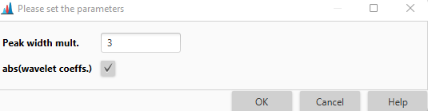

# **ADAP resolver**

## **Description**

:material-menu-open: **Feature detection → Chromatogram resolving → ADAP resolver**

ADAP detects EIC peaks by using the **continuous wavelet transform (CWT)** algorithm. Wavelet coefficients are first calculated as the inner product between the EIC and wavelets at different scales and locations. 

Subsequently, peak location and boundaries are determined through a **ridgeline detection** and simple local minima search. 

[//]: # (Though the algorithm uses a CWT is differs significantly from centWave primarily in the ridgline detection algorithm.)

## **References**

!!! quote " "

    1. Du, P., Kibbe W. A., and Lin S. M., Bioinformatics 2006, 22:2059-65.

    2. Wee A., Grayden D. B., Zhu Y., Petkovic-Duran K., and Smith D., Electrophoresis 2008, 29:4215-25.

### **Ridgeline detection**

A real peak in an EIC should create a **local maxima** in the wavelet coefficients at multiple scales. The best scale would create the largest coefficient. In case of the wavelet, it is the scale, for which the wavelet most closely matches the shape of the peak. Scales close to the best scale should also have reasonably similar shapes to the peak and therefore create adjacent maxima between those scales. 

**Ridgelines** are the series of connected local maxima across scales, which are indicative of a real peak. 

The applied procedure for detecting the ridgelines is similar to that described by Du et al. [[1](#references)] and Wee et al. [[2](#references)] and is as follows:

1. Begin with the coefficients corresponding to the largest wavelet scale.
2. Find the largest coefficient at this scale and initialize a ridgeline.
3. Remove all coefficients that are within half the estimated compact support of the **Ricker wavelet** (2.5 times the current scale).
4. Find the next largest coefficient discounting all removed coefficients and initialize another ridgeline.
5. Repeat steps (3)-(4) until there are no more coefficients remaining for this wavelet scale.
6. Move to the next scale (decrease by one) and repeat (1)-(6). Add new coefficients to an existing ridgeline if they are close in RT. 

    We define "close" to be a difference in their indices that is less than or equal to the current scale being investigated.
7. After all scales have been processed, ridgelines must have a **length**, i.e., the total number of scales represented in the ridgeline, greater than or equal to 7.

### **Signal-to-Noise threshold estimation**

#### **Intensity-based**

[//]: # (TODO Check the threshold algorithms if the description fully matches the implementation)

To calculate it, S is chosen to be the maximum intensity between the boundaries of the feature under investigation. Noise, N, is estimated using two different steps. The final estimate of N is the smaller value, which is then used to calculate S/N. Each estimation of the noise attempts to avoid overestimate from the accidental inclusion of other real features that may be close in RT.

**Step 1**:

1. Set two windows, one on each side of the peak in the EIC. The windows begin at the left and right peak boundaries and end at the peak boundaries plus or minus 2 times **peak width (PW)**, respectively. PW is defined to be the number of scans between the two boundaries of a peak.
2. Calculate the standard deviation of the intensities in the two combined windows and store it as one possible value of the noise.
3. Expand both windows out from the peak by a single scan. The boundaries closest to the peak remain the same. After the first expansion, each window has a length of 2 times PW+1.
4. Calculate and store the standard deviation of the intensities in the combined windows.
5. Repeat steps (3)-(4) until each window has a length of 8 times PW.
6. Incrementally shrink each window by one scan, calculating and storing the standard deviations of the combined windows. The windows are shrunk by moving the boundary closest to the peak toward the boundary furthest from it.
7. Repeat step (6) until the window size is 2 times PW. The final noise estimate is taken to be the smallest stored standard deviation.

**Step 2**:

1. Same as (1) in step 1.
2. Same as (2) in step 1.
3. Shift each entire window away from the feature by one scan; the window lengths do not change.
4. Repeat steps (2)-(3) until each window's boundary furthest from the feature is 8 times PW from the closest boundary of that feature.
5. The final noise is taken to be the smallest stored standard deviation.

#### **Wavelet coefficients-based**

The magnitude of the wavelet coefficient alone is not sufficient for determining if a feature is real due to its strong dependence on the intensities of the data points used in calculations. 

To ensure that low-intensity features can be reliably detected and that poorly shaped peaks can be reliably filtered out, the largest coefficient, $Cmax$, for a given feature is taken and divide it by the area, $A$, under the curve between the two boundaries of the peak. 

Then the area is calculated using a trapezoidal method so that $A$ is exactly the area under the curve created by connecting adjacent data points with straight lines. 

The result is a measure for which large values correspond to the features similar in shape to the wavelet. 

One important property of $Cmax/A$, is that intermittent dips in the intensity can increase the value due to the reduced area. This is beneficial for finding messy low-intensity features but can also be problematic if the area is so small it results in the detection of a feature with a very bad shape.

## **Parameters**

#### **Suffix**

This string is added to feature list name as suffix

#### **Original feature list**

Defines the processing.

Standard is to KEEP the original feature list and create a new processed list.

REMOVE saves memory.

PROCESS IN PLACE is an advanced option to process directly in the feature list and reduce memory consumption more - this might come with side effects, apply with caution.

#### **MS/MS scan pairing**

Set MS/MS scan pairing parameters. For more details see [MS2 scan pairing](..//featdet_ms2_scan_pairing/ms2_scan_pairing.md)

#### **Dimension**

Select the dimension to be resolve - either retention time, or mobility.

#### **S/N threshold**

The signal (S) to noise (N) ratio, S/N.

#### **S/N estimator**

There two options for S/N estimator:

- **Wavelet coefficient**

    If this parameter is chosen the calculations follow the algorithm described [here](#wavelet-coefficients-based)

    

    This uses two parameters:

    - **Peak width mult.** determines window size
    - **abs(wavelet coeffs.)** determines if the absolute values of coefficient are used

- **Intensity window SN**

   If this parameter is chosen the calculations follow the algorithm described [here](#intensity-based).

#### **Min feature height**

The smallest intensity a peak can have and be considered a real feature.

#### **Coefficient/area threshold**

The best coefficient (the largest inner product of wavelet with peak in ridgeline) divided by the area under the curve of the feature

#### **Peak duration range**

The acceptable range of peak widths. Features with widths outside this range will be rejected.

#### **RT wavelet range**

The range of wavelet scales used to build matrix of coefficients. Scales are expressed as RT values (minutes) and correspond to the range of wavelet scales that will be applied to the chromatogram. Choose a range that is similar to the range of feature widths expected to be found from the data.

{{ git_page_authors }}