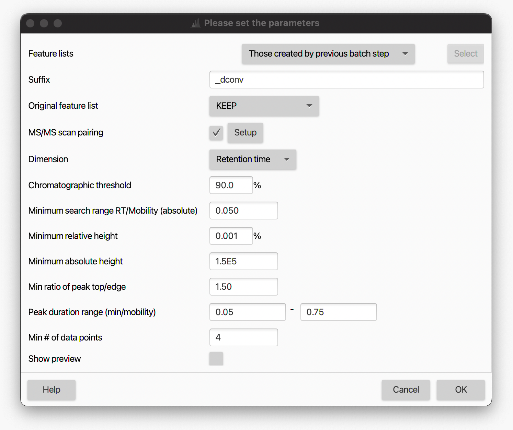
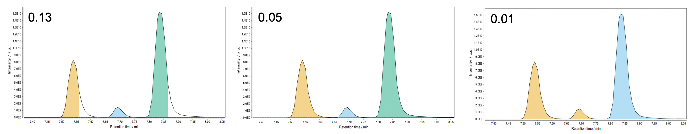
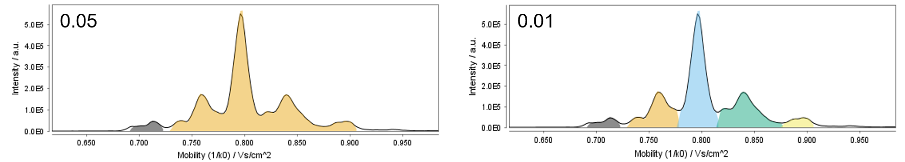

# **Local Minimum Resolver**

During the EICs building, overlapping and partially co-eluting peaks are retained as single features in the feature list (see, for example, [ADAP chromatogram builder](../lc-ms_featdet/featdet_adap_chromatogram_builder/adap-chromatogram-builder.md)). The _local minimum resolver_ module aims at splitting such "shoulder" LC peaks into individual features (_i.e._ [chromatographic resolving](../../terminology/general-terminology.md#chromatographic-resolving)) based on local minima. In fact, a local minimum in the EIC trace might correspond to the valley between two adjacent, partially-resolved peaks.

The algorithm examines all the data points in the EIC trace starting from the earliest RT. A scan window is set (see [Minimum search range RT/Mobility](#minimum-search-range-rtmobility-absolute) parameter) and centered around the examined data point. A data point is considered a local minimum if it is the lowest intense point within the scan window. When a local minumum is found, a set of user-defined intensity and peak duration requirements is checked. If they are fulfilled, the original overlapping peaks are split into new, distinct features. The LMR is particularly suitable for LC-MS data with little noise and nice peak shapes.

With the implementation of ion mobility (IM) support in MZmine 3, this module was expanded and can now be applied over both the RT and IM dimensions (see [Resolving the ion mobility dimension](#resolving-the-ion-mobility-dimension)).

---
## **Parameters settings**
:material-menu-open: Feature detection → Chromatogram resolving → Local minimum resolver

#### **Suffix**
String added as suffix to when creating the new feature list(s).

#### **Original feature list**
Keep or remove the input feature list(s). The _PROCESS IN PLACE_ option directly filter the input feature list and performs better in terms of memory usage; therefore, it is recommended over _REMOVE_, when available.

#### **MS/MS scan pairing**
Pair MS/MS fragmentation spectra collected in [DDA](../../terminology/general-terminology.md#data-dependent-acqusition-mode) mode to the resolved features. This is optional at this stage as the same can be done later in the pipeline using a separate [module](../featdet_ms2_scan_pairing/ms2_scan_pairing.md). See [MS2 scan pairing](../featdet_ms2_scan_pairing/ms2_scan_pairing.md) documentation for more details.

#### **Dimension**
Dimension to be resolved. Select _Retention time_ or _Mobility_ to run the module over the RT or IM dimension, respectively.

#### **Chromatographic threshold**
Percentage of data points in the EIC removed before local minima search. This represents an important filter for noisy chromatogram and significantly reduces the precessing time. 
The algorithm finds the intensity value (threshold) that leaves the specified percentage of data points in the EIC trace below XXX. All such data points are removed. For example, a _Chromatographic threshold_ = 50% will discard the lowest-intense 50% data points in the EIC trace.

💡 **_Tip_**. It must be noted that the algorithm examines the EICs throughout the entire RT range (_i.e._ also the zero data points are considered). Therefore, we recommend to set this value rather high (_e.g._ 90-95%) and lower it only if needed.

💡 **_Tip_**. When [resolving the ion mobility dimension](#resolving-the-ion-mobility-dimension), we recommend to lower this settings to no more than 80% since [mobilograms](../../terminology/ion-mobility-terminology.md#mobilograms) contains less data points than regular LC traces.

#### **Minimum search range RT/Mobility (absolute)**
Size of the RT, or mobility, window examined for local minimum search. An overly narrow search range can cause peak edges to be cut off, whereas a too wide search ranges might lead to an incomplete resolution of narrowly eluting peaks (see example below).

💡 **_Tip_**. A shorter _Minimum search range_ is generally needed when [resolving the ion mobility dimension](#resolving-the-ion-mobility-dimension).

#### **Minimum relative height**
Minimum relative intensity (respect to the highest data point in the EIC) a peak need to reach to be retained as a feature. This parameter can be used in combination with the [Minimum absolute height](#minimum-absolute-height)) setting as to filter the resolved features to be retained. Many users prefer to rely only on the _Minimum absolute height_ as it is more straightforward to set. To do so, set the _Minimum relative height = 0_ and the parameter will be ignored. 

💡 **_Tip_**. Modern mass spectrometers provides linear dynamic ranges up to 5 orders of magnitude. If we take an Orbitrap device with a detector saturation around 1.0E10 intensity, a _Minimum relative height_ = 0.001 would correspond to a 1.0E5 minimum intensity.

#### **Minimum absolute height**
Minimum absolute intensity a peak needs to reach to be retained as a feature. This parameter is very similar to the [Min highest intensity](../lc-ms_featdet/featdet_adap_chromatogram_builder/adap-chromatogram-builder.md#parameters) settings in the ADAP chromatogram builder module and the same concepts apply.

💡 **_Tip_**. When resolving the RT dimension, the same value used as [Min highest intensity](../lc-ms_featdet/featdet_adap_chromatogram_builder/adap-chromatogram-builder.md#parameters) in the EICs building can normally be used here.

💡 **_Tip_**. While [frame scans](../../terminology/ion-mobility-terminology.md#accumulations-mobility-scans-and-frames) are examined over the RT dimension, [mobility scans](../../terminology/ion-mobility-terminology.md#accumulations-mobility-scans-and-frames) are examined over the IM dimension. Therefore, this parameter might need to be adjested accordingly when [resolving the ion mobility dimension](#resolving-the-ion-mobility-dimension). 

#### **Min ratio of peak top/edge**
Minimum ratio between the intensity of the highest (apex) and side (left and right 'edges') points of a peak, to retain it as a feature. The peak edges have to be X times less intense than the peak apex for the feature to be retained. The purpose of this parameter is to reduce the detection of false local minima when the exaimend trace (EIC or _mobilogram_) is not smooth. In general, this mainly affects low intensity and not-baseline-resolved signals

💡 **_Tip_**. This parameter can best be optimized using the _Show preview_ option. We recommend values between 1.7 (not baseline separated) and 2 to start the optimisation.

#### **Peak durantion range (min/mobility)**
Range of acceptable peak length expressed in minutes (RT dimension) or absolute units (mobility dimension). This parameter can be used to filter out noisy features based on their overly short (or long) duration.

#### **Min # of data points**
Minimum number of data points a resolved peak needs to have to be considered valid and retained as a feature. This parameter can be used along with the [Peak duration range](#peak-durantion-range-minmobility) setting as  peak duration constraint to filter out noisy features.

💡 **_Tip_**. This parameter is very similar to the [Min group size in # of scans](../lc-ms_featdet/featdet_adap_chromatogram_builder/adap-chromatogram-builder.md#parameters) settings in the ADAP chromatogram builder module and the same value can normally be used here (usually, no less than 4-5).

💡 **_Tip_**. A feature in the IM dimension is normally made up of more data points than regular LC peaks. Therefore, a higher _Min # of data points_ can be set when [resolving the ion mobility dimension](#resolving-the-ion-mobility-dimension) to filter out noisy features.

#### **Show preview**
By checking this box, an interactive visualization panel will open to help the user to adjust the algorithm parameters. Two EIC traces can be dispalyed simoultaneously in two sub-panels to assess the impact of chosen settings on both "good" and "noisy" EIC traces. The feature list and EIC traces to display can be selected from the corresponding drop-down menus. A noisy EIC can generally be found by sorting the feature table by decreasing area, or by looking at the height/area ratio provided for each feature in the top sub-panel (noisy EIC tend to have low height/area ratios). We recommend optimising the parameters on good EICs and checking the results of these parameters with a noisy EIC.

---
## Resolving the ion mobility dimension
This same module can be used to resolve features co-eluting in the RT dimension, based on their ion mobility. The same concepts apply as in the resolution of the RT dimension. However, [_mobilograms_](../../terminology/ion-mobility-terminology.md#mobilograms) are examined instead of EIC traces and the same settings used for the RT dimension might not be optimal when resolving IM data. In particular, the following aspects should be born in mind:

1. While [_frame scans_](../../terminology/ion-mobility-terminology.md#accumulations-mobility-scans-and-frames) are examined over the RT dimension, [_mobility scans_](../../terminology/ion-mobility-terminology.md#accumulations-mobility-scans-and-frames) are considered over the IM dimension. As explained [here](../../terminology/ion-mobility-terminology.md#accumulations-mobility-scans-and-frames), _frame scans_ are essentially obtained by merging the _mobility scans_ acquired over an IM accumulation. Therefore, it might be necessary to adjust parameters like [Minimum absolute height](#minimum-absolute-height) or [Min ratio of peak top/edge](#min-ratio-of-peak-topedge) to account for the lower signal intensity of _mobility scans_.

2. [_Mobilograms_](../../terminology/ion-mobility-terminology.md#mobilograms) are recalculated from  raw data, even though a [smoothing](../featdet_smoothing/smoothing.md) step was previously applied. Non-smoothed _mobiligrams_ tend to be more jagged than regular EIC traces (see Figure). Threfore, some parameters (_e.g._ [Min search range](#minimum-search-range-rtmobility-absolute) and (_e.g._ [Min ratio of peak top/edge](#min-ratio-of-peak-topedge)) should be adjusted accordingly.

3. _Mobilograms_ contain less scans (_e.g._ ≈400-1000 per [frame](../../terminology/ion-mobility-terminology.md#accumulations-mobility-scans-and-frames), depending on instrument type and acquisition settings) compared to regular EICs (_e.g._ ≈4500 scans for 15 minutes LC run and scan rate of 0.2 seconds). Therefore, a lower [chromatographic threshold](#chromatographic-threshold) (_e.g._ 80%) is recommended to avoid relevant data points in the mobilogram being discarded.

    On the other hand, a single feature in the IM dimension is normally made up of more data points than regular LC peaks, due to the different timescale the IM separation is performed on (see [here](../../terminology/ion-mobility-terminology.md#background) for more details). Therefore, a higher _Min # of data points_ can be set when [resolving the ion mobility dimension](#resolving-the-ion-mobility-dimension) to filter out noisy features.

4. Different vendors use different units of mobility. For instance, [TIMS](../../terminology/ion-mobility-terminology.md#trapped-ion-mobility-spectrometry-tims) express ions' mobility as Vs/cm2, whereas [time dispersive IM devices](../../terminology/ion-mobility-terminology.md#time-dispersve-ion-mobility-spectrometry-dtims-and-twims) (DTIMS and TWIMS) use the ions' drift time (expressed in milliseconds). TIMS values are numerically smaller than DTIMS or TWIMS; therefore, the [minimum search range](#minimum-search-range-rtmobility-absolute) parameter should be adjusted accordingly. 
