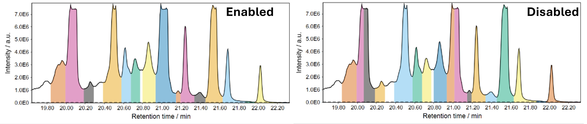

# Wavelet resolver

!!! info

    This feature resolver is currently in beta phase (11.2025). (Added after mzmine 4.8.5)

!!! Note

    Wavelet resolver vs. [Local minimum resolver](../featdet_resolver_local_minimum/local-minimum-resolver.md):

    While the local minimum resolver is the quicker resolver, it may struggle with chromatograms with high baseline
    and peaks on top said baseline. The wavelet resolver takes longer to compute, but may outperform the local minimum.  

## Parameters

#### Signal-to-noise threshold

Minimum required signal-to-noise ratio of a peak. The noise is calculated by the standard
deviation ($STD$)
or median absolute deviation ($MAD$) (see [noise calculation](#noise-calculation)
and [noise window factor](#noise-window-factor)). The signal
height ($S$) is determined by the peak height minus the average of the two edges.

$$\text{Signal-to-noise} = S/N$$

$$S = I_{peakTop} - \frac{I_{leftEdge}-I_{rightEdge}}{2}$$

$$N = STD(Background) \text{ or } MAD(Background)$$

#### Top to edge (SNR override)

If a potential feature does not match the SNR threshold, check if the top/edge ratio is above this
threshold.

#### Minimum height

Minimum absolute required of a signal to be retained as a feature.

#### Noise calculation

Choose a method to calculate the noise around a potential signal.
Other closely eluting signals are not used for noise/background calculation.

Default: Standard Deviation

#### Dip filter

Filters V-shaped dips in the baseline that are caused by instable sprays and may behave like
an unresolved double peak.

Default: enable for LC-MS, disable for GC-EI-MS

Example: Dip detected as feature without the dip filter enabled.

## Advanced parameters

#### Scales

Scales (widths) of the wavelets. Multiple wavelets allow detection of signals of varying widths.
More scales increase the processing time.
Larger scales allow recognition of wider peaks, small scales allow recognition of narrower peaks.
This scales with the number of points per peak, but should not be seen as a 1:1 factor. (A scale of
1 will not cause recognition of peaks with only 1 signal).

If disabled/default: 0.5, 1.0, 1.5, 2.0, 3.0, 5.0, 8.0, 10.0

#### Noise window factor

The window around a potential signal to calculate the signal-to-noise ratio in.
The window is defined by this factor multiplied by the peak width.
Only signals that do not belong to a potential other peak are used for noise calculation. At least 6
signals must be found to calculate the noise by the selected [noise calculation](#noise-calculation)
method. Otherwise the top-to-edge ratio of the signal must match the selected SNR.

If disabled/default: 3 is used

#### Required fitting scales

Minimum number of fitting wavelet scales for a peak to be retained.

If disabled/default: 2
Note: Enable and set to 1 to disable this filter

#### Apply robustness iteration

Regions of potential peaks are not used for noise calculation. This may cause too many regions being
excluded.
Applying a second iteration allows more robust noise calculation for signals in crowded regions of
the chromatogram.

Default: true

#### Edge detection

Define an algorithm to detect the edges of a peak.
Local minimum: Continues the search for a minimum as long as the next point (within a tolerance
depending on peak width) is lower than the previous.
Absolute minimum: Continues the search as long as the next point (within a tolerance depending on
peak width) is lower than the previous absolute minimum.
Slope: Continues the search until an increasing slope is reached. Uses varying window width
depending on peak width.

If disabled/default: Absolute minimum is used

#### Allow sign changes every N points

Removes noisy signals with lots of up/down movement.

If disabled: 2 is used.
To not use this filter enable and set to 1.

#### Maximum ratio of similar height signals in background

Noisy baselines may pass the SNR filter due to low standard deviation if the baseline is relatively
stable.
This filter checks if there are a lot of signals with a similar absolute height (80%) as a potential
peak.
If that is the case, the peak is removed.

If disabled: (0.10) will be used as default.
Note: A value of 1 disables this filter.

#### Saturation filter

Detects if a peak has a flat top signal due to saturation of the MS detector.

Default: true

