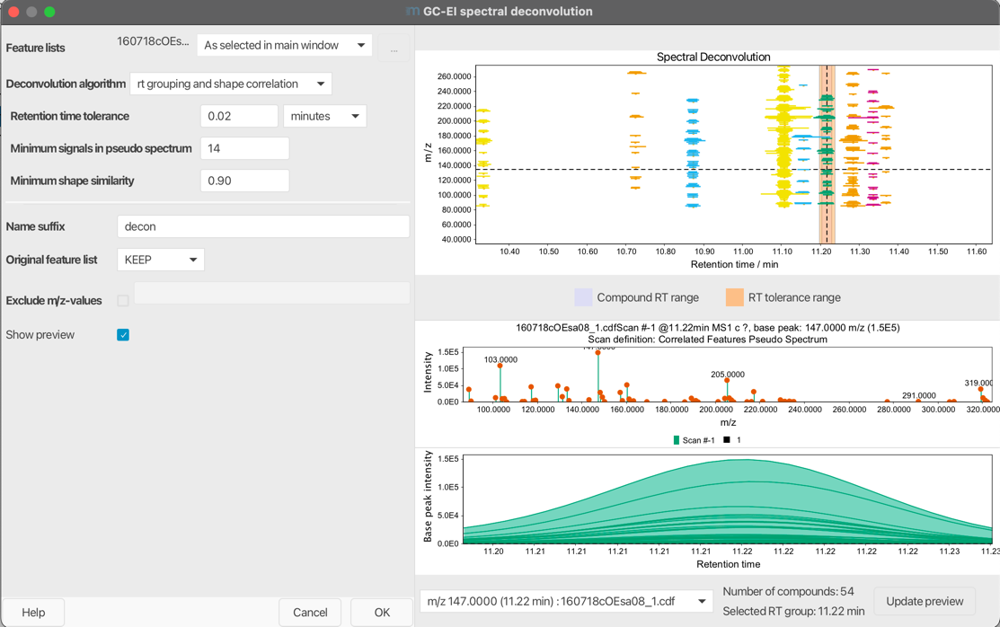

# GC-EI spectral deconvolution

:material-menu-open: **Feature list methods → Spectral deconvolution (GC) → GC-EI spectral deconvolution**

This ADAP-inspired module groups resolved features into pseudo spectra representing deconvoluted GC-EI spectra. Features are clustered by retention time and peak shape similarity to reconstruct the fragmentation spectrum of each co-eluting analyte.

!!! info "Prerequisite"
    This module requires resolved features. Run feature resolving (e.g., Local Minimum Resolver) before applying spectral deconvolution.

## Parameters

### Deconvolution algorithm

The **RT grouping and shape correlation** algorithm clusters features by retention time. Within each RT window, shape correlation (Pearson) against the most abundant representative feature filters out co-eluting interferences. Steps:

1. Sort all features by intensity (highest first).
2. For each feature, find all existing clusters whose representative RT falls within the specified tolerance.
3. If no cluster matches, start a new cluster.
4. If exactly one cluster matches, add the feature if its Pearson correlation with the representative meets the minimum threshold.
5. If multiple clusters match, select the one with the highest Pearson correlation (must still meet the minimum threshold).
6. Discard clusters with fewer signals than the configured minimum.

#### Retention time tolerance

Maximum RT difference (in minutes) between a feature and the cluster representative for the feature to be considered for that cluster. Default: **0.02 min**.

#### Minimum signals in pseudo spectrum

Minimum number of features required in a pseudo spectrum. Clusters below this threshold are discarded. Default: **10**.

#### Minimum shape similarity

Minimum Pearson correlation of a feature's RT profile to the cluster representative for the feature to be included. Range: 0–1. Default: **0.80**.

---

### Exclude m/z-values _(Optional)_

A list of m/z values or ranges (e.g., `1-50, 73, 100`) to exclude from being selected as the representative (model) feature for a pseudo spectrum. Excluded m/z values are still added to the pseudo spectrum but are not used as the cluster anchor unless all features are excluded.

### Name suffix

String appended to the output feature list name. Default: **decon**.

### Remove original feature list

If enabled, the input feature list is removed after processing.

---

## Algorithm {#algorithm}

Features are sorted by descending intensity before clustering, so the most abundant ion always 
becomes the cluster representative. Pearson correlation is computed over the overlapping RT range 
between two features' intensity profiles. This ensures that only signals with co-eluting, 
shape-matched profiles are grouped into the same pseudo spectrum, reducing false grouping between 
compounds with similar but shifted elution profiles.

---

## Preview

The parameter dialog includes a live preview. Click **Update preview** to visualise the current results:

- **Upper plot** — features colored by assigned compound group. The grey band marks the RT range of the most abundant feature in the selected group; the orange band shows the RT tolerance.
- **Lower plots** — the deconvoluted pseudo spectrum and an overlay of grouped feature profiles for quality control.
- **Compound selector** — a combo box to navigate between groups, showing a summary of the selected representative feature and the total number of groups.

---

{{ git_page_authors }}
