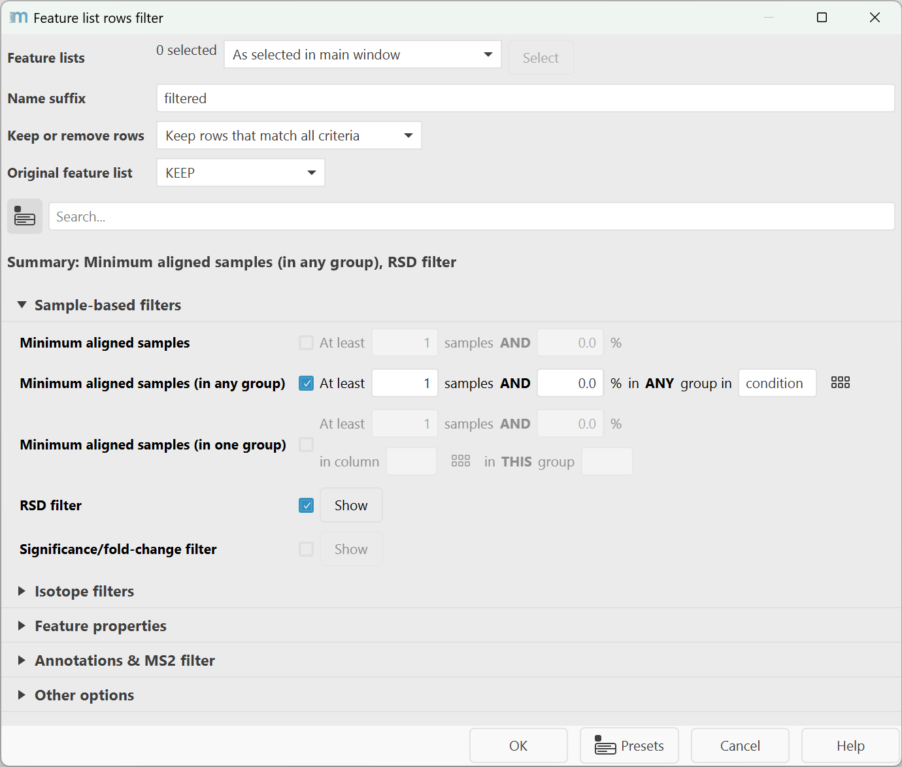

# **Feature list rows filter**

## **Description**

:material-menu-open: **Feature list methods → Feature list filtering → Feature list rows filter**

This module provides filters for many feature list row properties. The final resulting feature list
contains rows that **match all criteria** or those that match none, depending on the **Keep or
remove rows** parameter.

A range of different requirements can be set, such as the minimum number of features in the row, the
minimum number of features in an isotope pattern, peak duration etc.

Feature properties are referred to the representative row values for aligned feature list with
mutliple samples. This means that values like the feature's retention time are averages. Other
filters may use statistics across all samples.

## **Parameters**

The dialog holds the most important general parameters on the top to define the behavior of these
filters. All other parameters are grouped by topic and can be searched by the search bar. Selected
parameters are then displayed in the summary as links that, on mouse click, provide a quick filter
to find the parameters for setup.

#### Feature lists

Select the feature lists to apply the filters to.

#### Name suffix

Suffix to be added to the resulting feature list name.

#### Keep or remove rows

Select to either keep or remove the rows that match all defined criteria. Default is to keep rows
that match criteria.

#### Original feature list

It can be either processed in place, kept or removed.

### Sample-based filters

#### Minimum aligned samples (previously Minimum features in a row)

Minimum number of samples a feature needs to be detected in a row across all samples to match.
The value can be set both as an absolute number and a percentage of samples that both need to match.
The percentage can help to scale the filter with increasing study sizes.

#### Minimum aligned samples (in any group)

Minimum number of samples a feature needs to be detected in **any group** in a **metadata column**.
The percentage is applied for each group separately.
The value can be set both as an absolute number and a percentage of samples that both need to match.

#### Minimum aligned samples (in one group)

Minimum number of samples a feature needs to be detected in one **specific group** in a **metadata
column**.
The value can be set both as an absolute number and a percentage of samples that both need to match.

#### RSD filter

Filters by the relative standard deviation of the abundance (height or area) in one metadata group.
This filter is often used with pooled QCs.

Define a sample group by selecting a metadata column and a group in that metadata column that may
only show a maximum relative standard deviation (= coefficient of variation). Only rows that show a
CV below the given value, will be retained. A good sample group for this application are pooled QC
samples. If a feature is not detected in all QC samples, it will be removed, unless the "Keep
undetected" option is enabled.

#### Significance/fold-change filter (_"Volcano plot filter"_)

Filter that works similar to the volcano plot on both the significance and fold-change between
samples from two groups. Requires internal setup of the abundance measure, missing value imputation,
significance test, and thresholds for the p-value and log2(fold-change).

Groups are selected from the project metadata, two groups in the same column.

### Isotope filters

Isotope filters require that the
**[13C isotope filter](../filter_isotope_filter/isotope_filter.md)** and/or
**[isotope finder](../filter_isotope_finder/isotope_finder.md)** modules were applied.

#### Minimum features in an isotope pattern

The required minimum number of signals in a row's isotope pattern. This is a basic filter and stems
from mzmine 2 that only considers the number of signals. It is better to use the more sophisticated
**Validate 13C isotope pattern** filter.

#### Validate 13C isotope pattern

Searches for a +1 13C signal (considering possible charge states) within an estimated range
of carbon atoms. Optionally: Detect and filter rows that are 13C isotopes by searching for the
preceding-1 signal.

#### Remove redundant isotope rows

Removes rows that are not the most intense or the monoisotopic peak in an isotope pattern.

### Feature properties

#### m/z

Range of acceptable (average) m/z values in a row across all samples.

#### Retention time

Range of acceptable (average) retention times in minutes.

#### Chromatographic width (previously Features duration range)

Range of acceptable (average) feature durations as chromatographic widths in minutes.

#### Chromatographic FWHM

Range of acceptable chromatographic full-width at half maximum (FWHM) in minutes.

#### Charge

Range of row Charge

:warning: Please, run **[isotope finder](../filter_isotope_finder/isotope_finder.md)** to determine
charge.

#### Mass defect

Mass defect as a feature filter can be used for selective detection of compounds of interest, and
the values accepted are 0.314-0.5 or 0.90-0.15.

#### Kendrick mass defect

Filter features in a Kendrick mass defect (KMD) range. For more details
see [Kendrick mass defect](../../visualization_modules/kendrickmass/kendrick_mass_plot.md).

If KMD is used, following parameters can be changed in the setup.

- **Kendrick mass defect**
  Permissible range of a Kendrick mass defect per row
- **Kendrick mass base**
  Enter a sum formula for a Kendrick mass base, e.g. "CH2"
- **Shift**
  Enter a shift for shift dependent KMD filtering
- **Charge**
  Enter a charge for charge dependent KMD filtering
- **Divisor**
  Enter a divisor for fractional base unit dependent KMD filtering
- **Use Remainder of Kendrick mass**
  Use Remainder of Kendrick mass (RKM) instead of Kendrick mass defect (KMD)

### Annotations & MS2 filter

#### Never remove rows with MS2

If checked, all rows with MS2 are retained without applying any further filters on them.

#### Require MS2 scan (previously Feature with MS2 scan)

If checked, only features that have MS2 scan will be kept.

#### Never remove annotated rows

If checked, keep all rows with annotation and skip further filtering for them.

#### Flexible filter (e.g., annotation)

This filter is defined by a search type, matching mode, and textual query. In general, annotation
search types will match against any annotation like spectral library match, lipid match, or other
feature annotations from other modules. All annotations are considered, this means that sometimes a
row will match the filter but the reason is not the primary annotation visible but a secondary one
that may be hidden in the list of, e.g., library matches. The **comment (row)** search with modes *
*any** and **all** are useful options for row tagging and searching. Just insert comments in the
feature table comment column and use this filter.

[More details](../lc-ms_featdet/featdet_results/featdet_results.md#flexible-feature-list-filter)

#### Only identified?

If the checkbox is selected, only identified compounds will be retained.

#### Text in identity

Only rows that contain this text in their annotations will be retained. Check out the **flexible
filter** for better filtering options.

#### Text in comment

Only rows that contain this text in their comment field will be retained. Check out the **flexible
filter** for better filtering options like substring matching against the comment (row) type.

### Other options

#### Require other detector correlation

If checked, the rows that do not have at least one feature that is correlated to a signal of another
detector will be removed.

#### **Reset the feature number ID**

If checked, row IDs will be reset. This can be helpful for downstream tools that require consecutive
row IDs. Otherwise, the original IDs may provide better traceability throughout the mzmine data
processing.

{{ git_page_authors }}
