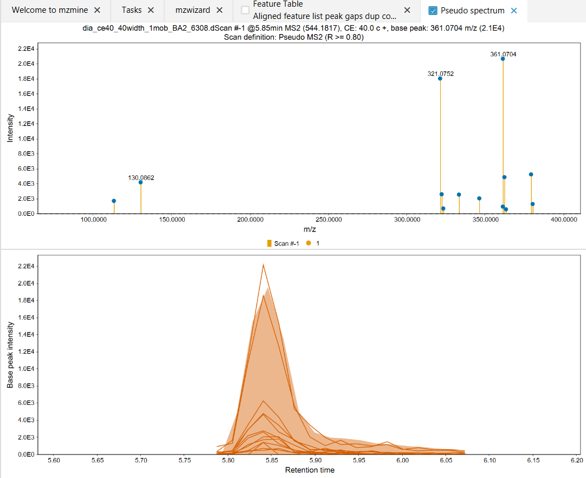
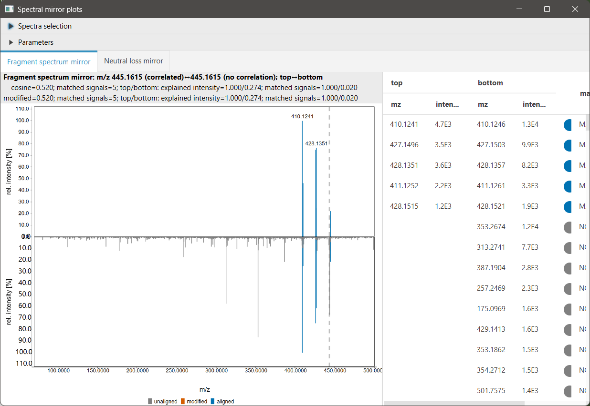

# DIA Pseudo MS2 Builder (experimental)

## Description

:material-menu-open: **Feature list methods → Feature list filtering → DIA pseudo MS2 builder**

In data-independent acquisition (DIA), all precursor ions within a broad (or cycling) isolation
window are co-fragmented simultaneously. There are no direct precursor–fragment pairs as in DDA.
This module reconstructs a **pseudo MS2 spectrum** for each MS1 feature by identifying MS2
fragment signals that co-elute with the feature across the retention time dimension, optionally
verified by Pearson correlation of their ion chromatograms.

!!! warning

    This module must be run **before alignment**, because it operates on single-file feature
    lists only. Running it on an aligned (multi-file) feature list will produce an error.

## Parameters

#### Feature lists

The feature list(s) to process. Must contain features from a single raw data file each.

#### MS2 scan selection

Selects which scans in the raw data file are treated as MS2 scans. The default selects all
scans at MS level 2. All permissible MS2 scans must have been processed
by [mass detection](../featdet_mass_detection/mass-detection.md).

#### Algorithm

Selects how pseudo MS2 spectra are paired to features. Two options are available:

---

### RT correlation _(default)_

Correlates the chromatographic shape (EIC) of each fragment ion with the MS1 feature shape over
the feature's retention time range. Only fragments with sufficient correlation are retained in the
pseudo spectrum. Both the MS2 scan selection and the quadrupole isolation window are taken into
account (quadrupole-aware).

#### RT correlation parameters

##### Minimum feature intensity

Only MS1 features with a height above this threshold are processed. Weaker features are skipped.
Default: 5 000.

##### Minimum fragment intensity

Only MS2 fragment ion traces with a maximum intensity above this threshold are considered as
candidates. Default: 1 000.

##### Number of correlated points

Minimum number of data points used for the Pearson correlation between the MS1 and MS2 EICs.
Should reflect the expected number of MS2 scans acquired across a chromatographic peak. Depends
on the DIA cycle time and chromatographic peak width. Default: 5.

##### Minimum Pearson correlation

Minimum Pearson correlation coefficient (R) between the MS1 feature shape and a fragment ion
EIC. Fragment ions below this threshold are excluded from the pseudo spectrum. Default: 0.80.

##### MS2 scan-to-scan m/z tolerance

m/z tolerance used for matching fragment ion signals across consecutive MS2 scans when building
fragment EICs. Default: ±0.005 Da or ±15 ppm.

##### Advanced parameters _(Optional)_

###### Relative intensity threshold _(Optional)_

Scans below this fraction of the chromatogram maximum are excluded from the correlation
calculation. This avoids correlating noise at the chromatographic baseline. Default: 0.1 %
(mzmine ≥ 4.8) / 10 % (mzmine < 4.8).

#### RT correlation algorithm

1. **Isolation window extraction** — DIA MS2 scans are grouped by their quadrupole isolation
   window (m/z range). Each unique isolation window is treated separately.

2. **Fragment EIC building** — Within each isolation window, the ADAP chromatogram builder is
   run on the MS2 scans to extract fragment ion chromatograms (EICs). The scan-to-scan m/z
   tolerance controls how signals are traced across scans.

3. **Feature–fragment correlation** — For each MS1 feature above the minimum intensity
   threshold, the isolation windows whose m/z range covers the precursor m/z are identified.
   For each candidate fragment EIC in those windows, the Pearson correlation with the MS1 feature
   shape is computed over the feature's RT range using at least **Number of correlated points**
   data points. Only fragments meeting the **Minimum Pearson correlation** threshold are kept.

4. **Pseudo spectrum assembly** — Retained fragments are assembled into a pseudo spectrum
   (`DIA_PSEUDO_MS2`). When multiple pseudo spectra are produced (e.g. from multiple isolation
   windows with the same collision energy), a consensus is computed retaining only fragment ions
   that appear in all individual spectra.

5. **Assignment** — The pseudo spectrum is assigned to the feature as its MS2.

---

### No correlation

Assigns the closest MS2 scan(s) to each feature by retention time without any shape correlation
filter. The isolation window is still checked (quadrupole-aware), so only scans whose isolation
window covers the feature's precursor m/z are considered. For IMS data, the mobility range is
also checked.

This option is faster but yields pseudo spectra (`UNCORRELATED`) that may contain fragment ions
from co-eluting precursors isolated in the same window.

!!! tip

    Run **RT correlation** first to assign high-confidence pseudo MS2s, then run **No
    correlation** (with **Replace existing MS2 spectra** disabled) to add MS2s to features
    that did not receive one from the correlation step.

#### No correlation parameters

##### Replace existing MS2 spectra

If enabled, any MS2 scans already assigned to a feature are replaced by the ones found by this
module. If disabled, features that already have MS2 scans are skipped. Default: disabled.

#### No correlation algorithm

1. For each feature, a binary search finds the MS2 scan closest to the feature's apex RT.
2. Scans are expanded outward from the apex until no scan falls within the feature's RT range.
3. Only one scan per collision energy is retained (the first matching one encountered).
4. For IMS data (diaPASEF), mobility scans within the feature's mobility FWHM are merged into
   a single pseudo spectrum; the isolation window and mobility range are both checked for a match.
5. The resulting pseudo spectra are assigned to the feature.

---

## Visualization

The results of DIA pseudo MS2 building can be inspected directly from the feature table. Right-click
any feature row and use the **Show** submenu.

### Pseudo spectrum

:material-menu-open: **Feature table → right-click → Show → Pseudo spectrum**

Opens a two-panel view for the selected feature:

- **Top panel (mass spectrum):** Displays the pseudo MS2 spectrum — each bar represents one
  fragment ion that was retained after correlation filtering. The x-axis is m/z and the y-axis
  is intensity.

- **Bottom panel (chromatograms):** Shows the extracted ion chromatograms (EICs) for the feature
  and all its pseudo MS2 fragment ions across the retention time range. The selected feature's
  own EIC is shown as a filled area; each fragment ion's EIC is overlaid as a line. Co-eluting
  fragments with high Pearson correlation will visually track the shape of the precursor EIC.

This view is the primary way to assess whether the correlation-based pairing has produced a
chemically sensible pseudo spectrum.

### DIA spectral mirror: correlated to all signals

:material-menu-open: **Feature table → right-click → Show → Dia spectral mirror: correlated to all
signals**

!!! note

    This option is only available for **ion mobility (IMS)** data.

Opens a mirror spectrum plot comparing two versions of the pseudo MS2:

- **Top spectrum (pointing up) — "Correlated":** The pseudo MS2 spectrum assigned to the
  feature after RT correlation filtering. Contains only fragment ions whose EIC shape matched
  the precursor feature above the **Minimum Pearson correlation** threshold.

- **Bottom spectrum (pointing down) — "All signals":** A merged reference spectrum built from
  all mobility scans within the feature's mobility FWHM that fall inside the feature's RT range.
  This represents every signal detected in the isolation window at this retention time and
  mobility, without any retention time correlation filter applied.

The cosine similarity score between the two spectra, the number of matched signals, and the
explained intensity are displayed alongside the plot. Matched fragment ions are highlighted and
listed in an interactive table.

**How to interpret:** Signals present in the top spectrum but absent in the bottom are artefacts
and indicate a problem. Signals present in the bottom but absent in the top were rejected by the
correlation filter — inspect the EICs in the **Pseudo spectrum** view to judge whether the
rejection was correct. A high cosine score between the two indicates that the majority of signal
intensity in the isolation window is explained by the correlated pseudo MS2.

---

{{ git_page_authors }}
