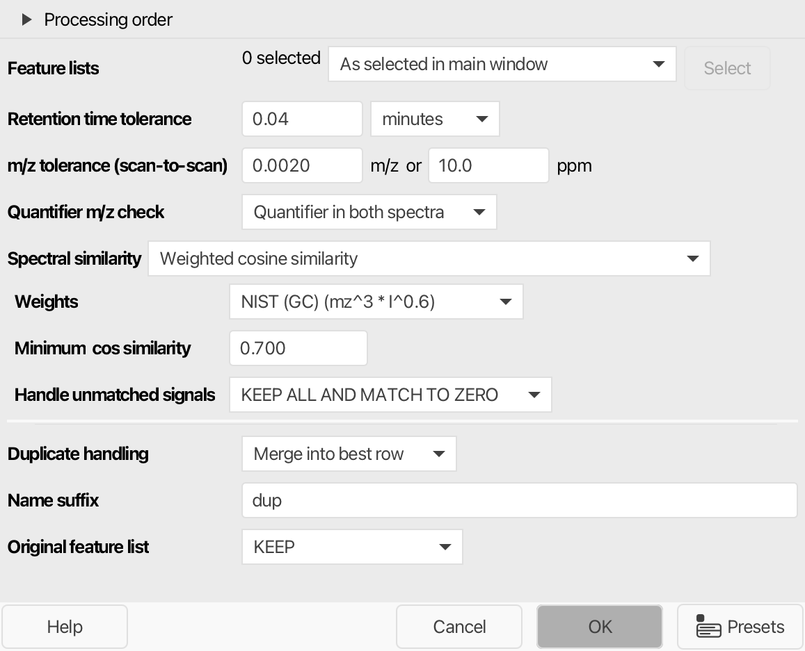

# GC-EI duplicate row filter

:material-menu-open: **Feature list methods → Feature list filtering → GC-EI duplicate row filter**

The alignment of GC-EI feature lists can split one compound into several rows, for example when
the compound was deconvoluted differently in some samples. After
[GC-EI gap filling](../gapfill_gc_ei/gc-ei-gap-filling.md), each of these rows may be filled in the
remaining samples, and the same compound then appears several times in the feature table.

The [Duplicate feature filter](../filter_duplicate_features/duplicate_feature_filter.md) compares
the average m/z and retention time of rows. That does not work well for GC-EI data:

- Rows of the same compound often have **different quantifier ions** (the m/z of the row), so a
  comparison of the row m/z misses them.
- Different co-eluting compounds often **share a common fragment ion** as quantifier, so a
  comparison of the row m/z would merge them.

The GC-EI duplicate row filter therefore compares the **retention time**, the **quantifier m/z**,
and the **deconvoluted pseudo spectra** of the rows. The best row of each group of duplicates is
kept. Its duplicates are removed, and their features can be merged into the best row.

!!! info "Prerequisites"

    - The rows need pseudo spectra from the
      [GC-EI spectral deconvolution](../featdet_spectraldeconvolutiongc/spectraldeconvolutiongc.md).
      Rows without a pseudo spectrum are not checked.
    - Run the filter after gap filling, for example
      [GC-EI gap filling](../gapfill_gc_ei/gc-ei-gap-filling.md).

The [processing wizard](../../wizard.md) adds this module to the GC-EI workflow directly after
GC-EI gap filling. It uses the intra-sample retention time tolerance, the scan-to-scan m/z
tolerance of the wizard, and the default settings shown below.

## Recommended citations

!!! info

    When using mzmine for your work, please consider citing: 
    Schmid R., Heuckeroth S., Korf A., et al. Integrative analysis of multimodal mass spectrometry data in MZmine 3, Nature Biotechnology (2023), doi:10.1038/s41587-023-01690-2.

---

## Parameters

#### Feature lists

The aligned GC-EI feature lists to filter.

#### Retention time tolerance

Maximum retention time difference between duplicate rows. After gap filling, rows of the same
compound have almost the same retention time, so a narrow tolerance is enough. Usually, use the
same retention time tolerance as for the
[GC-EI spectral deconvolution](../featdet_spectraldeconvolutiongc/spectraldeconvolutiongc.md).
Default: **0.04 min**.

#### m/z tolerance (scan-to-scan)

Used to merge the pseudo spectra of a row, to compare the pseudo spectra of two rows, to check the
quantifier m/z values, and to re-extract merged features. Default: **0.002 m/z or 10 ppm**.

#### Quantifier m/z check

Defines how the quantifier m/z values of two rows are compared:

- **Quantifier in both spectra**: The quantifier m/z of each row is a signal in the pseudo
  spectrum of the other row. This finds duplicates with different quantifier ions.
- **Same quantifier m/z**: Both rows have the same quantifier m/z. Use this to only merge rows
  that are quantified on the same ion.
- **No m/z check**: Only the retention time and the spectral similarity are compared.

Default: **Quantifier in both spectra**.

#### Spectral similarity

The algorithm and the minimum score to compare the pseudo spectra of two rows. Rows below the
minimum score are not duplicates. The pseudo spectra of all features in a row are merged into one
spectrum first (signals within the m/z tolerance are combined and their intensities summed).
See [spectral similarity measures](../id_spectral_library_search/spectral-similarity-measures.md)
for the available algorithms and their parameters.

Default: **Weighted cosine similarity** with the weights **NIST (GC)**, a **Minimum cos
similarity** of **0.7**, and **KEEP ALL AND MATCH TO ZERO** for unmatched signals. The
**Composite cosine identity** used by the [GC-EI aligner](../align_gcei/align_gc_ei.md) is also
available.

#### Duplicate handling

The best row of a group of duplicates is kept and its duplicates are removed. The best row is
the one with the most detected features (then most features in total, then the highest feature).

- **Merge into best row**: A feature of a duplicate is transferred if the best row has no feature
  in that sample, or only a gap-filled (estimated) feature while the duplicate has a detected
  feature. If the feature has a different m/z than the best row, it is re-extracted at the
  quantifier m/z of the best row, so that all features of a row are quantified on the same ion.
  If there is no signal at this m/z, the feature is not transferred. Transferred features keep
  their pseudo spectrum.
- **Remove duplicates**: The duplicates are removed without transferring any features.

Default: **Merge into best row**.

#### Name suffix

Suffix added to the name of the new feature list. Default: **dup**.

#### Original feature list

Defines what happens to the input feature list:

- **KEEP**: Keeps the original feature list and adds the filtered copy to the project.
- **REMOVE**: Removes the original feature list after filtering to save memory.
- **PROCESS_IN_PLACE**: Filters the original feature list directly and appends the suffix to its
  name.

Default: **KEEP**.

---

## Algorithm {#algorithm}

1. **Merged spectra.** For each row, the pseudo spectra of all features are merged into one
   spectrum.
2. **Ranking.** Rows are sorted from best to worst: most detected (or manually integrated)
   features, then most features in total, then the highest feature.
3. **Duplicate search.** Starting with the best row, all lower-ranked rows within the
   **Retention time tolerance** are compared. A row is a duplicate if it passes the
   **Quantifier m/z check** and reaches the minimum **Spectral similarity**. Duplicates are only
   compared to the row that ranks highest, so groups do not chain over several rows with
   gradually changing spectra.
4. **Resolution.** Duplicates are merged into the best row or removed, depending on
   **Duplicate handling**. The row values (average m/z, retention time, height, area) of merged
   rows are updated.

!!! tip

    Isomers with very similar spectra and almost the same retention time cannot be told apart by
    this filter. If such compounds are merged, decrease the **Retention time tolerance** or
    increase the minimum spectral similarity.

---

{{ git_page_authors }}
