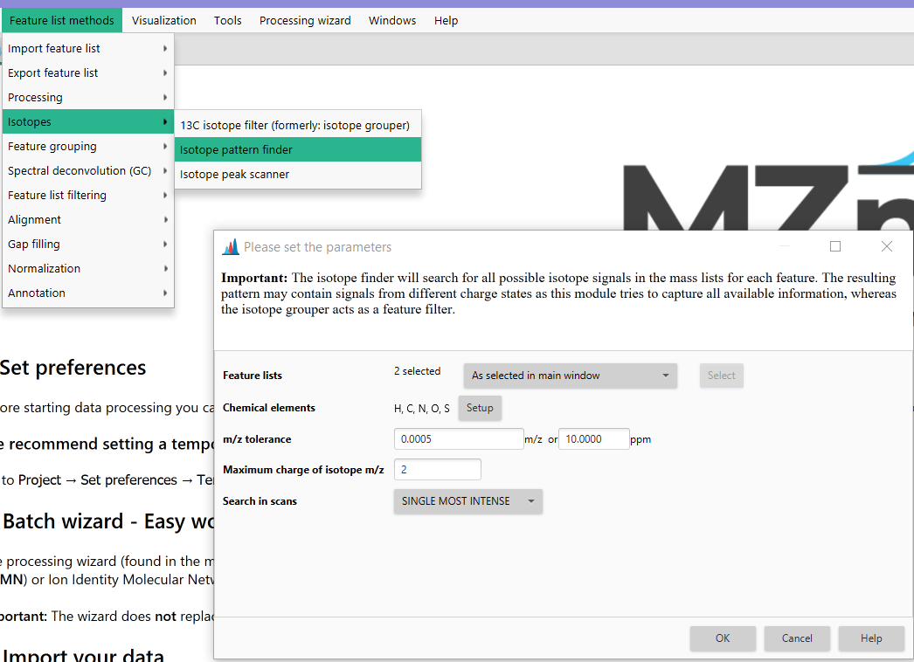

# Isotope pattern finder

The **Isotope pattern finder** is found under **Feature list methods → Isotopes → Isotope pattern finder.**

The module searches isotope patterns for each feature in selected feature lists by going back to the mass spectra. 
Starting from the feature m/z the algorithm will first backtrack any possible preceding isotope signals using a list
of delta masses created from elements, their stable isotopes, and an m/z tolerance. For example, a -2 signal might 
be detected when searching for Br isotopes. In a second step, all picked potential isotope m/z values are used to 
search next isotope (with higher m/z). This is done for each charge state.    I

### Parameters

#### Chemical elements
All stable isotopes of the chosen elements are used to create a list of mass differences to search. Signals with this mass difference (m/z difference with different charge states) are then considered as potential isotope signals.

#### m/z tolerance
Maximum allowed difference between two features' m/z values in order for them to be considered the same. The value is specified both as absolute tolerance (in m/z) and relative tolerance (in ppm). The tolerance range is calculated using maximum of the absolute and relative tolerances.

#### Maximum charge of isotope m/z
Maximum possible charge of isotope m/z distributions. 
All present m/z values obtained by dividing isotope masses with 1,2 ...,maxCharge values will be considered.
The default value is 1, but insert an integer greater than 1 if you want to consider ions of higher charge states.

#### Search in scans
Currently, the supported option is "Single most intense", which means the search for isotopes will happen in the single most intense MS scan of each feature.
