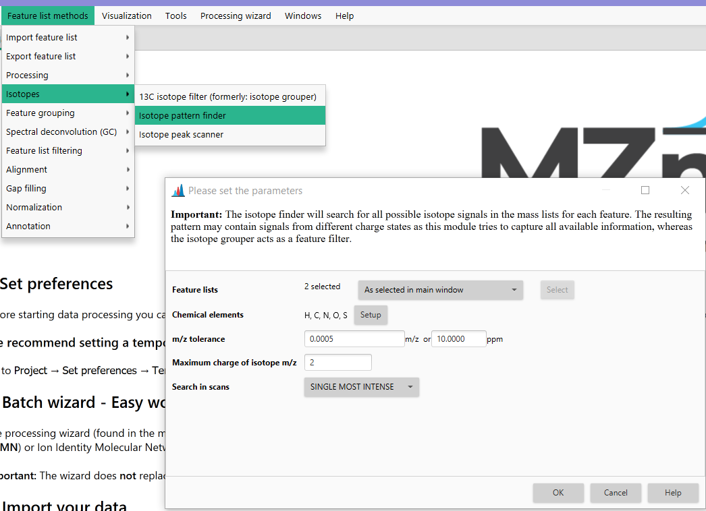

# **Isotope pattern finder**

## **Description**

:material-menu-open: **Feature list methods → Isotopes → Isotopic peaks finder.**

!!! info

    The detection algorithm was completely reworked in mzmine >4.10.6.

The module searches isotope patterns for each feature in selected feature lists by going back to
the mass spectra. Starting from the feature m/z, the algorithm predicts a carbon-based envelope
model (the expected relative isotope intensities for a plausible carbon count at that mass), then
searches around every offset of that envelope for matching signals in the most intense scan of the
feature. Every charge state up to the maximum is evaluated this way; the charge whose signals best
match the modelled envelope is reported as the most probable one, and other highly probable charge
states are flagged (for example overlapping [M+H]+ and [2M+2H]2+ patterns). The resulting pattern is
intentionally inclusive so that downstream formula prediction can refine it further.

### Parameters

Only the "Automatic" algorithm is currently offered in the parameter dialog. It exposes the three
parameters below and defaults everything else (which elements are modelled, element
auto-detection, whether only explainable signals are kept, refinement across the feature's FWHM
scans) to sensible values that are not yet user-configurable.

#### m/z tolerance
Maximum allowed difference between a feature's m/z and a candidate isotope signal in the same scan,
in order for them to be considered part of the same pattern. The value is specified both as
absolute tolerance (in m/z) and relative tolerance (in ppm); mzmine uses whichever of the two is
larger. Default: 15 ppm or 5 mDa, whichever is larger.

#### Require 13C isotope peak
If enabled, a charge is only accepted when the signals form a gap-free ladder on the
charge-adjusted 13C grid through the detected pattern. Features without such a ladder are skipped,
which is useful to suppress noise and heavy-isotope-only artefacts. Enabling this also truncates
the reported pattern at the first missing 13C position, even if further signals exist beyond the
gap (molecules whose pattern is dominated by an intense +2 comb, such as Cl, Br, or Cu, are allowed
to use every second 13C position instead). When the base peak is the monoisotopic signal, its
M+1/M relative intensity must also be roughly plausible for the carbon count the mass implies;
mid-envelope patterns without a visible monoisotopic signal (e.g. proteins) are exempt from this
ratio check. Off by default.

#### Maximum charge of isotope m/z
Maximum possible charge of the isotope distribution. Charges 1 to this value are evaluated and the
most probable charge is selected; other highly probable charges are flagged. Default: 3.

{{ git_page_authors }}