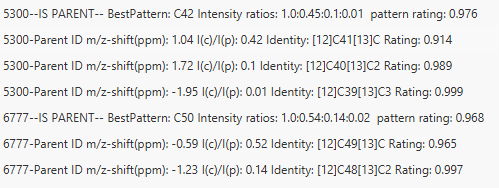

# **Isotope peak scanner**

## **Description**

:material-menu-open: **Feature list methods → Isotopes → Isotope peak scanner**

This module can scan acquired MS-Data for an isotope pattern of a specified **element combination**. The element combination is given as a string parameter (e.g. "Cl3"). 

The isotope pattern of this element combination will be calculated and compared to your MS-Data. The result is a new feature list containing just the isotope features. The features will have an **isotope rating**, comparing the found features to the calculated isotope pattern giving the user the option to manually evaluate the results. 

Additionally, the features will also be assigned to an isotope combination. Furthermore, the isotope features will be registered as an isotope pattern in MZmine so modules like Sum formula prediction can use the results to compare them to the calculated isotope pattern of predicted sum formulas.

In the resulting feature table, the monoisotopic mass (lowest) will be referred to as "Parent".

### **Isotope rating**

Rating is calculated using the following formulas:

$$R_m/z,k=\frac{m/z_{child}}{m/z_{parent}+\Delta{M_k}}$$

$$\frac{I_{parent}}{A_{parent}}=\frac{I_k}{A_k}$$

$$I_{exp.,l}=\frac{I_{parent}}{A_{parent}}\cdot{A_K}$$

$$R_{I,k}=\frac{I_{exp.,k}}{I_k}=\frac{I_{parent}}{A_{parent}}\cdot\frac{A_k}{I_k}$$

where R is the rating, k - the number of an isotope peak, exp. - the calculated intensities, parent - the isotope peak with the lowest mass, child describes all other isotope peaks. 

:material-lightbulb: If any rating is bigger than 1, for example if m/z_(parent) + ΔM is smaller than m/z_(child), then it will be adjusted by 1/R to be comparable. 

:material-lightbulb: If intensity shall be checked as well, m/z and intensity rating will be multiplied resulting in the final rating.

## **Parameters**

**Feature lists**

The feature list(s) that shall be analyzed.

#### **m/z tolerance**

m/z window around the expected isotope features to scan for isotope peaks.

#### **Check RT**

If chosen, compares RT of feature to that of a parent. Based on the following parameter of **Retention time tolerance** feature is either filtered out or preserved.

:warning: Invoking this parameter might not make sense for imaging or direct infusion, but is critical for chromatographic data.

#### **Retention time tolerance**

Maximum allowed difference between two retention time values

#### **Chemical formula**

Element (combination) whose isotope pattern to be searched for. Please enter the two letter Symbol of the elements. (e.g. \"Gd\", \"Cl2Br\")

#### **Auto carbon**

If activated, Isotope peak scanner will calculate isotope patterns with variable numbers of carbon specified in Setup. The pattern with the best fitting number of carbon atoms will be chosen for every detected pattern.

:material-lightbulb: This will greatly increase computation time but helps with unknown-compound-identification.

:warning: Please note that 13C isotope peaks might overlap with hetero atom isotope peaks depending on the resolution of your MS. This influences intensity ratios and will yield **wrong results**, since this prediction is based on intensity ratios of isotope peaks.

:warning: This option yeilds no exact results, but might give a good hint about data.

#### **Charge**

Amount and polarity(e.g.: [M]+=+1 / [M]-=-1).

:warning: This is important for multiply charged molecules because the m/z offset between isotope peaks will halve for molecules with a charge of two.

#### **Min. pattern intensity**

The minimum normalized intensity of a peak in the final calculated isotope pattern. Depends on the sensitivity of your MS. This differs from minimum abundance. Min = 0.0, Max = 0.99999.

#### **Merge width(m/z)**

This will be used to merge peaks in the calculated isotope pattern if they overlap in the spectrum. Specify in m/z, this depends on the resolution of your mass spectrometer.

#### **Minimum height**

Minimum peak height to be considered as an isotope peak.

:warning: Setting this parameter is crucial if you use the **Calculate accurate average** parameter. (see below)

#### **Check intensity ratios**

Compare intensity of peaks to the calculated abundance of the isotope pattern.

:material-lightbulb: It's recommended to check this parameter for more accurate results.

:warning: However, when processing fragment data, and it's unknown how much of an isotope pattern remains charged it might be reasonable to uncheck this. (e.g.: Fragmenting a Cl8-isotope-pattern-molecule -> If "Element pattern" = Cl4 this module will recognize everything with Cl4 or more Cl. However, this will lead to a messy result feature list)

#### **Minimum rating**

Minimum rating to be considered as an isotope peak. min = 0.0, max = 1.0

#### **Rating type**

Method to calculate the rating with.

- **Highest Intensity** is the standard method and faster.
- **Temporary average** is slower method but could be more accurate for more intense peaks.

#### **Calculate accurate average**

This method will use averaged intensities over all mass lists in which ALL relevant masses were detected in. This will only be done for features that match the defined rating-calculation with the given rating.

This will scan all mass lists for the peak closest to the identified isotope peak in the feature list and average the intensity.

If there are no scans that match all criteria avg rating will be -1.0.

:warning: Make sure the mass list is contained in the feature list.

#### **Name suffix**

Suffix to be added to feature list name. If "auto" then the module will itself create a suffix.

## **Results**

This figure shows an example of the result peak list produced by Isotope peak scanner. 
It features the detected isotope peaks, a detected m/z ppm-offset, expected (@monoisotopic mass) and detected intensity ratios, the isotope composition, the rating, and (if specified) the average rating.

[//]: # (TODO formula &#40;look below&#41;)

[//]: # (This figure shows the results of the sum formula prediction for the compound Pigment Red 112. Using just the integrated 13C isotope pattern recognition the correct sum formula has and isotope pattern score of 1.6 % &#40;A&#41; for the correct sum formula. Using Isotope peak scanner and recognizing the Cl3 and C isotope pattern the score for the correct sum formula is 82.0 % &#40;B&#41;.)

## **Troubleshooting**

**Error**: I'm using "Calculate accurate average" but the average rating is always -1.0!

**Solution**: All isotope features have been detected in the peak list. But they are not in the same mass lists at the same time which makes them incomparable since isotope features should be detected simultaneously, or they might me less intense than the specified "Minimum height".

**Error**: I'm not getting any results, although I'm sure a specific element is in the scan!

**Solution 1**: Are you sure every isotope has been detected? How sensitive is you MS? Try to increase values for minimum abundance or minimum pattern intensity. You might need low minimum abundance but high minimum intensity, because a peak of a specific isotope composition might not been detected due to low relative intensity in the pattern. Check our preview function!

**Solution 2**: Another solution might be changing the merge width. Check how good the resolution of your MS data is and adjust the merge width to that. If (several) isotope compositions overlap, the intensities have to be merged. You can see a preview in the preview window!

{{ git_page_authors }}