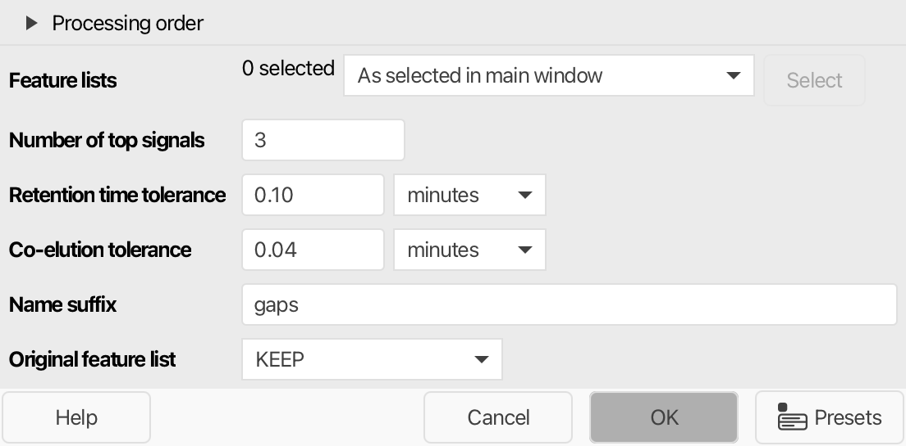

# GC-EI gap filling

:material-menu-open: **Feature list methods → Gap filling/Recursive feature finding → GC-EI gap filling**

This module fills missing values ([gaps](../../terminology/general-terminology.md#missing-values))
in aligned GC-EI feature lists. In the
[GC-EI workflow](../../workflows/gcmsworkflow/gcms-workflow.md), each row is a deconvoluted
compound: it has a pseudo spectrum and a quantifier m/z, which is the m/z of the row.

Common fragment ions occur across the whole run in GC-EI data. A gap filler that only looks for
any signal at the quantifier m/z and the row retention time would often pick up unrelated
signals. This module only fills a gap when the compound is confirmed in that sample:

1. It takes the **N most intense signals** of the row's pseudo spectra.
2. It detects features for these m/z values and the quantifier m/z in the sample again, with the
   **same chromatogram builder, smoothing, and resolver settings** that were used to create the
   feature list.
3. If all of these signals are detected as co-eluting features at the retention time of the row,
   it adds the **feature of the quantifier m/z** to the row.

Gap-filled features have the feature state ESTIMATED and are shown with a grey background in the
feature table.

!!! info "Prerequisites"

    - The feature list must be aligned, for example with the
      [GC-EI aligner](../align_gcei/align_gc_ei.md).
    - The rows need pseudo spectra from the
      [GC-EI spectral deconvolution](../featdet_spectraldeconvolutiongc/spectraldeconvolutiongc.md).
      Rows without a pseudo spectrum are skipped.
    - The processing history of the feature list must contain a
      [Chromatogram builder](../lc-ms_featdet/featdet_adap_chromatogram_builder/adap-chromatogram-builder.md)
      step and a feature resolver step after it, for example the
      [Local minimum resolver](../featdet_resolver_local_minimum/local-minimum-resolver.md). The
      resolver must work in the retention time dimension. The module stops with an error if one
      of these steps is missing.
    - The mass lists of the raw data files must still be available, because chromatograms are
      built from the mass lists, as in the chromatogram builder.

The [processing wizard](../../wizard.md) adds this module to the GC-EI workflow automatically.
It runs after the feature list rows filter, with the inter-sample retention time tolerance as
**Retention time tolerance** and the intra-sample retention time tolerance as
**Co-elution tolerance**. It is followed by the
[GC-EI duplicate row filter](../filter_duplicate_features_gc_ei/gc-ei-duplicate-filter.md), which
removes rows of the same compound that were split by the alignment.

## Recommended citations

!!! info

    When using mzmine for your work, please consider citing: 
    Schmid R., Heuckeroth S., Korf A., et al. Integrative analysis of multimodal mass spectrometry data in MZmine 3, Nature Biotechnology (2023), doi:10.1038/s41587-023-01690-2.

---

## Parameters

The settings for detecting features (m/z tolerance, chromatogram builder thresholds, smoothing,
and resolver parameters) are not part of this dialog. They are read from the processing history
of the feature list, so gap-filled features are detected with the same criteria as all other
features. See [Algorithm](#algorithm).

#### Feature lists

The aligned GC-EI feature lists to gap-fill.

#### Number of top signals

The number of most intense signals in the pseudo spectra of a row (merged over all samples, see
[Algorithm](#algorithm)). All of these m/z values need to be detected as features in a sample
before the row is gap-filled in that sample. The quantifier m/z of the row always needs to be
detected as well, even if it is not one of the top signals. Default: **3**, minimum: 1.

Higher values make gap filling stricter and reduce false positives. Lower values allow more gaps
to be filled in samples with low compound abundance, where only the most intense fragments are
above the detection thresholds.

!!! tip

    Many GC-EI spectra share the same intense fragment ions, for example m/z 73 and 147 for
    TMS-derivatized compounds. Such ions are found in almost every sample at almost every retention
    time, so they do not help to confirm a compound. If the top signals of your compounds are
    dominated by such ions, increase the **Number of top signals**.

#### Retention time tolerance

Maximum allowed difference between the retention time of the row and the apex of the feature
detected for the quantifier m/z. Usually, use the same tolerance as for the alignment.
Default: **0.10 min**.

#### Co-elution tolerance

Maximum allowed difference between the apex of the quantifier feature and the apex of the feature
detected for each other top signal. This makes sure that all signals elute together, like the
fragments of one compound. Usually, use the same retention time tolerance as for the
[GC-EI spectral deconvolution](../featdet_spectraldeconvolutiongc/spectraldeconvolutiongc.md).
Default: **0.04 min**.

#### Name suffix

Suffix added to the name of the new feature list. Default: **gaps**.

#### Original feature list

Defines what happens to the input feature list:

- **KEEP**: Keeps the original feature list and adds a gap-filled copy to the project.
- **REMOVE**: Removes the original feature list after gap filling to save memory.
- **PROCESS_IN_PLACE**: Adds the gap-filled features directly to the original feature list and
  appends the suffix to its name.

Default: **KEEP**.

---

## Algorithm {#algorithm}

1. **Settings from the processing history.** The module reads the processing history of the
   feature list:
    - the last **Chromatogram builder** step,
    - the last feature resolver step after it, and
    - the last **Smoothing** step between the two, if there is one.

    These settings are used to detect features again. Smoothing steps after the resolver,
    baseline correction, and feature filters are not repeated.

2. **Top signals.** For each row, the pseudo spectra of all features in the row are merged into
   one spectrum. Signals within the m/z tolerance of the chromatogram builder are combined, and
   their intensities are summed. The **Number of top signals** most intense signals are selected.
   The row's m/z is the quantifier m/z.

3. **Gaps.** A gap is a raw data file in which a row has no feature.

4. **Chromatogram building.** For each raw data file with gaps, a chromatogram (EIC) is built for
   each quantifier and top signal m/z:
    - It uses the m/z tolerance of the chromatogram builder around the target m/z and the most
      intense signal per scan.
    - It covers the same scans as the original chromatograms, which is the whole run. This
      matters because resolver thresholds, such as the chromatographic threshold of the local
      minimum resolver, depend on the whole chromatogram.
    - It must pass the same filters as in the chromatogram builder: **Minimum consecutive
      scans**, **Minimum intensity for consecutive scans**, and **Minimum absolute height**.

5. **Smoothing and resolving.** The chromatograms are smoothed (if smoothing was part of the
   original processing) and resolved with the original resolver and its parameters.

6. **Confirmation.**
    - The resolved feature of the quantifier m/z with the apex closest to the row retention time
      is selected. Its apex must be within the **Retention time tolerance**.
    - For each other top signal, a resolved feature must have its apex within the
      **Co-elution tolerance** of the quantifier apex.
    - A top signal within the m/z tolerance of the quantifier is already confirmed by the
      quantifier feature.

    If any signal is missing, the gap stays empty.

7. **Gap filling.** If all signals are confirmed, the resolved quantifier feature is added to the
   row with the feature state ESTIMATED.

Raw data files are processed in parallel.

!!! note

    Gap-filled features do not get a pseudo spectrum. Spectral library search and molecular
    networking keep using the pseudo spectra of the features that were detected in the first place.

!!! warning "Retention time calibration"

    The [Retention time correction on feature lists](../norm_rt_calibration/norm_rt_calibration.md)
    module corrects the retention times of features but not the retention times of the scans. The
    GC-EI workflow of the processing wizard uses this module when **Recalibrate retention times**
    is enabled. In samples with a gap, the module
    searches the uncorrected raw data around the corrected row retention time. Make sure the
    **Retention time tolerance** is larger than the remaining retention time shifts between
    samples.

---

{{ git_page_authors }}
