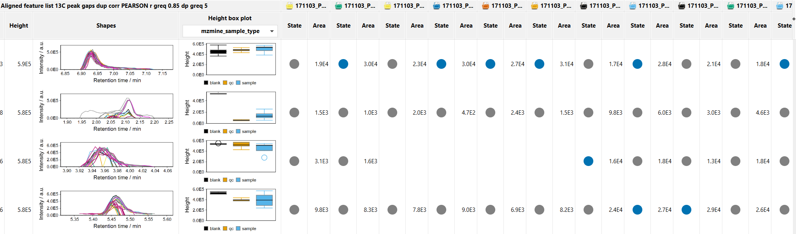

# **Peak finder** 

## **Description**

:material-lightbulb: It is a recommended gap-filling algorithm.

:material-menu-open: **Feature list methods → Gap filling → Peak finder**.

[//] # (TODO ADD FIGURE ALIGNED TABLE)

When a feature cannot be identified/quantified in certain sample will be assigned a zero-intensity value during the feature alingment (see [here](../align_join_aligner/join_aligner.md) for more details).This produces **gaps** in the aligned feature table, commonly referred to as [missing values](../../terminology/general-terminology.md#missing-values).

There is a number of occasions where, due to suboptimal feature detection, a _missing value_ is assigned even tough the peak is actually present. Some chromatographic features in an aligned feature list may not be detected in every sample for several reasons, such as:

1. Peak intensity below the minimum abundance threshold. The peak will be not detected even though there is a peak, and it can be gap-filled for the alignment process if the peak having the same RT and m/z is detected in other samples.
[//] # (TODO Explain minimum abundance threshold)
2. Peak discarded in a previous processing step. Peaks filtered out due to low peak intensity
3. Misalignment due to shifts in m/z, retention time, or ion mobility within feature lists from different samples (or batches). Might originate from inaccurate mass calibration, etc.
4. Inaccurate peak detection and deconvolution of co-eluting compounds. Co-eluting features that are not baseline separated might be resolved in one sample but kept unsplit in another 
5. Feature shape constraints in the resolver or later feature filters

All of these reasons can result in undesirable gaps (missing values) in the aligned feature table. Those gaps are not limited to smaller signals but can also affect abundant features. 

To account for this problem, the user can use the Peak finder module as a secondary, informed feature finding step. The gap-filling module (_i.e._ _'Peak finder' algorithm_) aims at reducing false missing values and 'fill the gaps' by going back to the original raw data and re-integrating the peak area where the peak is expected. This approch is sometimes reffered to as 'back-filling'.

The algorithm searches for signals within the original centroided mass spectra. It fills the gaps in the feature list according to the user parameters, with the most crucial being **m/z tolerance** and **RT tolerance**. These two tolerances define the window where the algorithm should find the new feature. 

Each feature in the aligned table is examined individually within the RT window associated to the examined features. Algorithm searches for appropriate features in that window. If the user-defined requirements are met, the peak is integrated, and the retrieved peak area is used to reconstruct omitted features and fill the gap.

[//] # (TODO ORIGINAL of TEXT above: If requirements are met (e.g. REQUIREMENTS) the peak integrated and the retrieved peak area used to XXX, this filling the gap. and reconstructs omitted chromatographic peaks in “empty” samples by scanning the m/z and retention time region of LC–MS spectra corresponding to the detected peaks in other samples.)

In the feature table, gap-filled features are marked with a grey color as the feature state (see [feature table description](../lc-ms_featdet/featdet_results/featdet_results.md)). There may still be some gaps in which no evidence for the peak was found, marked by orange.

:warning: DANGER OF DUPLICATED FEATURES. Some features in the dataset can show duplicates, which appear during feature recognition and alignment of samples. The duplicates falsify the exploratory analysis of data and are removed in MZmine.

The gap-filled feature table can be further used in downstream data analysis

## **Parameters**

#### **Name suffix**
Suffix to be added to the peak list name. 

#### **Intensity tolerance**
Maximum allowed deviation from the expected peak shape in chromatographic direction.

#### **m/z tolerance**
m/z range which will be applied when searching for the possible feature in the raw data.

The tolerance can be specified as absolute tolerance (in _m/z_), relative tolerance (in ppm), or both. When both are specified, the tolerance range is calculated using the maximum between the absolute and relative tolerances.

#### **Retention time tolerance**
Retention time range when searching for the possible feature in the raw data.

#### **Minimum data points**
Feature will be used for gap filling only if it satisfies the set minimum number of data points.

:material-lightbulb: Usually a lower number of data points is used compared to the primary feature finding workflow with the resolvers.

#### **Original feature list**
User can either keep, remove, or process in place of the original feature list. The latter two increase memory efficiency and throughput while users might want to keep the original feature list as a reference. 

