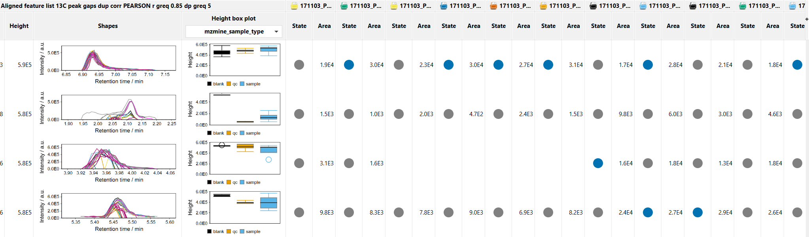
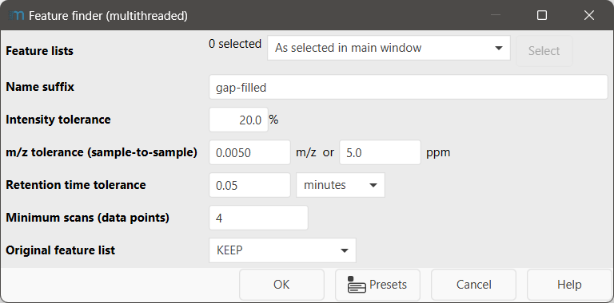

# Peak finder (multithreaded)

## Description

:material-lightbulb: This is the recommended gap-filling algorithm.

:material-menu-open: **Feature list methods → Gap filling → Peak finder**

When a feature cannot be detected in a particular sample during LC-MS processing, the alignment
step assigns a zero-intensity (missing) value for that sample, producing a **gap** in the aligned
feature table (see [missing values](../../terminology/general-terminology.md#missing-values)).

Gaps arise from several common causes:

1. Peak intensity falls below the minimum threshold of the feature detection step, even though
   signal is present in the raw data.
2. The peak was removed by a subsequent filter (e.g., feature shape or intensity filter).
3. RT or m/z shifts between samples cause misalignment, so the peak is not recognised as the
   same feature across files.
4. Co-eluting compounds are resolved in one sample but merged in another, causing the minor
   component to go undetected.
5. Feature shape constraints in the resolver discard the peak.

The Peak finder module addresses this by returning to the original raw data and re-integrating
the signal in the m/z and RT region expected for each gap. This approach is sometimes called
back-filling. The algorithm searches the centroided mass spectra (mass lists) and attempts to
reconstruct a chromatographic peak at the gap location.

!!! warning 

    Mass detection must be run on all raw data files before gap filling, because the algorithm
    reads from the processed mass lists, not raw intensity values.

Gap-filled features are marked with a **grey** background in the feature table
(feature state: ESTIMATED). Rows where no evidence was found remain empty.

The module runs the gap-filling algorithm in parallel: raw data files are distributed evenly
across all available CPU threads, giving significantly faster processing for large studies.

!!! tip

    For large datasets (many rows × many samples), use **Process in place** or **Remove** for the
    original feature list to reduce peak memory usage. Consider pre-filtering with the
    **Feature list rows filter** to remove features present in fewer than X% of samples before
    gap filling, as this directly reduces the number of gaps to search.

## Parameters

#### Name suffix

Suffix appended to the new feature list name. Default: `gap-filled`.

#### Intensity tolerance

Maximum fractional deviation allowed between consecutive data points when evaluating the shape
of a candidate peak in the chromatographic (RT) direction. The algorithm walks outward from the
apex:

- **Before the apex** (ascending side): a new point is accepted if its intensity is not more
  than `intTolerance × prevIntensity` below the previous point (i.e., small dips are tolerated).
- **After the apex** (descending side): a new point is accepted if its intensity has not risen
  by more than `intTolerance × prevIntensity` above the previous point (i.e., re-ascending
  signal breaks the peak).

Default: 20 % (0.2). Lower values enforce a stricter peak shape; higher values allow noisier
chromatographic profiles to be gap-filled.

#### m/z tolerance

m/z window used to search the raw data for the gap. The tolerance is applied to the average m/z
of the feature list row (i.e., sample-to-sample tolerance). Both absolute (Da) and relative (ppm)
values can be specified; the wider of the two is used.

#### Retention time tolerance

RT window around the row's average retention time to search for the gap. The window is applied
symmetrically (±tolerance).

#### Minimum scans (data points)

A candidate peak is only accepted if it contains at least this many data points (scans). Use a
lower number here than in the primary feature detection step, since gap-filled peaks tend to be
weaker and narrower. Default: 1.

#### Original feature list

Determines what happens to the input feature list after processing:

- **Keep** — the original list is kept and a new gap-filled copy is added to the project.
- **Remove** — the original list is removed after gap filling to save memory.
- **Process in place** — the original list is modified directly; no copy is created.

---

## Algorithm {#algorithm}

1. **Gap identification** — For each row in the feature list, any sample that has no is treated as a
   gap. The search window is defined as the m/z tolerance range around the row's average m/z
   combined with the RT tolerance range around the row's average RT.

2. **Parallel file processing** — Raw data files are split into equal-sized groups and assigned
   to sub-tasks, one per available CPU thread. Each sub-task processes its group of files
   independently.

3. **Scan-by-scan search** — For each gap, the sub-task iterates over all scans of the
   corresponding raw data file. In each scan that falls within the RT window, the most intense
   signal within the m/z range is recorded.

4. **Peak shape validation** — Consecutive data points are grouped into candidate peak segments
   using the intensity tolerance to detect where the signal starts re-ascending (a new peak
   begins). Within each segment, the algorithm requires a local maximum inside the RT range to
   accept the segment as a valid peak candidate.

5. **Best candidate selection** — Among all candidate segments, the one with the highest apex
   intensity inside the RT range is selected to fill the gap.

6. **Minimum data points filter** — A gap is only filled if the best candidate segment contains
   at least the configured minimum number of data points.

---

{{ git_page_authors }}
