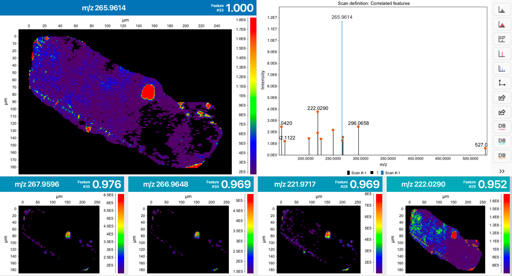
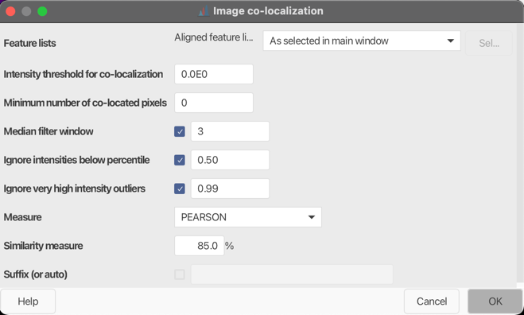

# **Image co-localization**

## **Description**

:material-menu-open: **Feature list methods → Feature grouping → Image co-localization**.

This module systematically identifies and groups images sharing similar spatial ion distributions. The user can choose between various similarity measure (e.g. pearson correlation) and can apply different filtering options before image comparison.

## **Parameters**

#### **Feature Lists**
Select feature 

#### **Intensity threshold for co-localization**
This intensity threshold is used to filter data points (pixel) before image co-localization.

#### **Minimum number of co-located pixels**
Minimum number of locations (pixels) that must be co-located.

#### **Median filter window**
Optional: Smooth over pixels to reduce noise and remove outliers.

#### **Ignore intensities below percentile**
Optional: Only consider intensities above the selected percentile.

#### **Ignore very high intensity outliers**
Optional: Only consider values below the selected percentile, 0.99 is recommended.

#### **Measure**
Select similarity measure.

#### **Min image correlation**
"Minimum percentage for image similarity to be considered co-located."

#### **Suffix (or auto)**
Suffix to be added to the feature list name.

{{ git_page_authors }}