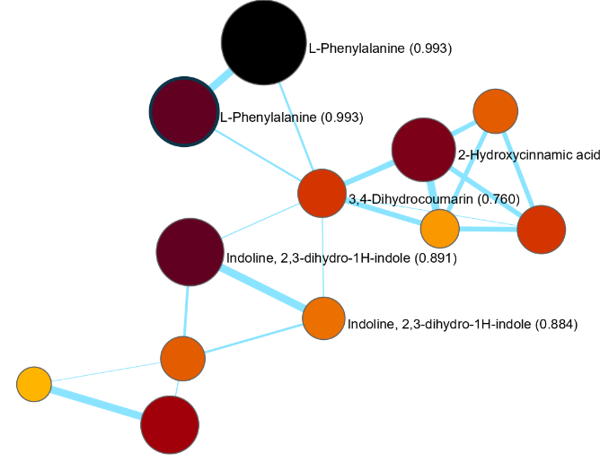
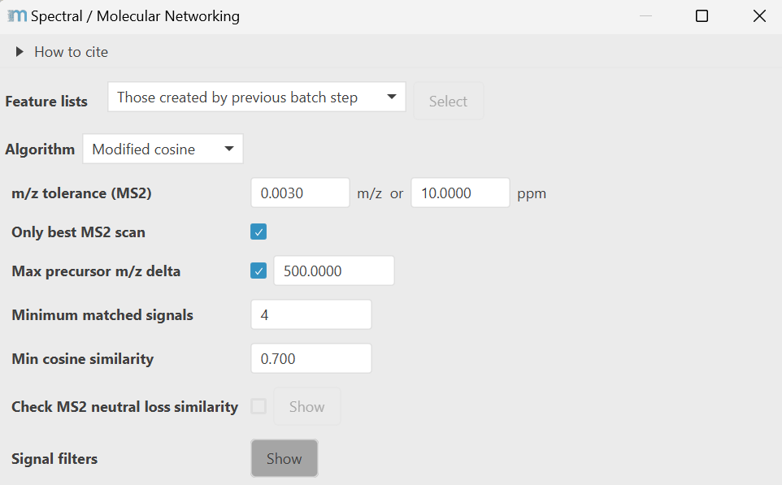

# Spectral / Molecular Networking

!!! warning

    Molecular networking in mzmine currently only supports fragmentation data with precursor m/z. 
    Therefore, GC-EI-MS data will result in unpredictable results due to the missing precursor information.     

:material-menu-open: **Feature list methods → Feature grouping → Spectral / Molecular Networking**

!!! info

    This module runs molecular networking in mzmine. There is no data uploaded to GNPS in this process.
    For GNPS interoperability, refer to the dedicated export module [export module](../io/data-exchange-with-other-software.md#gnps-fbmniimn-export).

Feature-Based Molecular Networking (FBMN) and Ion Identity Molecular Networking (IIMN) group
features
based on their fragmentation pattern similarity. While similar to spectral library search, the
algorithms used
for molecular networking are open for modifications of the precursor m/zs. Choose between the
modified cosine
similarity that is known to connect fragmentation spectra of analog molecular structures, mostly
with single modifications,
or the MS2Deepscore similarity that aims to converge spectral and structural similarity.

Finally, molecular networks can be visualized in mzmine's interactive network
visualizer [interactive_ion_id_netw.md](../../visualization_modules/interactive_ion_id_netw/interactive_ion_id_netw.md).
Exports are available to .graphml format and to edges files (.csv).

Example of the molecular networking results visualized in mzmine.

## Recommended citations

!!! info

    When applying Feature-Based Molecular Networking (FBMN), please consider citing: 
    Nothias LF, Petras D, Schmid R et al. Nat Meth 17, 905–908 (2020) [https://www.nature.com/articles/s41592-020-0933-6](https://www.nature.com/articles/s41592-020-0933-6)
     
    When applying Ion Identity Molecular Networking (IIMN), please consider citing: 
    Schmid R, Petras D, Nothias LF et al. Nat Comm 12, 3832 (2021) [https://www.nature.com/articles/s41467-021-23953-9](https://www.nature.com/articles/s41467-021-23953-9)
     
    When using MS2Deepscore, please consider citing: 
    de Jonge N, Joas D, Truong LJ, van der Hooft JJJ, Huber F bioRxiv [2024.03.25.586580](https://doi.org/10.1101/2024.03.25.586580)

---

## Parameters

The parameter dialog changes the parameters based on the selected algorithm. Here shown for the
modified cosine algorithm.

### Algorithm: Modified cosine

The modified cosine similarity aligns spectra by grouping signals within the same m/z tolerance.
Compared to spectral library matching, which allows only direct matches of the same fragment
signals - modified cosine also considers matching neutral loss mass differences to the precursor
ions. Therefore, signal pairs may be derived from the same neutral loss or the same produced
fragment ion, allowing for structural analogs to cluster in the same sub networks.
Signals without matching partner will be scored against 0 intensity. All spectra are square root
transformed to balance the contribution of medium and high intensity signals.

#### m/z tolerance

Tolerance to group fragment signals by m/z. Fragments are group by direct match of m/z or by having
the same neutral loss mass difference to the precursor ion. Most intense fragment signals are
considered first.

#### Only best MS2 scan

If checked the algorithm will only use the top most intense MS2 scan. Otherwise, all scans are
compared.

#### Max precursor m/z delta

If checked only features with precursor m/z difference lower than the specified value are compared.

#### Minimum matched signals

Minimum required signals to match two fragmentation spectra. Default 4 signals for small molecules.
Use higher number of signals for more confident matches and compound classes with richer
fragmentation data.

#### Min cosine similarity

Minimum cosine for matches between fragmentation spectra.

#### Signal filters:

Additional signal filters that reduce the spectral complexity while retaining most of the spectral
information. This speeds up the matching for spectra with many fragment signals.

#### Remove residual precursor m/z

Remove all signals +- the precursor m/z.

#### Crop to top N signals

First applies the intensity filter (see below) then crops the remaining signals to the top 250.

#### Signal threshold (intensity filter)

Above N signals, start using the intensity percentile filter (see below). This does **not** filter
to 50 signals so the final number of signals may be higher.

#### Intensity filter at >N signals

Remove signals so that X% of intensity is retained. This removes lower abundant signals that play a
minor role in matching. Overall this can speed up matching.

### Algorithm: MS2Deepscore

This algorithm uses a deep neural network to train embeddings that aim for spectral similarities
that approach structural similarities. The module allows loading of pre-trained models in the
PyTorch script format.

#### MS2Deepscore model

A pre-trained MS2Deepscore model can be downloaded
from [https://zenodo.org/records/12628369](https://zenodo.org/records/12628369)
and contains the PyTorch script model (.pt) which should be selected in this parameter.
The same folder should contain the settings.json file also supplied on Zenodo.

#### Minimum signals

Minimum number of signals to consider a fragment spectrum. This is **not** the number of matched
signals because MS2Deepscore works by comparing its embeddings.

#### Min similarity

Minimum MS2Deepscore spectral similarity to consider matched. The score is scaled from 0-1 with 1
being the best match.

---

{{ git_page_authors }}
