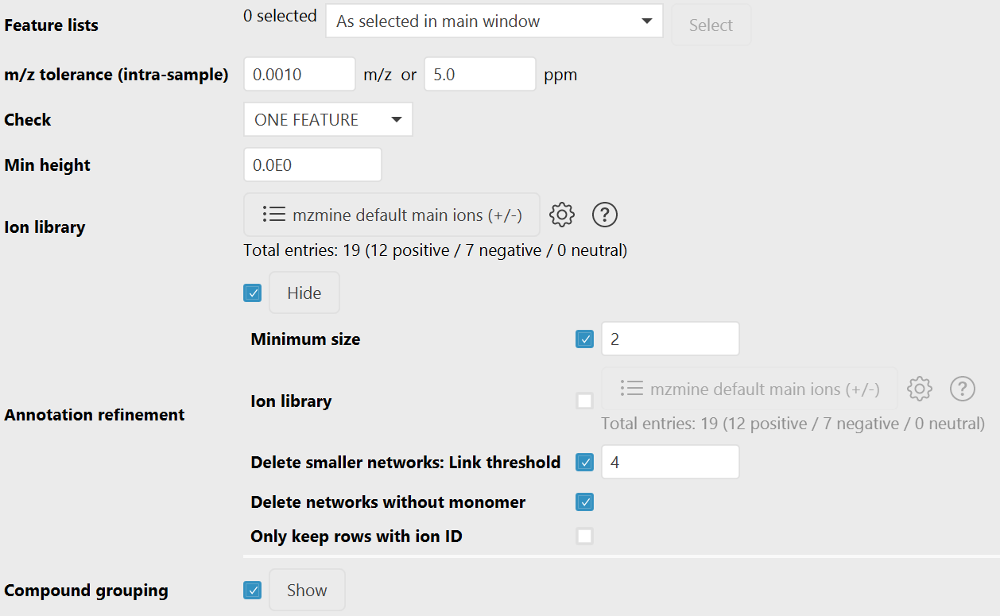

# Ion identity networking

:material-menu-open: **Feature list methods → Feature grouping → Ion identity networking**

Annotates grouped features (same retention time and, optionally, feature shape and height
correlation) as ion adducts, in-source fragments, and multimers. All feature pairs within a
correlation group are searched against an [ion library](../../../ions/ions.md): whenever two rows
resolve to the same neutral mass under two ion types of the library, an ion identity is assigned and
both rows join the same ion identity network.

Ion identities are the basis of the **Ion Identity Molecular Networking (IIMN)** workflow in mzmine:
run this module and then
[Spectral / Molecular Networking](../../group_spectral_net/molecular_networking.md), which combines
the ion identity networks with MS2 fragmentation similarity into one network. The resulting
networks can be explored in mzmine's
[interactive network visualizer](../../../visualization_modules/interactive_ion_id_netw/interactive_ion_id_netw.md)
and exported to `.graphml`.

!!! warning

    Apply [Correlation grouping (metaCorrelate)](../metacorr/metacorr.md) before running this module.

## Recommended citations

<!-- markdown-link-check-disable -->
!!! info

    When using this modules, please consider citing the corresponding publication(s): 
    Schmid, R., Petras, D., Nothias, LF. et al. Ion identity molecular networking for mass
    spectrometry-based metabolomics in the GNPS environment. Nat Commun 12, 3832 (
    2021). https://doi.org/10.1038/s41467-021-23953-9

    Schmid R., Heuckeroth S., Korf A., et al. Integrative analysis of multimodal mass spectrometry data in MZmine 3, In Review (2023)

---
<!-- markdown-link-check-enable -->

## Parameters

#### _m/z_ tolerance

Intra sample _m/z_ tolerance describes the difference between two ions of the same molecule at the
same retention time. This tolerance is usually very small and depends on the mass resolution.
Orbitrap instruments for example 3 ppm.

#### Check

- **ONE FEATURE**: Only one feature needs to match (_m/z_ difference within one sample)
- **ALL FEATURES**: All features need to match (_m/z_ difference within ALL samples)
- **AVERAGE**: Matches the _m/z_ difference of average values

#### Min height

Minimum height of features to consider. Leave at 0 to use all features that passed the feature
detection workflow criteria.

#### Ion library

The full list of ions to search: adducts, in-source fragments, multimers, and clusters. When two
features, annotated with two of these ion types, result in the same neutral mass, an ion identity is
assigned.

The default is _mzmine default comprehensive (+/-)_. Select a different library, or create your own,
as described in [Ion types & libraries](../../../ions/ions.md). Only ion types matching the polarity
and charge state of a row are used for that row, so a dual-polarity library is safe to use for data
of a single polarity.

!!! tip

    This step should only focus on the main ions that are typically detected in the MS method.
    Later, the _Add ion identities to networks_ module can add rarer ions to existing networks.

#### Annotation refinement _(optional)_

Annotation refinement is optional but should be applied to finalize ion identities, after all
subsequent optional steps of _Add ion identities to networks_.

**Parameters:**

- _Minimum size (optional)_: Only retain ion networks with at least n ions (often 3). The more ions
  the higher the confidence in the annotation.
- _Ion library (optional)_: The library of main ions, i.e., ions that are well expected in this
  analysis. Each final ion identity network must contain at least one of them. While unchecked, the
  internal _mzmine default main ions (+/-)_ library is used.
- _Delete smaller networks: Link threshold (optional)_: Important parameter to only keep the best
  annotation, when this annotation is supported by n-1 ions (network size n).
- _Delete networks without monomer_: Only keep a network if at least one ion is M+... and not only
  multimers like 2M, 3M...
- _Only keep rows with ion ID_: Remove all rows from the feature list that have no ion identity
  annotation.

#### Compound grouping _(optional)_

Directly creates a compounds list from this feature list, where the correlated rows and their ion
identities are grouped into compound rows. The same step is also available as the separate
[Compound grouping](../../group_compound_grouping/compound_grouping.md) module. And is usually 
applied after all steps including any annotation steps for better results. 

---

{{ git_page_authors }}
