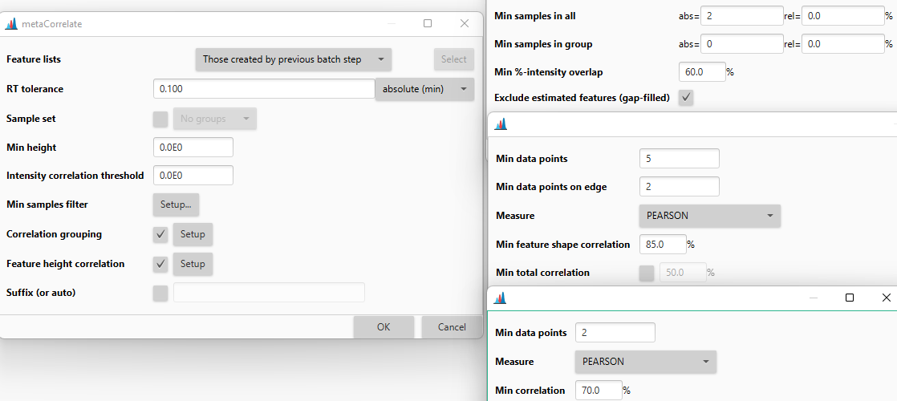

# metaCorrelate feature grouping

:material-menu-open: **Feature list methods → Feature grouping → Correlation grouping (metaCorrelate)** 

This module groups features based on various properties:
- Retention time
- Feature shape Pearson correlation (optional: Only apply if at least 5 data points)
- Feature height correlation

## Recommended citations
!!! info
    When using this modules, please consider citing the corresponding publications: 
    Schmid, R., Petras, D., Nothias, LF. et al. Ion identity molecular networking for mass spectrometry-based metabolomics in the GNPS environment. Nat Commun 12, 3832 (2021). https://doi.org/10.1038/s41467-021-23953-9
    
    Schmid R., Heuckeroth S., Korf A., et al. Integrative analysis of multimodal mass spectrometry data in MZmine 3, In Review (2023)

---

## Parameters

#### RT tolerance
First filter that only checks features that fall within the same retention time window. Should be strict (~FWHM / 3) 
when correlation grouping is disabled. With correlation grouping as a strict filter, the RT tolerance can be wider.

#### Min height
Minimum height of features to consider. Leave at 0 to use all features that passed the feature detection workflow 
criteria.

#### Intensity correlation threshold
Minimum intensity of data points in a feature to compare during feature shape Pearson correlation. All data points 
below this value are disregarded. Leave at 0 to use the noise levels set in the mass detection steps. 

#### Sample set _(optional)_ 
Grouping of samples, only when using _Min samples filter_. Needs project metadata to be set. 

#### Min samples filter
Only group features if they were detected in a minimum number of samples (absolute and relative minimum). Values are 
provided for 
- _Min samples in all_ (all samples) and 
- _Min samples in group_ (for groups from _Sample set_ parameter)
- _Min %-intensity overlap_ defines the percentage of intensity (sum of data point intensity) of the lower abundant 
  feature needs to fall within the RT range of the larger feature
- _Exclude estimated features (gap-filled)_ excludes gap-filled features from the comparison

#### Correlation grouping _(optional)_
Applies a feature shape correlation filter in retention time dimension. 

!!! warning
    Only use when having enough data points, i.e., 5 data points total and 2 on each side of the apex. Otherwise, 
use feature height correlation and a more narrow RT tolerance

**Parameters:**
- _Min data points_: Minimum number of correlated data points
- _Min data points on edge_: Minimum number of points on each sides of the apex
- _Measure_: Similarity measure (default: Pearson)
- _Min feature shape correlation_: Minimum similarity of two features (within the same sample) to be grouped. Pearson 
  _r_=85% is default.
- _Min total correlation (optional)_: Minimum similarity when taking all the data points from all samples into account

#### Feature height correlation
Applies a correlation filter by taking all the feature heights across samples for feature pairs. 

!!! warning
    Only applicable if the heights are comparable across samples: Similar matrix and ionization conditions

**Parameters:**
- _Min data points_: Minimum number of correlated data points (samples)
- _Measure_: Similarity measure (default: Pearson)
- _Min correlation_: Minimum similarity

#### Suffix (or auto) _(optional)_
Add a suffix to the feature list or just use an automatically generated suffix based on the parameters.

{{ git_page_authors }}
