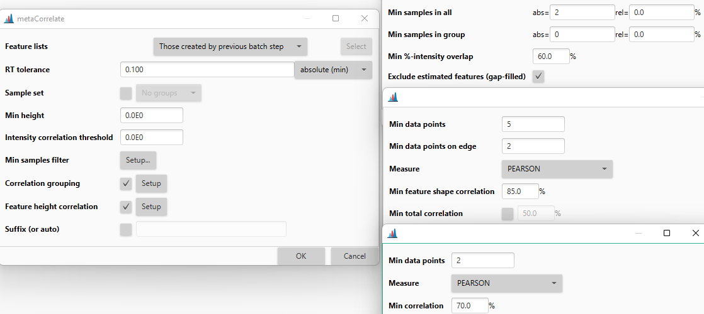

# metaCorrelate feature grouping

:material-menu-open: **Feature list methods → Feature grouping → Correlation grouping (metaCorrelate)**

This module groups features that likely originate from the same compound across a feature list.
Grouping is based on co-elution in retention time combined with optional correlation filters:

- Retention time co-elution
- Feature shape Pearson correlation across scans within a sample _(optional)_
- Feature height (intensity) correlation across samples _(optional)_

Grouped features are linked in the feature list and can subsequently be used by
[Ion Identity Networking](../iin/iin.md) and molecular networking workflows.

<!-- markdown-link-check-disable -->
## Recommended citations
!!! info

    When using this modules, please consider citing the corresponding publications: 
    Schmid, R., Petras, D., Nothias, LF. et al. Ion identity molecular networking for mass spectrometry-based metabolomics in the GNPS environment. Nat Commun 12, 3832 (2021). https://doi.org/10.1038/s41467-021-23953-9
    
    Schmid R., Heuckeroth S., Korf A., et al. Integrative analysis of multimodal mass spectrometry data in MZmine 3, In Review (2023)

---
<!-- markdown-link-check-enable -->

## Parameters

#### RT tolerance

First filter: only feature pairs within this retention time window are considered for grouping.
Use a narrow tolerance (~FWHM / 3) when feature shape correlation is disabled. With shape
correlation enabled as a strict secondary filter, the RT tolerance can be wider.

#### Minimum feature height

Minimum peak height for a feature to be included in the grouping. Leave at 0 to include all
features that passed the detection workflow. Useful to exclude weak gap-filled features from
driving grouping decisions.

#### Intensity threshold for correlation

Data points below this absolute intensity are excluded before computing feature shape Pearson
correlation. Leave at 0 to use the noise level from the mass detection step.

#### Min samples filter

Only group a feature pair if both features are detected in a sufficient number of samples.
Sub-parameters:

- **Min samples in all** — minimum detections across all samples.
- **Min samples in group** — minimum detections within any one sample group (requires project
  metadata).
- **Min % intensity overlap** — the lower-intensity feature must have at least this fraction of
  its total signal intensity fall within the RT range of the higher-intensity feature. Skipped
  automatically for datasets with ≥ the threshold set in **Advanced parameters**.
- **Exclude estimated features (gap-filled)** — gap-filled features do not count towards the
  minimum sample requirement.

#### Feature shape correlation _(Optional, enabled by default)_

Applies a within-sample Pearson correlation filter on the chromatographic peak shapes.

!!! warning

    Requires sufficient data points: at least 5 total with ≥ 2 on each side of the apex.
    For sparse chromatograms, disable this and rely on RT tolerance and feature height correlation.

Sub-parameters:

- **Min data points** — minimum number of scan-level data points used for the correlation.
- **Min data points on edge** — minimum points required on each side of the apex.
- **Measure** — similarity measure (default: Pearson).
- **Min feature shape correlation** — minimum Pearson _r_ to accept a grouping within a sample.
  Default: 0.85.
- **Min total correlation** _(optional)_ — minimum Pearson _r_ computed over all data points
  from all samples combined.

#### Feature height correlation _(Optional, enabled by default)_

Applies a cross-sample correlation filter using peak heights. Each feature pair is evaluated by
correlating their heights (one value per sample) across the sample set.

!!! warning

    Only meaningful when signal intensities are comparable across samples (similar matrix and
    ionization conditions). Not suitable for studies with large systematic intensity differences
    between samples.

Sub-parameters:

- **Min data points** — minimum number of samples with detections in both features.
- **Measure** — similarity measure (default: Pearson).
- **Min correlation** — minimum Pearson _r_ to accept a grouping.

#### Suffix (or auto) _(Optional)_

Custom suffix appended to the output feature list name. Deselect to generate an automatic suffix
based on the active parameters.

#### Original feature list

Determines what happens to the input feature list:

- **Keep** _(default)_ — the original list is retained and a new grouped copy is created.
- **Remove** — the original list is removed after processing.
- **Process in place** — the original list is modified directly.

#### Advanced parameters _(Optional, expanded by default)_

##### Keep extended stats

When enabled, additional per-correlation statistics are stored with every grouping result.
Required by some visualization modules that display correlation details. Disabled by default to
conserve memory.

##### Simplify for ≥ samples

For datasets with at least this many samples, the **Min % intensity overlap** check is skipped
to improve performance. Default: 250 samples.

{{ git_page_authors }}
