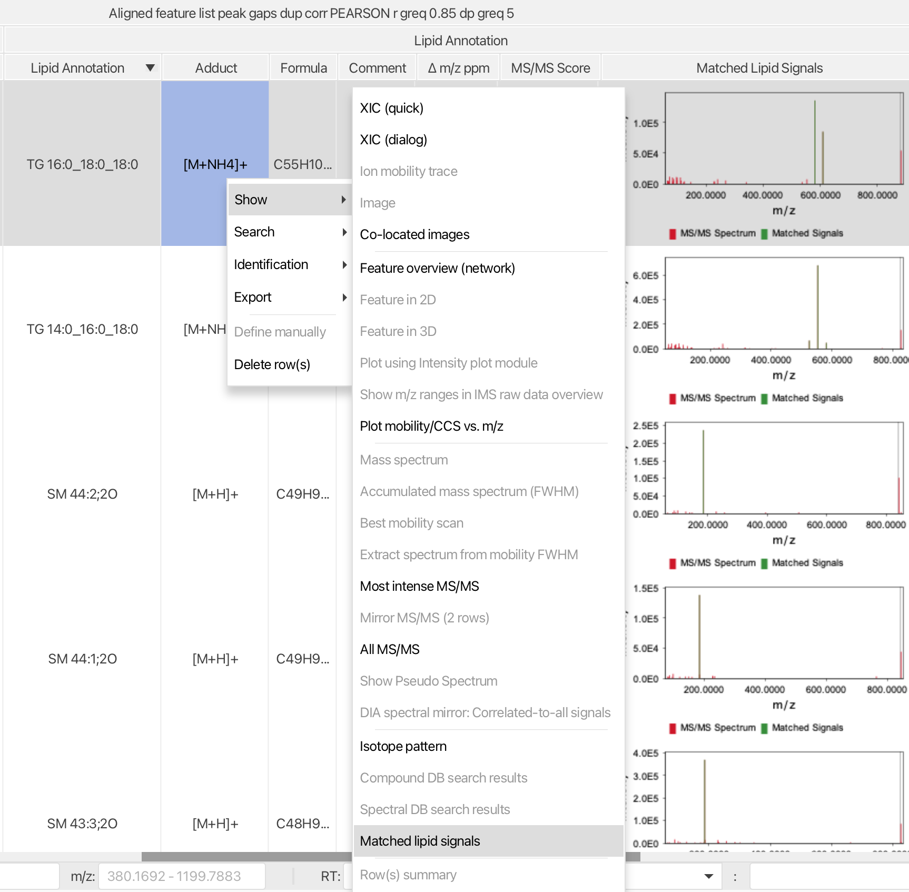
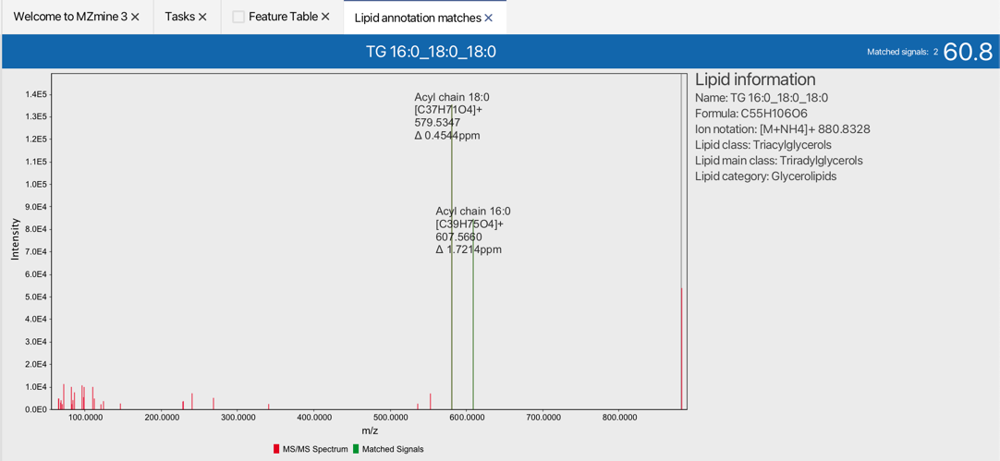
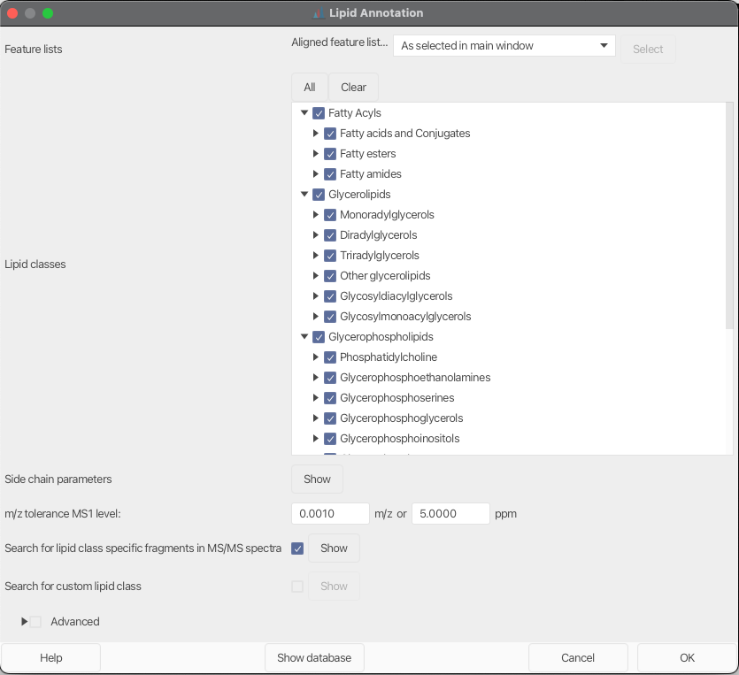
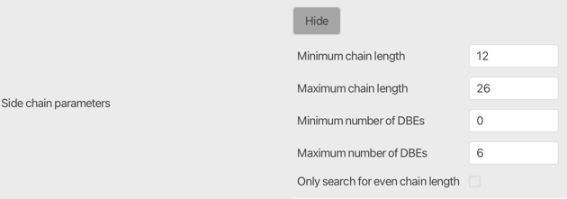
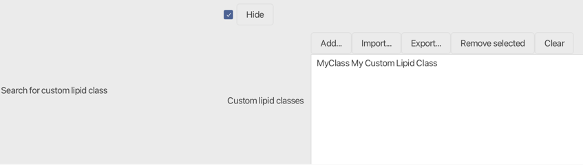
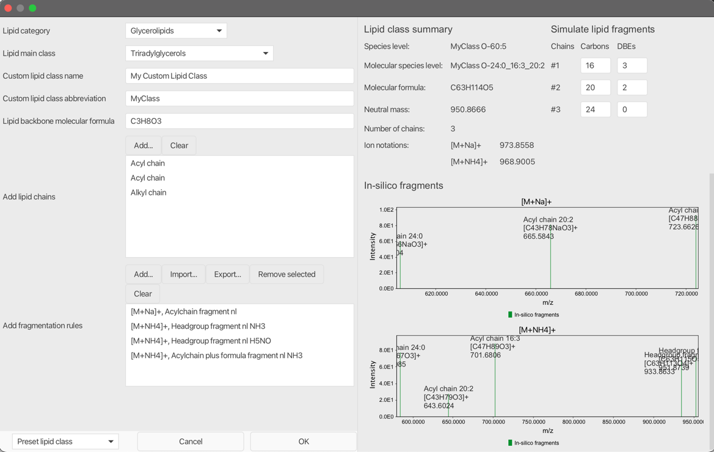
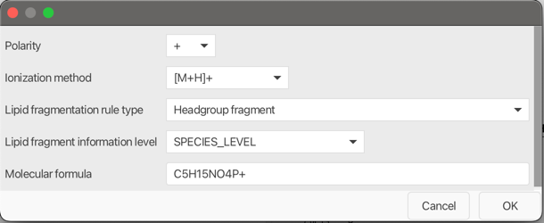

# Lipid Annotation

## Description

:material-menu-open: Feature list methods → Annotation → Search spectra → Lipid annotation

This module uses lipid class and ion notation specific fragmentation rules to annotate lipids in the feature lists. Lipids will be annotated based on accurate m/z on MS1 level and matched lipid fragments in MS2 spectra. 
This rule-based annotation approach follows Lipidomics Standards Initiative guidelines and uses the latest shorthand notation for lipid structure from mass spectrometry to avoid over-annotation. Annotations on species and molecular species level are currently supported. 

!!! tip
    
    Lipid annotations are directly added to the feature list. Matched fragments can be quickly evaluated. To validate the annotation quality right click on the annotated feature list row and select Matched lipid signals.
:material-menu-open: Show → Matched lipid signals

## Recommended citations

!!! info
    When using the Lipid annotation module consider reading and citing the original publication and the MZmine 3 publication.

    1. Korf, A., Jeck, V., Schmid, R., Helmer, P. O., & Hayen, H. (2019). Lipid Species Annotation at Double Bond Position Level with Custom Databases by Extension of the MZmine Open-Source Software Package. Analytical chemistry, 91(8), 5098-5105. doi:10.1021/acs.analchem.8b05493
    2. Schmid R., Heuckeroth S., Korf A., et al. Integrative analysis of multimodal mass spectrometry data in MZmine 3, Nature Biotechnology (2023), doi:10.1038/s41587-023-01690-2.

## Parameters

#### Lipid classes

This parameter lists all pre-configured lipid classes in MZmine. Each selected lipid class will be added to the search scope.  

#### Side chain parameters

Set the allowed min and max for chain length (number of carbons) and double bond equivalents (DBE) in a lipid chain. The number of chains is defined in the lipid class.
12 to 26 carbons and 0 to 6 DBEs is recommended as a starting point.
!!! warning

    Lipid chain variation highly depends on the analyzed sample.
!!! tip

    Odd chain lipid chains can be skipped by "Only search for even chain length to avoid false positive annotations.

#### m/z tolerance MS1 level

Enter m/z tolerance for exact mass matching on MS1 level. Lipids outside the m/z tolerance will not be matched.

#### Search for lipid class-specific fragments in MS/MS spectra

Activate this parameter to highly increase lipid annotation confidence.

!!! warning

    Mass detection on MS2 level needs to be performed first.

Set a mz tolerance for matching signals in MS2 spectra.
Set a Minimum MS/MS score to accept a lipid annotation. The score is the explained intensity [%] of all signals in MS/MS spectrum. Matches below the set score will be removed, except the optional parameter Keep unconfirmed annotations is selected.
Unconfirmed annotations will be marked with a comment in the feature list.

#### Search for custom lipid class

If selected, the user can add their own custom lipid class that will be added to the search scope. Click the Add... button or double-click on an already defined custom lipid class to start with the configuration. Configured custom classes can be exported and re-imported for further analysis.
!!! tip

    You want your lipid class preset in MZmine? Contribute to the code or contact the developers.

#### Advanced
Optional parameters
#### Ions to ignore
Selected ion notations can be ignored for annotations. This is very important in negative mode when using acetate or formate buffer solutions as LC eluent. Lipids that form adducts with formate in negative mode usually also form adducts with acetate. Therefore, most preset lipid classes have implemented fragmentation rules for both ion notations.
Since MZmine does not know the experimental LC setup, it is highly recommended to manually rule out ions that are unlikely to be formed.

!!!danger

    The delta between formate and acetate is CH2, exactly the difference of a lipid chain length. Including both ions when analyzing negative mode data will result false positive annotations.

#### Show database

By clicking the button "Show database" at the bottom of the window, a tab holding information on the selected lipid classes is opened.
All lipids are displayed in a table and in two Kendrick mass plots &#40;KMD CH2 left, KMD H right&#41;. Lipids that interfere in the selected m/z window are marked grey, isobaric lipids are marked red. The others are displayed in green.
!!! tip

    As a starting point select a preset lipid class from the combo box at the bottem left corner.
## Custom lipid classes and fragmentation rules
As described in the parameters section, custom lipid classes can be defined, stored and reused. 
The following parameters need be set up:
#### Lipid Category
Select a lipid category. The selected lipid category influences the lipid annotation algorithm since different rules are applied for species and molecular species level annotation construction. E.g. when using a sphingolipid chain type and a sphingolipid related fragmentation rule, make sure to set the lipid category to Sphingolipids.
Currently featured lipid categories:
- Fatty Acyls
- Gylcerolipids
- Glycerophospholipids
- Sphingolipids
- Sterol Lipids

#### Lipid Main Class
Select a lipid main class. The selection is for reference only and has no impact on the annotation process.

#### Custom lipid class name
Define a name for your lipid class. The name is for reference only.
!!!warning

    Must be unique when using multiple custom lipid classes.

#### Custom lipid class abbreviation
Define an abbreviation of the lipid class. The abbreviation will be used for the shorthand annotation.

#### Lipid backbone molecular formula
Define the molecular formula of a lipid class without lipid chains. E.g. for Diacylglycerophosphocholines (PC) use the formula of glycerol-choline C8H20O6PN.
!!! warning

    Compared to other lipid categories, sphingolipids share atoms in the backbone chain and the polar headgroup. Therefore, the determination of the backbone formula is more complicated.
    E.g. for Sphingosine use C3H9N as the lipid backbone formula. Missing oxygens will be added by the selected Sphingolipid backbone chain.

#### Add lipid chains
Add lipid side chains by selecting the Add... button. The following lipid chains are currently supported:
- Acyl chain
- Acyl mono hydroxy chain
- Alkyl chain
- Amid chain
- Amid mono hydroxy chain
- Shpingolipid mono hydroxy backbone chain
- Shpingolipid di hydroxy backbone chain
- Shpingolipid tri hydroxy backbone chain

#### Add lipid chains
!!! warning

    When using Spingolipid backbone chains make sure to use Sphingolipids as Lipid category.

### Add fragmentation rules

#### Polarity
Select polarity (+ or -).

#### Ionization method
Select an ion notation from the combo box. The ion notation will also be considered when calculating the intact lipid ion.

#### Lipid fragmentation rule type
!!! tip

    Use the pseudo spectra on the right containing in-silico fragments based on defined rules, to validate your custom fragmentation rules 

Following lipid fragmentation rule types are currently supporter:
- Headgroup fragment
  - Fix ion formula: C5H15NO4P+ for choline head group fragment
- Headgroup fragment nl
  - Fix neutral loss: C2H8NO4P for PE head group loss 
- Acylchain fragment
  - [M-H]- form of any acyl chain
- Acylchain fragment nl
  - Neutral loss of an acyl chain
- Acylchain plus formula fragment
  - An acyl chain fragment plus a defined formula 
- Acylchain plus formula fragment nl
  - A neutral loss of an acyl chain plus a defined formula
- Acylchain minus formula fragment
  - An acyl chain fragment minus a defined formula
- Acylchain minus formula fragment nl
  - A neutral loss of an acyl chain minus a defined formula
- Two acylchains plus formula fragment
  - Two acyl chains combined plus a defined formula. Select CL lipid class to see an example
- Alkylchain plus formula fragment
  - An alkyl chain fragment plus a defined formula

!!! warning
    
    Use the following Sphingolipid related rule types only when selecting Sphingolipids as Lipid Category.
- Sphingolipid mono hydroxy backbone chain fragment
  - Fragment of the sphingolipid backbone chain
- Sphingolipid di hydroxy backbone chain fragment
  - Fragment of the sphingolipid backbone chain
- Sphingolipid tri hydroxy backbone chain fragment
  - Fragment of the sphingolipid backbone chain
- Sphingolipid mono hydroxy backbone chain minus formula fragment
  - Fragment of the sphingolipid backbone chain minus a defined formula
- Sphingolipid di hydroxy backbone chain minus formula fragment
  - Fragment of the sphingolipid backbone chain minus a defined formula
- Sphingolipid tri hydroxy backbone chain minus formula fragment
  - Fragment of the sphingolipid backbone chain minus a defined formula
- Amid chain fragment
  - Fragment of an amid chain
- Amid chain fragment nl
  - Neutral loss of an amid chain
- Amid chain plus formula fragment
  - Amid chain plus formula fragment
- Amid chain plus formula fragment nl
  - A neutral loss of an amid chain plus a defined formula
- Amid chain minus formula fragment
  - Amid chain minus formula fragment
- Amid chain minus formula fragment nl
  - A neutral loss of an amid chain minus a defined formula
- Amid mono hydroxy chain fragment 
  - Fragment of an oxidized amid chain
- Amid mono hydroxy chain plus formula fragment
  - Oxidized amid chain plus formula fragment
- Amid mono hydroxy chain minus formula fragment
  - Oxidized amid chain minus formula fragment
- Precursor
  - Special case fore fatty acids, which checks if ONLY the precursor is present. 

{{ git_page_authors }}