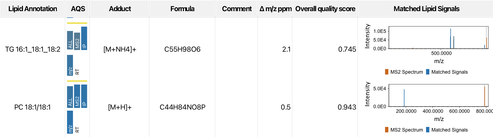
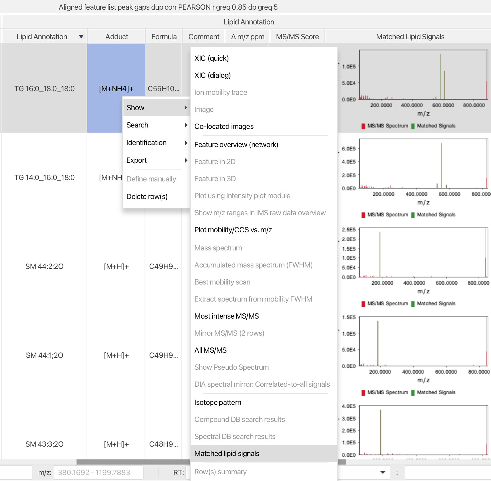
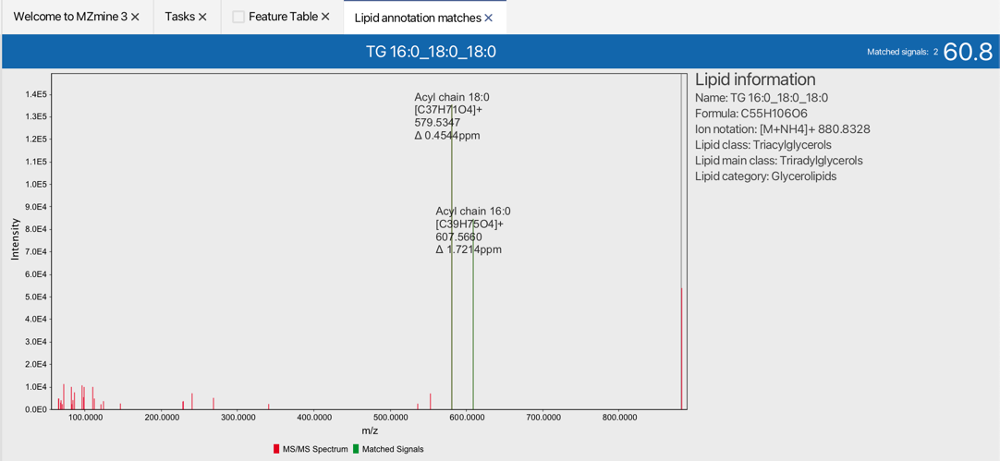
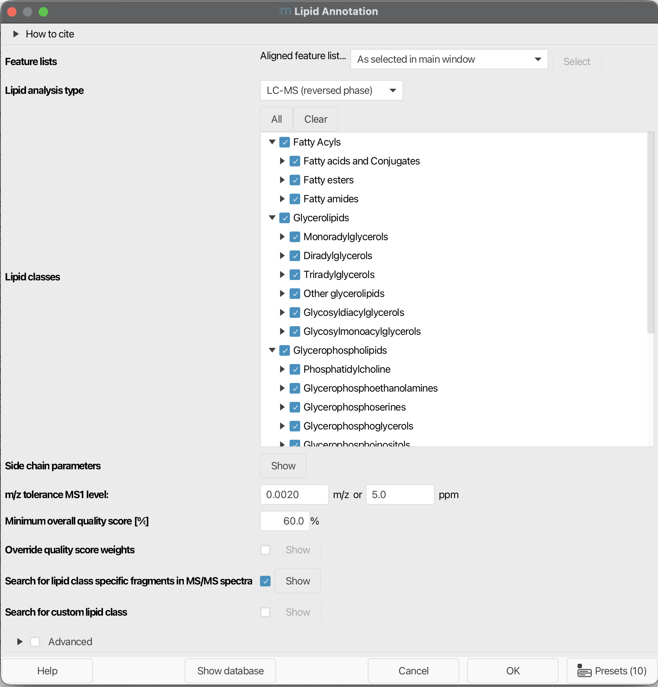
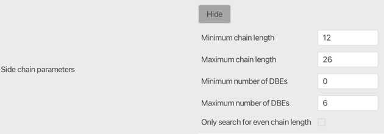
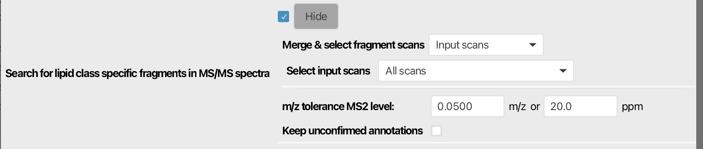
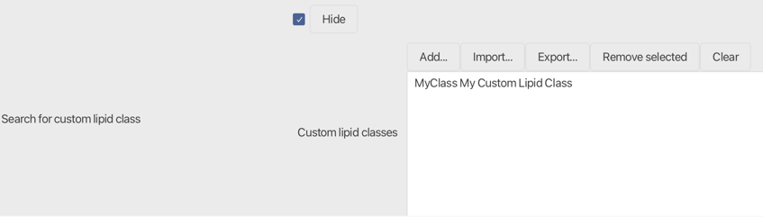
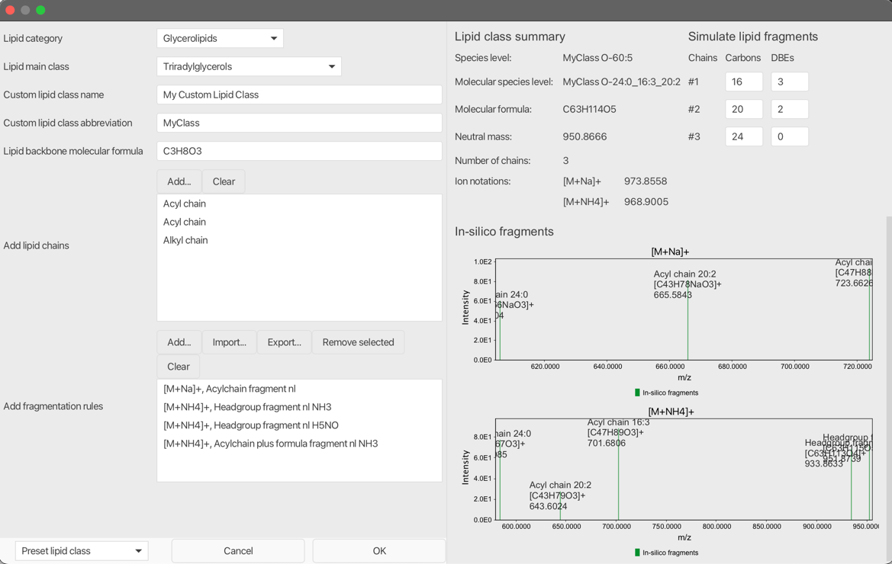
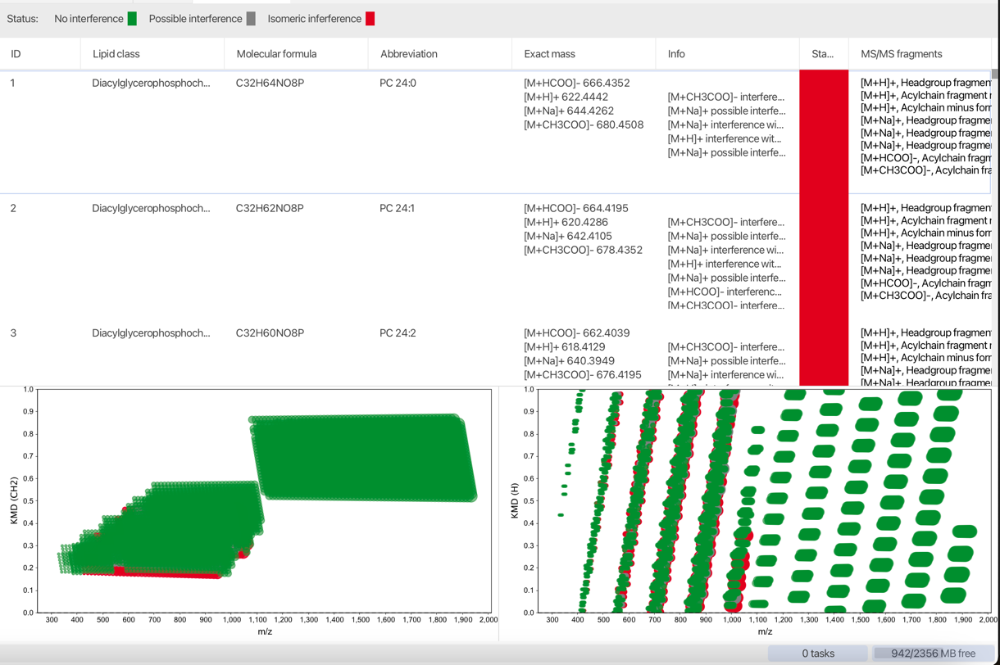
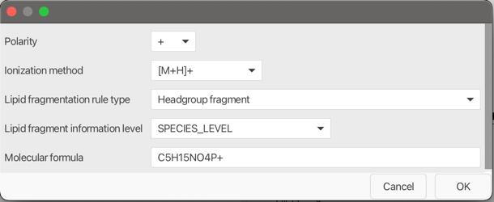

# Lipid Annotation

## Description

:material-menu-open: Feature list methods → Annotation → Search spectra → Lipid annotation

This module uses lipid-class-specific and ion-specific fragmentation rules to annotate lipids in feature lists. Candidate lipids are rank lipid annotations by an overall quality score. This score combines MS1 mass accuracy, optional MS/MS explained intensity, adduct agreement, isotope pattern similarity, interference by competing annotations, and analysis-type-specific retention-time behavior.

This rule-based workflow follows Lipidomics Standards Initiative guidelines and uses current shorthand notation to avoid over-annotation. Species-level and molecular-species-level annotations are currently supported.

!!! tip

    Lipid annotations are added directly to the feature list and sorted by their overall quality score. Matched fragments can be inspected quickly. To validate the annotation quality, right click on the annotated feature list row and select Matched lipid signals.

:material-menu-open: Show → Matched lipid signals

## Recommended citations

!!! info

    When using the Lipid annotation module, consider citing the original lipid annotation publication, the custom lipid class publication if applicable, and the MZmine 3 publication.

    1. Korf, A., Jeck, V., Schmid, R., Helmer, P. O., & Hayen, H. (2019). Lipid Species Annotation at Double Bond Position Level with Custom Databases by Extension of the MZmine Open-Source Software Package. Analytical chemistry, 91(8), 5098-5105. doi:10.1021/acs.analchem.8b05493
    2. Rudt, E., Froning, M., Heuckeroth, S., et al. (2025). Custom lipid classes in MZmine. Analytical Chemistry, 97(14), 7781-7788. doi:10.1021/acs.analchem.4c05989
    3. Schmid, R., Heuckeroth, S., Korf, A., et al. Integrative analysis of multimodal mass spectrometry data in MZmine 3, Nature Biotechnology (2023), doi:10.1038/s41587-023-01690-2.

## Parameters

#### Lipid analysis type

Select the acquisition or analysis type used for the experiment:

- `LC-MS (reversed phase)` enables reversed-phase retention-time trend scoring.
- `LC-MS (HILIC)` enables HILIC class-window scoring.
- `Direct infusion` and `Imaging` disable retention-time-based scoring.

#### Lipid classes

This parameter lists all pre-configured lipid classes in mzmine. Each selected lipid class is added to the search scope.

#### Side chain parameters

Set the allowed minimum and maximum chain length (number of carbons) and double bond equivalents (DBE) for lipid chains. The number of chains is defined by the selected lipid class.

`12` to `26` carbons and `0` to `6` DBEs is a good starting point.

!!! warning

    Lipid chain variation highly depends on the analyzed sample.

!!! tip

    Enable `Only search for even chain length` to skip odd-chain candidates when they are unlikely in your samples.

#### m/z tolerance MS1 level

Enter the m/z tolerance for precursor exact-mass matching on the MS1 level. Lipids outside this tolerance are not matched.

#### Minimum overall quality score [%]

Set the minimum QC-based lipid annotation score required to keep an annotation. The overall score combines:

- MS1 mass accuracy
- optional MS/MS explained intensity
- adduct agreement between the lipid annotation and the row ion identity
- isotope pattern similarity
- interference by competing annotations in the same row
- optional elution-order scoring for LC-based experiments

#### Override quality score weights

Optionally, override the default component weights of the overall quality score. This is useful if you want to emphasize or down-weight specific evidence types such as MS/MS, isotope pattern, adduct agreement, or elution order.

For `Direct infusion` and `Imaging`, retention-time-related weights are not used.

#### Search for lipid class-specific fragments in MS/MS spectra

Activate this parameter to increase annotation confidence by searching for class-specific fragments in MS/MS spectra.

!!! warning

    Mass detection on MS2 level needs to be performed first.

This submodule currently provides:

- fragment scan selection and merging settings
- an MS2 m/z tolerance for fragment matching
- `Keep unconfirmed annotations`

If `Keep unconfirmed annotations` is enabled, MS1-only matches without sufficient MS/MS evidence are retained and marked with a warning comment in the feature list. Otherwise, only MS/MS-confirmed matches are kept.

!!! info

    In the current implementation, MS/MS explained intensity is no longer configured as a separate hard cutoff. It contributes to the overall quality score instead.

!!! tip

    MS/MS confirmation currently requires at least one major fragment or two minor fragments.

#### Search for custom lipid class

If selected, user-defined custom lipid classes are added to the search scope. Click `Add...` or double-click an existing custom class to open the configuration dialog. Configured custom classes can be exported and re-imported for later analyses.

!!! tip

    If you want a lipid class to become part of the default presets, consider contributing it to the code base or contacting the developers.

#### Advanced

#### Ions to ignore

Selected ion notations can be excluded from annotation. This is especially important in negative mode when acetate or formate buffers are used as LC eluents. Many preset lipid classes contain fragmentation rules for both ion types, so excluding chemically implausible adducts can strongly reduce false positives.

Since mzmine does not know the exact LC setup, it is recommended to rule out ion types that are unlikely to form in the experiment.

!!! danger

    The mass difference between formate and acetate is `CH2`, exactly the same difference as one lipid-chain carbon increment. Including both ions in negative-mode data can therefore create false positive annotations.

#### Show database

Click `Show database` at the bottom of the setup window to open a tab containing all lipids generated for the current class and chain settings.

The generated lipids are displayed in a table and in two Kendrick mass plots &#40;KMD CH2 on the left, KMD H on the right&#41;. Lipids interfering in the selected m/z window are shown in grey, isobaric lipids in red, and the remaining entries in green.

!!! tip

    A good starting point is to select one preset lipid class in the combo box at the bottom left corner and inspect the generated search space.

## Results and downstream review

After annotation, matched lipids are stored directly on the feature list rows together with their annotation status and overall quality score.

- Use `Show lipid annotation QC dashboard` to get a full overview of the annotation quality.
- Use `Show → Matched lipid signals` to inspect the fragment evidence of a selected annotation.
- Use [Lipid annotation summary](../../visualization_modules/lipid_annotation_summary/lipid_annotation_summary.md) for a quick class-level overview of the annotated feature list.
- Use [ECN plots](../../visualization_modules/ecn_plots/ecn_plots.md) for retention-time trend inspection of annotated lipids.
- Use [Lipid annotation quality control dashboard](../../visualization_modules/lipid_annotation_qc_dashboard/lipid_annotation_qc_dashboard.md) to inspect lipid annotation summary, Kendrick mass plots, annotation quality, retention-time analysis, matched signals, and isotope patterns in one place.
- Use `Lipid annotation multi-row cleanup` to remove duplicate lipid annotations across rows. Cleanup can be applied globally or only within an RT tolerance window, and can prioritize preferred ionization types for selected lipid classes.

## Custom lipid classes and fragmentation rules

As described above, custom lipid classes can be defined, stored, exported, and reused.

The following parameters need to be configured:

#### Lipid Category

Select the lipid category. The selected category influences the annotation algorithm because different rules are applied for species-level and molecular-species-level construction. For example, sphingolipid chain types and sphingolipid fragmentation rules should be used with the `Sphingolipids` category.

Currently available lipid categories:

- Fatty Acyls
- Glycerolipids
- Glycerophospholipids
- Sphingolipids
- Sterol Lipids

#### Lipid Main Class

Select a lipid main class. The selection is for reference only and has no impact on the annotation process.

#### Custom lipid class name

Define a name for your lipid class. The name is for reference only.

!!! warning

    Must be unique when using multiple custom lipid classes.

#### Custom lipid class abbreviation

Define an abbreviation of the lipid class. The abbreviation will be used for the shorthand annotation.

#### Lipid backbone molecular formula

Define the molecular formula of a lipid class without lipid chains. For example, for diacylglycerophosphocholines (`PC`) use the glycerol-choline backbone formula `C8H20O6PN`.

!!! warning

    Compared to other lipid categories, sphingolipids share atoms in the backbone chain and the polar headgroup. Therefore, the determination of the backbone formula is more complicated.

    For example, for sphingosine use `C3H9N` as the lipid backbone formula. Missing oxygens are added by the selected sphingolipid backbone chain.

#### Add lipid chains

Add lipid side chains by selecting `Add...`. The following chain types are currently supported:

- Acyl chain
- Acyl mono hydroxy chain
- Alkyl chain
- Amid chain
- Amid mono hydroxy chain
- Sphingolipid mono hydroxy backbone chain
- Sphingolipid di hydroxy backbone chain
- Sphingolipid tri hydroxy backbone chain

!!! warning

    When using sphingolipid backbone chains, make sure to use `Sphingolipids` as the lipid category.

### Add fragmentation rules

#### Polarity

Select polarity (+ or -).

#### Ionization method

Select an ion notation from the combo box. The ion notation will also be considered when calculating the intact lipid ion.

#### Lipid fragmentation rule type

!!! tip

    Use the pseudo spectrum on the right, which contains in-silico fragments based on the defined rules, to validate custom fragmentation rules.

The following fragmentation rule groups are currently supported:

- Headgroup rules: `Headgroup fragment`, `Headgroup fragment nl`
- Acyl-chain rules: `Acylchain fragment`, `Acylchain fragment nl`, `Acylchain plus formula fragment`, `Acylchain plus formula fragment nl`, `Acylchain minus formula fragment`, `Acylchain minus formula fragment nl`, `Two acylchains plus formula fragment`
- Alkyl-chain rules: `Alkylchain fragment`, `Alkylchain fragment nl`, `Alkylchain plus formula fragment`, `Alkylchain plus formula fragment nl`, `Alkylchain minus formula fragment`, `Alkylchain minus formula fragment nl`

!!! warning

    Use sphingolipid-related rules only when `Sphingolipids` is selected as the lipid category.

- Sphingolipid backbone rules: mono-, di-, and tri-hydroxy backbone fragments; plus-formula fragments; plus-formula neutral losses; minus-formula fragments; and minus-formula neutral losses
- Amid-chain rules: `Amid chain fragment`, `Amid chain fragment nl`, `Amid chain plus formula fragment`, `Amid chain plus formula fragment nl`, `Amid chain minus formula fragment`, `Amid chain minus formula fragment nl`
- Oxidized amid-chain rules: `Amid mono hydroxy chain fragment`, `Amid mono hydroxy chain plus formula fragment`, `Amid mono hydroxy chain minus formula fragment`
- `Precursor`: special case for fatty acids that checks if only the precursor is present

{{ git_page_authors }}
