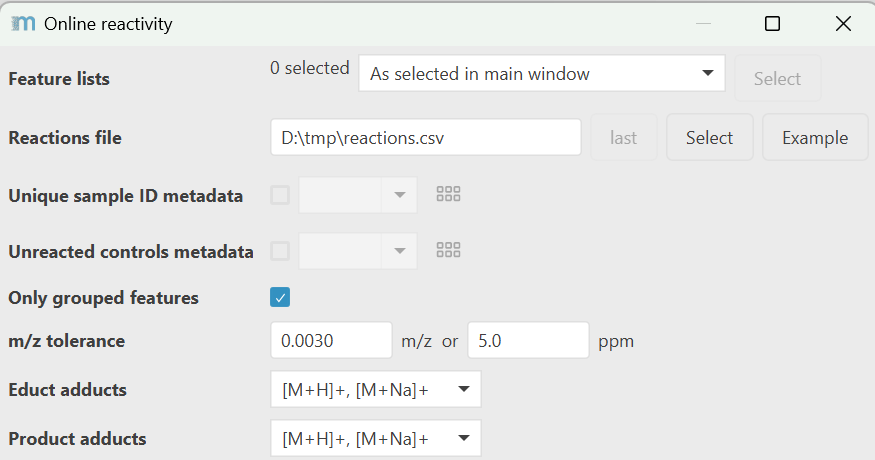

# Online reactivity

:material-menu-open: **Feature list methods → Feature grouping → Online reactivity**

This module searches for reaction educt-product pairs in individual samples or in control and
reacted samples. As a result features are flagged as products or educts of a reaction defined by
SMARTS string (similar to SMILES but better to define functional groups with flexibility). This
annotation can later be exported in the MS2 spectra export, GNPS export, SIRIUS export, and for
other annotation tools. These SMARTS can provide information of functional groups that need to be
present in the actual structure to facilitate structure annotation.

This module follows an online, post-column derivatization/reaction LC-MS strategy. After the LC
separation, reactants are added before ionization and MS analysis. This means that the reaction's
educt and product have the same retention time. They may appear in the same **reacted** sample or if
the reaction is complete, a control sample (sample without a reactant) without a reaction is
required.

Control samples (without reaction) provide additional filtering options that the product should only
appear in reacted samples, and the educt must appear in the control and may be present in the
reacted sample.

## Recommended citations

!!! info

    When using mzmine for your work, please consider citing: 
    Schmid R., Heuckeroth S., Korf A., et al. Integrative analysis of multimodal mass spectrometry data in MZmine 3, Nature Biotechnology (2023), doi:10.1038/s41587-023-01690-2.

    When using this modules, please consider citing the corresponding publication(s): 
    Vitale, G.A., Xia, SN., Dührkop, K. et al. Enhancing tandem mass spectrometry-based metabolite annotation with online chemical labeling. Nature Communications 16, 6911 (2025). https://www.nature.com/articles/s41467-025-61240-z

---

## Parameters

#### Feature lists

Select the feature lists to process

#### Reactions file

This file defines the reactions applied to specific samples. The example button provides a template
tsv or csv table file. The file contains:

- **filename_contains**: A unique ID that links a reaction to a sample
- **reaction_name:** A free text name for the reaction
- **delta_mz:** The m/z difference of m/z(product) - m/z(educt)
- **educt_smarts:** The SMARTS that defines the educt of the reaction. This is the molecule targeted
  by the reaction.
- **reaction_smarts:** The reaction SMARTS that defines the transformation from educt to product.
  The . defines molecule boundaries and allows the definition of multiple molecules per reaction
  side. [SMARTS definitions.](https://www.daylight.com/dayhtml/doc/theory/theory.smarts.html)

| filename_contains     | reaction_name | delta_mz | educt_smarts         | reaction_smarts                                  |
|-----------------------|---------------|----------|----------------------|--------------------------------------------------|
| unique_id_in_filename | my_reaction   | 123.45   | (\[#6]\[CX3]\(=O\)O) | (\[#6]\[CX3]\(=O\)O).(OC)>>\[#6]\[CX3]\(=O\)OC.O |

#### Unique sample ID

Metadata column that defines a unique sample ID. Go to Project/Metadata to load a metadata sheet and
reload this module to select this column. The values should be a substring found in the filenames.
Make sure to use a prefix or suffix before and after numbers otherwise id1 also matches id10. Just
adding a simple suffix id1_ will resolve this issue.

#### Reaction sample type

Metadata column that defines all samples as either control or reacted. Control is unreacted and
reacted is after applying the reaction. Go to Project/Metadata to load a metadata sheet and reload
this module to select this column.

Possible values are:

- **Control**: false, educt, control
- **Reacted**: true, product, reacted

#### Only grouped features

Only allow reaction relationships if the features where grouped. For example,
by [metaCorrelate](../id_ion_networking/metacorr/metacorr.md)
feature grouping based on retention time. The idea is that in the online reaction setup, the
retention time should be the same for educts and products. If the educt is fully converted into
products in the reacted samples, then consider disabling feature shape correlation to rely on
retention time only for grouping.

#### m/z tolerance

The tolerance to match the reaction with potential educt and product features. The m/z tolerance is
applied to the product m/z (important for the relative tolerance in ppm). This means a potential
product is matched against the educt + delta_mz (from reactions file).

#### Educt adducts & Product adducts

Educt and product adducts define more combinations to check reactivity matches.
This can be helpful if the ionization changes after the reaction, e.g.,
educt ionizes as \[M+Na\]+ and product as \[M+H\]+ - this changes the delta m/z searched.

---

{{ git_page_authors }}
