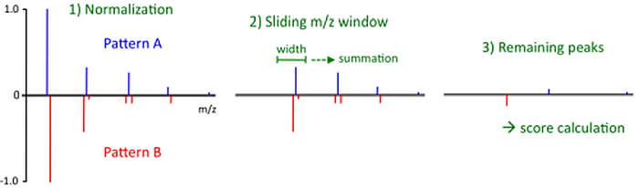
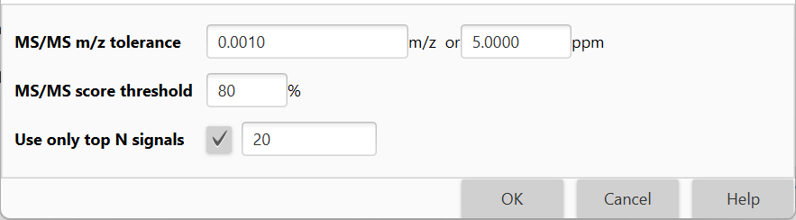

# **Chemical formula prediction**

## **Description**

:material-menu-open: **Feature list methods → Annotation → Search spectra → Chemical formula prediction**

[//]: # (TODO are there two modules for formula prediction - one available from the menu and other from the feature table??)

This module attempts to calculate all possible molecular formulas for every peak in the peak list, using given elemental and heuristic constraints. 

For a detailed description of the functionality and the embedded algorithms, please see the publication [[1](#references)].

## **References**

!!! quote " "

    1. Pluskal T. et al, Highly Accurate Chemical Formula Prediction Tool Utilizing High-Resolution Mass Spectra, MS/MS Fragmentation, Heuristic Rules, and Isotope Pattern Matching. Anal Chem (2012), 84(10):4396-403. DOI: <a>10.1021/ac3000418</a>.

    2. Kind and Fiehn, Seven Golden Rules for heuristic filtering of molecular formulas obtained by accurate mass spectrometry. BMC Bioinformatics (2007). DOI: <a>10.1186/1471-2105-8-105</a>.

## **Parameters**

#### **Charge**

The neutral mass is calculated from the peak m/z value, its charge and type of ionization adduct.

#### **Ionization type**

The neutral mass is calculated from the peak m/z value, its charge and type of ionization adduct.

#### **Sorting**

_Optional parameter_

If this option is chosen, the user-defined sorting is applied to all selected feature lists.

#### **Max best formulas per feature**

This parameter defines the maximum number of formulas to be added to a single feature. 

#### **m/z tolerance**

Tolerance of the neutral mass for searching the formula.

#### **Elements**

Elements allowed in the formula and their minimum and maximum counts.

#### **Element count heuristics**

_Optional parameter_

Selection of heuristic restrictions on element counts. These heuristics check the formula's element counts as defined in [[2](#references)].

##### **Available parameters**

These include:

- **H/C ratio**

    Ratio of hydrogen to carbon atoms, with available value range 0.1 <= H/C ratio <= 6.

- **NOPS/C ratios**

    Ratio of nitrogen to carbon atoms, with available valueN/C ratio <= 4,
    Ratio of oxygen to carbon atoms O/C ratio <= 3,
    Ratio of phosphorus to carbon atoms P/C ratio <= 2,
    Ratio of sulphur to carbon atoms S/C ratio <= 3

- **Multiple element counts**

    If this parameter is chosen, then several following rules apply:

    - if number of N/O/P/S atoms all > 1 then N< 10, O < 20, P < 4, S < 3
    - if number of N/O/P atoms all > 3 then N < 11, O < 22, P < 6
    - if number of O/P/S atoms all > 1 then O < 14, P < 3, S < 3
    - if number of P/S/N atoms all > 1 then P < 3, S < 3, N < 4
    - if number of N/O/S atoms all > 6 then N < 19 O < 14 S < 8

#### **RDBE restrictions**

_Optional parameter_

Selection of restrictions on RDBE (rings double bonds) values. The **Ring Double Bond Equivalents (RDBE)** value estimates the number of rings and unsaturated bonds in a molecule. It can be calculated from a chemical formula using the following general equation:

$$RDBE=1+\frac{1}{2}(\sum_{i}n_i(\nu_i-2))$$

where $n_i$ is the number of atoms and $\nu_i$ the formal valence of the element i.

Theoretically, each ring or a double bond increases the RDBE value by 1, while each triple bond increases the value by 2.

:warning: This equation can only be used for formulas composed of elements with a well-defined formal valence.

A number of exceptions to the RDBE rule are known, however, the RDBE value still provides a useful indicator regarding the validity of a molecular formula.

##### **Available parameters**

These include:

- **RDBE range**

    Range of allowed RDBE (Range or Double Bonds Equivalents) value.

    [[2](#references)] recommended the RDBE upper limit of 40 for common chemical compounds. The authors also stated that RDBE should not be negative, although certain exceptions may occur when formal valence states are exceeded.

- **RDBE must be an integer**

    Only integer values are allowed for RDBE. This condition is a natural implication of the principle of valence balance, which states that the number of atoms with odd valence must be even. Such assumption is valid for all neutral, non-radical molecules.

#### **Isotope pattern score**

_Optional parameter_

If selected, only results that fit the required isotope pattern similarity score will be returned. 

Several modules in MZmine offer the option the compare the isotope patterns of peaks and assign a score (percentage) of similarity to them. 

Until MZmine version 2.2, the CDK (Chemistry Development Kit) library was used to perform this operation. An improved algorithm, introduced in MZmine 3, is described below. The **similarity of two isotope patterns** is determined as follows:

- Both isotope patterns are normalized (such that highest isotope in each pattern has the intensity of 1.0) and merged into a single spectrum. In this single spectrum  all isotopes from the first pattern have a positive intensity, while the isotopes of the second pattern have negative intensity.
- A sliding window of user-defined width ("Isotope m/z tolerance" parameter) is moved over the whole m/z range, from the lowest m/z to the highest. Each pair of isotope peaks fitting within the window is added together, forming a single peak with the m/z value of the higher m/z of the pair.
- The final similarity score is calculated from the remaining peaks as

$$score_{isotopes}=\prod_{i}(1-\mid{I_i}\mid)$$

where $I_i$ is the intensity of remaining peak $i$.

A trivial observation is that for two identical isotope patterns the similarity score will be 100%, while for two completely different patterns 0% score is returned.

Only a single parameter is required for the evaluation of the algorithm, defining the width of the sliding window.

:material-lightbulb: It should be noted, though, that the optimal value of width of the sliding window parameter might be different from the commonly perceived “mass accuracy” of the instrument as mass resolving power and preprocessing of the data must be considered. For example, even if the mass accuracy of the major isotopes may be less than 0.001 m/z, the mass difference between minor isotopes may be significantly higher.

##### **Additional parameters**

These include: 

- **Isotope m/z tolerance**

    m/z tolerance which defines what isotopes would be considered same when comparing two isotopic patterns.

    This tolerance needs to be higher than general m/z precision of the data, because some small isotopes may overlap with the sides of bigger isotopic peaks.

- **Minimum absolute intensity**

    Minimum absolute intensity of the isotopes to be compared. Isotopes below this intensity will be ignored.

- **Minimum score**

    If the score between isotope pattern is lower, the match will be discarded.

#### **MS/MS filter**

_Optional parameter_

Use MS/MS pattern for candidate formula evaluation. 

In tandem mass spectrometry (MS/MS), during fragmentation, part of the original ion is detached, and the mass of the detached part is called the **neutral loss**. 

The neutral loss represents a fragment of the original molecule, so the chemical formula of such fragment must be a subset of the chemical formula of the precursor. 

When searching for the ion’s chemical formula, each candidate formula may therefore be evaluated using the ion’s MS/MS spectrum using the **algorithm** described below.

1. Mass list must be provided for the MS/MS spectrum of the ion of interest (see the [Mass detection modules](../featdet_mass_detection/mass-detection-algorithms.md)). It is assumed that all items in the mass list represent true fragment ions and noise has been removed. 
2. If the mass list contains any isotopes, remove them from the list. Isotopes are defined as ions with mass approximately 1 Da higher than another ion on the list, which has higher intensity. 
3. Calculate neutral losses for all the ions on the list by subtracting the fragment ion mass from the precursor mass. 
4. Try to generate a chemical formula for each neutral loss using the elements and maximum counts of formula F, within the user-defined mass tolerance. Small neutral losses (less than 5 Da) are ignored. 
5. If at least one formula can be found, the neutral loss is considered as interpreted. 
6. The evaluation score is calculated for each candidate formula F as described belows:

$$score_{MS/MS}=\frac{n_{found}}{n_{total}}$$

where $n_{found}$ is the number of ions for which the neutral loss could be interpreted, and $n_{total}$ is the total number of considered fragment ions.

##### **Available parameters**

- **MS/MS m/z tolerance**
    
    Tolerance of the m/z value to search (+/- range).

- **MS/MS score threshold**

    If the score is lower than the threshold, a match is discarded.

- **Use only top N signals**

    Use only N most abundant signals for scoring.
    :material-lightbulb: This option speeds up the search.

{{ git_page_authors }}