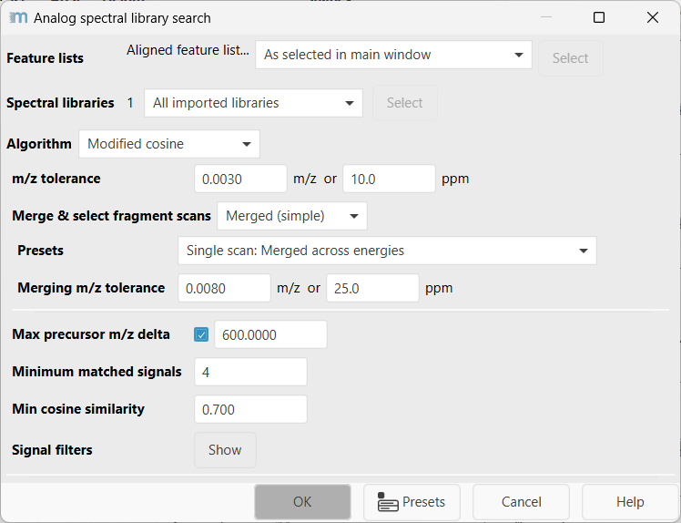
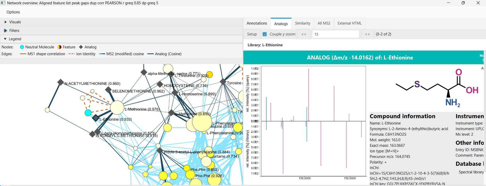

# **Analog spectral library search**

:material-menu-open: **Feature list methods -> Annotation -> Search spectra -> Analog spectral
library search**

!!! info
   Analog search was added in mzmine 4.10

## **Description**

The analog spectral library search compares feature list rows against imported spectral libraries
with similarity algorithms that can detect structurally related compounds even when the precursor
m/z differs from the library entry. It is intended as a complement to the regular
[spectral library search](../id_spectral_library_search/spectral_library_search.md): direct precursor-mass matches are skipped so
the result list focuses on analog or modification-aware candidates.

The module searches selected feature lists, uses MS/MS fragment spectra from each row, and stores
the results in a separate **Analog spectral match** row annotation column. Analog matches keep the
library entry metadata, similarity score, matching signal count, optional machine-learning score,
and compound identifiers separate from regular spectral-library annotations.

!!! warning

    The module requires feature rows with fragment spectra and mass lists. For LC-MS/MS data, run
    mass detection on the MS2 level before searching. Library entries without precursor m/z values
    are not used.

!!! tip

    Use the regular spectral library search first when you want identity-style matches within a
    narrow precursor m/z tolerance. Use analog spectral library search when you want to find related
    library compounds across precursor mass shifts.

## Recommended citations

!!! info

    When using MZmine for your work, please consider citing: 
    Schmid R., Heuckeroth S., Korf A., et al. Integrative analysis of multimodal mass spectrometry
    data in MZmine 3, Nature Biotechnology (2023), doi:10.1038/s41587-023-01690-2.

    When using MS2Deepscore, please also consider citing: 
    de Jonge N.F., Chekmeneva E., Schmid R., et al. Cross ionization mode chemical similarity
    prediction between tandem mass spectra in metabolomics, Nature Communications 17, 2483 (2026),
    doi:10.1038/s41467-026-69083-y. 
    Huber F., van der Burg S., van der Hooft J.J.J., et al. MS2DeepScore: a novel deep learning
    similarity measure to compare tandem mass spectra, J Cheminform 13, 84 (2021),
    doi:10.1186/s13321-021-00558-4.

    When using DreaMS, please also consider citing: 
    Bushuiev R., Bushuiev A., Samusevich R., Brungs C., Sivic J., Pluskal T. Self-supervised
    learning of molecular representations from millions of tandem mass spectra using DreaMS,
    Nature Biotechnology 44, 630-640 (2026), doi:10.1038/s41587-025-02663-3.

---

## **Parameters**

#### **Feature lists**

Select the feature list rows to search. Rows without suitable fragment spectra are skipped.

#### **Spectral libraries**

Select the imported spectral libraries to search. The library import options and supported file
formats are described in the [spectral library search documentation](../id_spectral_library_search/spectral_library_search.md).

#### **Algorithm**

Selects the similarity algorithm and shows the corresponding nested parameters. The available
choices are **Modified cosine**, **Cosine (no precursor)**, and **MS2Deepscore**. The
**DreaMS** option is currently disabled and documented below for the upcoming enablement.

---

### Algorithm: Modified cosine

Modified cosine aligns library and query fragments both by direct fragment m/z and by neutral-loss
mass differences to the two precursor ions. This makes it suitable for analog searching because two
related compounds can share fragment ions or neutral losses even when their precursor masses differ.

The modified cosine is applicable to (IMS)-MS data with soft ionisation processes, such as ESI and APCI.

The search uses all fragment spectra selected by **Merge & select fragment scans** and keeps the
best scoring match for each library entry. Matches are sorted by cosine similarity.

#### **m/z tolerance**

Maximum m/z difference for pairing fragment signals or neutral losses. The default is 0.003 m/z or
10 ppm, whichever is larger for the signal being compared.

#### **Merge & select fragment scans**

Controls which fragment spectra are used for each row, including whether scans are merged or kept
as representative scans. See [Merge & select fragment scans](../filter_scan_merge_select/scan_merge_select.md)
for the detailed presets and advanced options.

#### **Max precursor m/z delta** _(Optional)_

Limits the absolute precursor m/z difference between the feature row and a candidate library entry.
The default enabled value is 600 m/z. Increasing this value searches broader analog mass shifts but
also increases runtime and the number of candidates.

#### **Minimum matched signals**

Minimum number of paired fragment signals or neutral losses required for a stored match. The default
is 4. Higher values are more selective but can remove useful analog hits for compounds with sparse
fragmentation.

#### **Min cosine similarity**

Minimum cosine score required to store a match. The score is scaled from 0 to 1; the default is 0.7.

#### **Signal filters**

Applies optional preprocessing to query and library spectra before scoring. These filters reduce
spectral complexity and can improve speed on spectra with many fragment signals.

#### **Remove residual precursor m/z** _(Optional)_

Removes signals around the precursor m/z before scoring. The default enabled range is +/- 10 m/z.
This is useful when residual precursor or isotope signals would otherwise dominate the similarity.

#### **Crop to top N signals**

Limits spectra to the most abundant remaining signals after intensity filtering. The default is 250
signals.

#### **Signal threshold (intensity filter)**

Applies the intensity-percent filter only when a spectrum contains more than the threshold number of
signals. The default threshold is 50 signals.

#### **Intensity filter at >N signals**

Keeps the most intense signals that explain the target fraction of total intensity. The default is
98% of intensity.

---

### Algorithm: Cosine (no precursor)

This option performs a direct cosine-style fragment comparison without using precursor masses for
neutral-loss alignment. It uses the most intense fragment scan from each feature row and searches a
wide precursor range, while still skipping direct precursor matches within the fragment m/z
tolerance.

The Cosine (no precursor) algorithm is applicable to GC-EI data with hard ionisation.

This option is mainly useful when precursor-based neutral-loss logic is not appropriate, for example
for pseudo spectra or workflows where precursor m/z should not drive the alignment.

#### **m/z tolerance**

Maximum m/z difference for pairing fragment signals. The default is 0.003 m/z or 10 ppm, whichever
is larger.

#### **Minimum matched signals**

Minimum number of paired signals required for a stored match. The default is 8.

#### **Min cosine similarity**

Minimum cosine score required to store a match. The score is scaled from 0 to 1; the default is 0.7.

#### **Signal filters**

Applies intensity-based filtering without residual precursor removal. Defaults are 350 top signals,
a 100-signal threshold for intensity filtering, and 98% retained intensity.

---

### Algorithm: MS2Deepscore

MS2Deepscore embeds query and library spectra with a neural network and compares the embeddings by
dot product. Unlike the cosine algorithms, it does not restrict candidates by precursor mass during
the main search. Direct precursor matches are skipped with a fixed tolerance of 15 ppm or 0.005 m/z.

MS2 Deepscore is applicable to (IMS)-MS data with soft ionisation.

For each stored MS2Deepscore analog match, MZmine also computes a modified-cosine fallback score
with the same 15 ppm or 0.005 m/z tolerance. This fallback score is used for mirror-plot style
visualization, while the analog match list is sorted by the MS2Deepscore score.

#### **MS2Deepscore model**

Path to the PyTorch script model file. The matching settings file must be in the same folder and
named either like the model with `_settings.json` appended or simply `settings.json`. The model can
be downloaded from the parameter dialog.

#### **Merge & select fragment scans**

Controls scan selection before embedding. MS2Deepscore uses the first selected fragment scan per row
that has a precursor m/z and a mass list.

#### **Minimum signals**

Minimum number of fragment signals required before a query scan is embedded. The default is 4, and
the minimum allowed value is 3.

#### **Min similarity**

Minimum MS2Deepscore similarity required to store a match. The score is scaled from 0 to 1; the
default is 0.9.

---

### Algorithm: DreaMS

DreaMS embeds MS/MS spectra with a transformer model trained to learn molecular representations from
large collections of tandem mass spectra. In analog spectral library search it will follow the same
ML matching path as MS2Deepscore: query and library embeddings are compared by dot product, direct
precursor matches are skipped with a fixed tolerance of 15 ppm or 0.005 m/z, and a modified-cosine
fallback score is attached for spectrum visualization.

DreaMS is applicable to (IMS)-MS data with soft ionisation.

#### **DreaMS model**

Path to the PyTorch script model file. The matching settings file must be in the same folder and
named either like the model with `_settings.json` appended or simply `settings.json`. The expected
model file name is `DreaMS_embedding_model_torchscript.pt`, and the model can be downloaded from
the parameter dialog.

#### **Merge & select fragment scans**

Controls scan selection before embedding. The prepared analog-search implementation uses the first
selected fragment scan per row that has a precursor m/z and a mass list.

#### **Min similarity**

Minimum DreaMS similarity required to store a match. The score is scaled from 0 to 1; the default is
0.75.

#### **k-nearest neighbors** _(Currently not used by analog search)_

The shared DreaMS networking parameter set contains k-nearest-neighbor controls. These are used by
DreaMS molecular networking to constrain graph density, but the prepared analog spectral library
search path does not use them for library matching.

#### **Batch size**

Number of spectra processed in one forward pass through the DreaMS model when computing embeddings.
The default is 32. Lower values reduce memory use but can slow the search.

---

## Results and network view

Analog hits are written to the **Analog spectral match** row type. This column can be expanded like
regular spectral library matches to inspect compound names, identifiers, similarity, matching
signals, ML score when applicable, precursor m/z differences, formulas, structures, and other
library metadata.

When analog matches are present, the interactive network visualizer can add **Analog** compound
nodes. Each analog node represents a deduplicated library-compound group, and edges connect the
feature rows that matched that group. Analog library annotations are grouped when they share a
compound identifier such as compound name, InChIKey, InChI, SMILES, formula, or CAS number. Direct
spectral library matches to the same compound can be folded into an existing analog group, but they
do not create analog nodes by themselves.

Analog network edges are labeled by the score type that created them, for example analog cosine,
analog MS2Deepscore, or analog DreaMS. Selecting analog nodes in the network view can also show
the backing library entries together with selected feature rows in spectrum views.

---

## Algorithm {#algorithm}

1. MZmine loads imported library entries that contain precursor m/z values.
2. Query fragment spectra are selected from each feature row according to the chosen algorithm.
3. Direct precursor matches are skipped so the output focuses on analog candidates.
4. The selected similarity algorithm scores each query-library pair.
5. Matches that pass the algorithm thresholds are appended to the row's **Analog spectral match**
   list.
6. Cosine results are sorted by cosine score. MS2Deepscore and DreaMS results are sorted by
   the ML score and also carry a modified-cosine fallback score for visualization.

{{ git_page_authors }}
