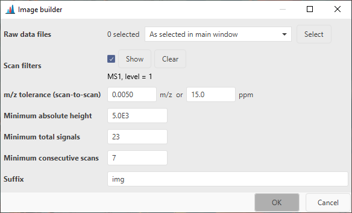

# Image builder

## Description

:material-menu-open: **Feature detection → Imaging → Image builder**

The image builder will create ion image features from mass spectrometry (MS) imaging raw data.
Similar to the [LC-MS feature detection](../../lc-ms_featdet/featdet_adap_chromatogram_builder), a
[feature list](../../lc-ms_featdet/featdet_results) will be produced, containing images for every
detected m/z.

## Parameters

### Scan filters

Sets the scans to be used for image generation. The default is MS level = 1 without additional
filtering.

### m/z tolerance (scan-to-scan)

Defines the fluctuation of an individual m/z peak in between scans. For TOF instruments, 0.005 m/z
or 20 ppm is a good starting point, while Orbitraps or FT-ICRs can achieve narrower signals
depending on the
set resolution.

### Minimum absolute height

The minimum intensity an ion image feature must have in at least one point to be considered and
retained in the final feature list.

### Minimum total signals

The minimum amount of pixels, an ion image must be detected in. Consider your total image pixel size
when setting this parameter.

### Minimum consecutive signals

The minimum consecutive signals for an ion image feature to be detected.

### Suffix

The suffix for the created feature list.

{{ git_page_authors }}
