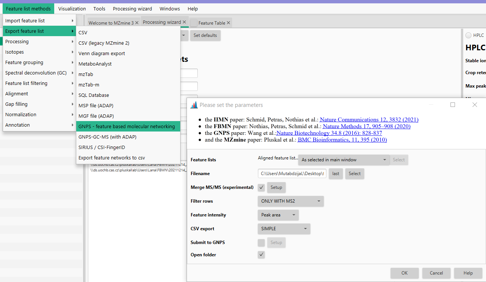

# **Data export to other software**

[//]: # (TODO Check if all works for the latest versions of the software)

## **GNPS-FBMN/IIMN export**

### **Description**

:material-menu-open:  **Feature list methods → Export feature lists → GNPS - feature based molecular networking**.

This module connects MZmine feature finding results to the [GNPS](https://gnps.ucsd.edu/) workflows for [Feature-based Molecular Networking (FBMN)](https://ccms-ucsd.github.io/GNPSDocumentation/featurebasedmolecularnetworking/) and [Ion Identity Molecular Networking (IIMN)](https://ccms-ucsd.github.io/GNPSDocumentation/fbmn-iin).

Using this module, the user can export the feature list needed for the manual submission to GNPS' feature based molecular networking (GNPS FBMN) or directly submit the job to the GNPS platform from MZmine. In both cases, two files are created:

1. Quantification table (CSV file) which contains the features and their associated information (e.g., average m/z, retention time, and each feature's area or height).
2. MS/MS spectral summary (.MGF file) which contains one representative MS/MS spectrum for each row in the feature list.
3. A [supplementary edges file](https://ccms-ucsd.github.io/GNPSDocumentation/fbmn-iin/#supplementary-pairs) with related ion identities (if ion identity networking was performed).

### **References**

!!! quote " "

    **IIMN:** Schmid R., Petras D., Nothias LF, et al. [Ion Identity Molecular Networking for mass spectrometry-based metabolomics in the GNPS Environment](https://www.nature.com/articles/s41467-021-23953-9). Nat. Comm. 12, 3832 (2021).

    **FBMN:** Nothias, L.-F., Petras, D., Schmid, R. et al. [Feature-based molecular networking in the GNPS analysis environment](https://www.nature.com/articles/s41592-020-0933-6). Nat. Methods 17, 905–908 (2020).

    **GNPS:** Wang, M. et al. [Sharing and community curation of mass spectrometry data with Global Natural Products Social Molecular Networking](https://doi.org/10.1038/nbt.3597). Nat. Biotechnol. 34, 828–837 (2016).

### **Parameters**

#### **Filename**
Name to be given to the output files (.MGF and .CSV). In this field, the user can either write the path where they want to save the file, or click "select", navigate into the desired output folder, write the output name in the "file name" field and click save. Once that is done, the path should be visible in the Filename field in the GNPS export module.

#### **Merge MS/MS (experimental)**
If checked, high quality MS/MS spectra that correspond to one feature are merged, instead of exporting only the most intense MS/MS spectrum. See [MS/MS merger](merge_ms2_kai.md) for additional information.

#### **Filter rows**
In the final output files, the user can select to export all the rows without any filters applied, rows only with MS/MS spectra, rows with MS/MS and Ion Identity (it gives MS/MS and the adduct information) and rows with MS/MS or Ion Identity. Normally, for FBMN you want to retain features with MS/MS spectra.

#### **Feature intensity**
The user can either select peak area or peak height which will then be displayed in the quantification table.

#### **CSV export**
The user can choose between **simple**, **comprehensive**, or **all**. Difference is in the amount of information that is present in the quantification table. Simple resembles the legacy format from the MZmine 2 export. Both options can be used for FBMN in GNPS other tools might rely on the simple MZmine 2 style output.

#### **Submit to GNPS**
This option allows any user to directly submit FBMN/IIMN jobs to GNPS. The password and user name are optional and are sent without encryption (until the server has moved to its final location with https).
The input files uploaded to GNPS with the "Submit to GNPS" option are not saved on your GNPS user account. These files are deleted on monthly basis, which prevent future cloning of the job and retrieval of the files. Use the "standard" interface of FBMN for persistant jobs and more options. Or log into your GNPS account and click on **Clone to latest version** for a job submitted via direct interface.

#### **Open folder**
Opens the export folder.

## **GNPS GC-MS (with ADAP)**

### **Description** 

:material-menu-open: **Feature list methods → Export feature list → Export to GNPS GC-MS (with ADAP)**

!!! warning
     This module should be run on aligned feature list after applying one of the spectral deconvolution methods (see ADAP manual).

The GNPS GC-MS module exports all files needed for the GC-MS workflow on the GNPS web platform. This includes the **feature quantification table (CSV file)** and the **spectral summary (.MGF file)** with representative clustered GC-EI-MS spectra for the row in an (aligned) feature list.

### **References**

!!! quote
     1. Smirnov et al.: J. Proteome Res 2017, DOI: 10.1021/acs.jproteome.7b00633 
     2. Wang et al.: Nature Biotechnology 34.8 (2016): 828-837.
     3. Pluskal et al.: BMC Bioinformatics, 11, 395 (2010)

### **Parameters**

#### **Feature lists**
Name of the feature list(s) to be exported.

#### **Filename**
Base name for the output files

#### **Representative m/z**
The m/z value that is exported to the mgf and used in GNPS GC-MS. Options: 
- As in feature table, 
- highest m/z, 
- heighest intensity.

#### **Feature intensity**
Intensity in the quantification table (csv file). Available options are:
- Peak area,
- Peak height.

#### **Open folder**
_Optional parameter_

Opens the folder containing the output files.

## **SIRIUS/ CSI-FingerID**

### **Description**

:material-menu-open: **Feature list methods → Export feature list → SIRIUS / CSI-FingerID**

The module allows the export of spectral features to Sirius from a selected feature list or an aligned feature list in **.MGF** format. The generated .MGF file can be directly processed with Sirius (version 3.4 minimum). 

Sirius uses both the deconvoluted isotopic pattern for each feature and the corresponding MS2 spectrum to rank molecular formula candidates. Spectral features exported consist of a pair of MS1 and MS2 spectrum for each row. Note that the MS1 spectrum can contain the deconvoluted isotopic peaks. 

!!! warning
     A masslist with mass detection performs on MS level 2 has to be generated first and selected.

This module can be used in combination with the Export for GNPS module and imported back into GNPS molecular networks. Please refer to the following documentation for a detailed tutorial:

### **References**

!!! quote
     1. **MZmine2 paper**: Pluskal et al.: BMC Bioinformatics, 11, 395 (2010)
     2. K. Dührkop, et al. “Sirius 4: a rapid tool for turning tandem mass spectra into metabolite structure information”, Nat methods, 2019.

#### **Instructions**

Before using the module, perform the following:

- Deconvolute isotopic peaks:
     Feature list methods →  Isotopes → 13C isotope filter
- Filter out peak without MS/MS spectrum associated.
     MZmine2 Menu: Peak list methods / Filtering / Peak list row filter / Keep only peaks with MS2 scan (GNPS)
- Reset the peak number ID.
     MZmine2 Menu: Peak list methods / Filtering / Peak list row filter / Reset the peak number ID
- Perform mass detection on MS level 2 and select.
     MZmine2 Menu: Raw data methods / Mass detection
  [Make sure to use a noise threshold consistent with the MS level 2]

### **Parameters**

#### **Feature lists**
Name of the feature list(s) to be exported.

#### **Filename**
Base name for the output files

#### **Merge MS/MS**

Merge high qualitative MS/MS into one spectrum instead of exporting all MS/MS separately.

#### **m/z tolerance**

m/z tolerance to exclude duplicates in correlated spectrum.

#### **Renumber IDs**
_Optional parameter_

Resets the IDs (uses the row ID otherwise).

#### **Only rows with annotation**
_Optional parameter_

Only export rows with an annotation (run MS annotate or metaMScorrelate).

#### **Exclude empty MS/MS spectra**
_Optional parameter_

Do not export empty MS/MS spectra (only features with MS/MS spectrum with at least 1 signal are exported).

#### **Exclude multiple charge**
_Optional parameter_

Do not export multiply charged rows.

#### **Exclude multimers**
_Optional parameters_

Do not export rows that were annotated as multimers (2M) (run MS annotate or metaMScorrelate).

## **MetaboAnalyst export**

### **Description**

:material-menu-open: **Feature list methods → Export feature list → MetaboAnalyst export**

This module exports the contents of the peak list into a csv file formatted. This csv file can be easily uploaded into the **Statistical Analysis** module of the **MetaboAnalyst** service. 

!!! warning

     Prior to export, samples must be separated into groups by a user-defined parameter (see :material-menu-open: Project →  Set sample parameters menu). Each group must contain at least 3 samples (raw data files).

#### **Format of exported CSV file**

The exported file is formatted as shown below. Each feature is represented by its ID in the feature list, m/z value (formatted according to MZmine configuration), retention time value (formatted according to MZmine configuration), and the preferred identity (name).

     "Sample","ko15","ko16","ko18","ko19","ko21","ko22","wt15","wt16","wt18","wt19","wt21","wt22"
     "Label","KO","KO","KO","KO","KO","KO","WT","WT","WT","WT","WT","WT"
     "1:258.110@13.4 (name1)",147887.53,451600.71,65290.38,56540.93,85146.33,162012.44,175177.08,82619.48,51951.61,69198.22,153273.47,98144.28
     "2:137.045@9.4 (name2)",1778569,1567038,1482796,1039130,1223132,1072038,1950287,1466781,1572679,1275313,1356014,1231442
     "4:184.0733@13.7 (name4",237993.6,269714,201393.4,150107.3,176989.7,156797,276541.8,222366.2,211717.7,186850.9,188285.9,172348.8
     ...

### **Parameters**

#### **Filename**

Name of exported CSV file for MetaboAnalyst. If the file already exists, it will be overwritten.

#### **Grouping parameter**

Project parameter that will be used to obtain group information to each sample (e.g. control vs disease). Please set parameters in the Project/Set sample parameters menu.

### **Uploading to MetaboAnalyst**

In MetaboAnalyst, please select the Statistical Analysis module.

After selecting the Statistical Analysis module, please set the parameters as shown below. In the "Data File" field, please select the CSV file generated by this MZmine module.

For details about MetaboAnalyst functions and capabilities, please refer to its documentation.

## **Tidymass**

Tidymass can import the csv feature table from MZmine, using `convert_mzmine2mass_dataset` function. For more details see [Tidymass tutorial](https://www.tidymass.org/start/create_mass_dataset/#mzmine-feature-table-to-mass_dataset-class).

{{ git_page_authors }}