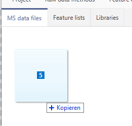
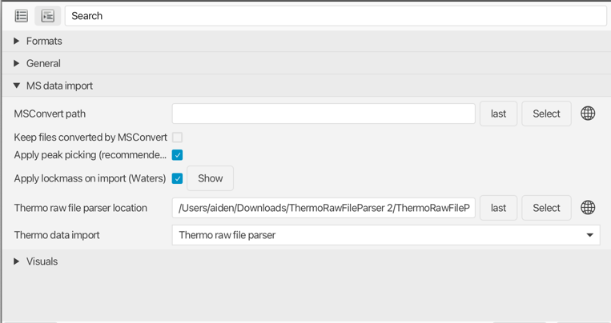
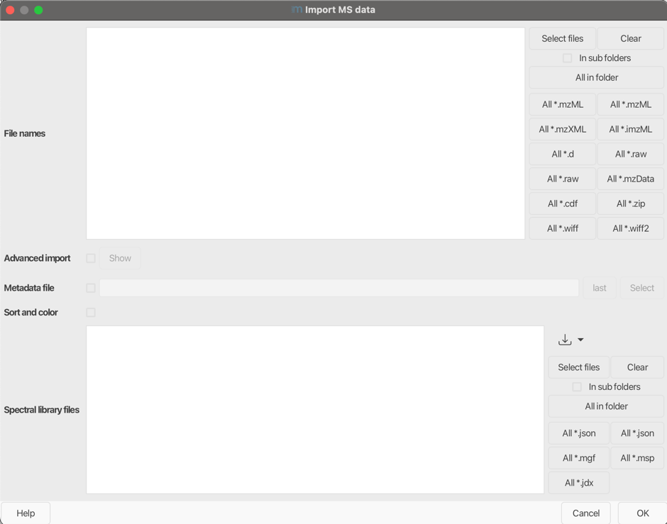

# **Data import**

You can simply drag & drop the raw data into the MS data files tab of the main window. Alternatively,
you can use the **Import MS data** module.

!!! info

    mzmine can use MSConvert for raw data conversion automatically. Make sure to setup the MSConvert installation path in the mzmine preferences.

## **MS data**

### **Description**

Raw data can be imported via :material-menu-open: **Raw data methods → Import MS data**.

### **File names**

Click **Select files** or choose the preferred data format (All*.) and browse the desired directory. All data files stored therein will be imported.
The enabled option **in sub folders** searches all files in the whole subdirectory tree.

### **Advanced import**

#### **Scan filter**
You can set up the scan filter to reduce the overall data. Options include e.g. polarity, or retention time range.

#### **Crop MS1 m/z**
You can filter for a specified m/z range.

#### **MS1 detector and MS2 detector**
!!! tip

    When processing very large datasets (hundreds to thousands of data files), the mass detection
    can be run during the import. All signals below the specified noise level are not imported (altering the raw data on the import), thus saving memory and processing time.

Set the mass detection parameters as described in the Mass detection section. 

!!! warning

    While it is slightly more efficient to do this during data import, only the processed data is stored
    and the unprocessed data is discarded. Only use this method if you have tested that the final
    results are the same, compared to splitting the data import and mass detection into two separate
    steps.

!!! caution

    If you use a mzbatch file created by the mzwizard, make sure to remove the mass detection steps if you apply MS1 and MS2 detection during the import.

#### **Denormalize fragment scans (traps)**
This option denormalizes scans with MS level > 1, acquired with trap instruments, including Orbitrap or trapped ion mobility spectrometry (TIMS).
When enabled, each scan is multiplied with the injection time resulting in "raw" intensities. If the injection time is missing in the data file, the scans remain unprocessed.
This option is encouraged before spectral merging to reduce the intensity differences between scans acquired with different injection times.

### **Metadata file**
Select this option,if you have a .csv of .tsv file with your metadata. If you need a template it is recommended to import all your raw data files into mzmine and then navigate to
:material-menu-open: **Project → Sample metadata**. Select the export button in the bottom toolbar. The **Format** *mzmine internal* is recommended.

### **Sort and color**
!!! warning

    This option requires metadata

If selected, the raw data will be colored based on *sample_type*, which covers **blank**, **QC**, and **sample**.

### **Spectral library files**
Select all spectral library files you want to import.

{{ git_page_authors }}
