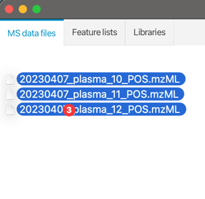
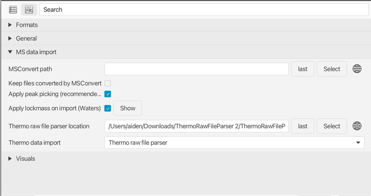
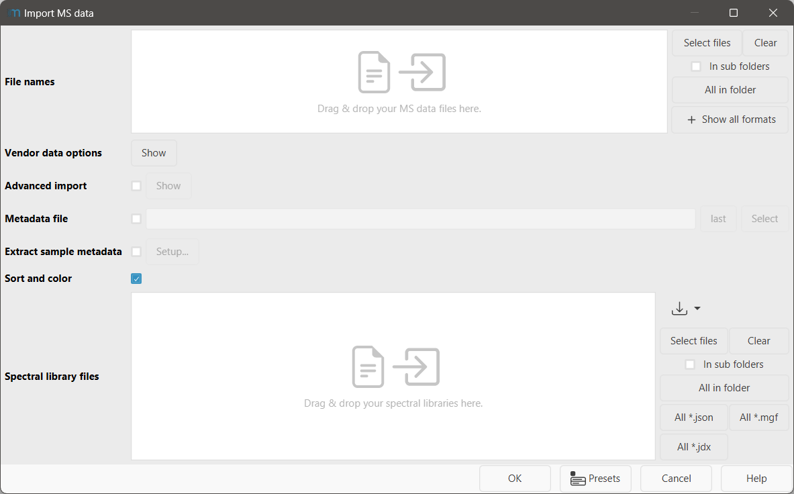

# **Data import**

You can simply drag & drop the raw data into the MS data files tab of the main window. Alternatively,
you can use the **Import MS data** module.

!!! info

    mzmine can use MSConvert for raw data conversion automatically. Make sure to setup the MSConvert installation path in the mzmine preferences.

## **MS data**

### **Description**

Raw data can be imported via :material-menu-open: **Raw data methods → Import MS data**.
The module combines the import of many MS data formats (see [formats](../../data_conversion.md)) and adds advanced, format- and vendor-specific import options.

### **File names**

Click **Select files** or choose the preferred data format (All*.) and browse the desired directory. All data files stored therein will be imported.
The enabled option **in sub folders** searches all files in the whole subdirectory tree.

### **Vendor data options** {#vendor-data-options}

These options control how vendor-specific raw data is handled during import:

- **Try vendor centroiding** – applies the vendor peak picking during import/conversion where it is
  supported. Using the vendor algorithm usually gives better results than a generic one.
- **Remove calibrant signals (Thermo)** – removes internal calibration signals from MS1 and MS2
  spectra of Thermo Orbitrap data on import. For MS level ≥ 3, use the *Scan signal removal* module.
- **Apply lockmass on import (Waters)** – applies lockmass correction for native Waters raw data
  imported via MSConvert.
- **Waters MassLynx data import** – selects whether Waters MassLynx files are imported via MSConvert
  or via the native Waters library. MSConvert can retain the converted mzML files (faster on
  re-import) but cannot centroid IMS data; the native import supports centroiding (by mzmine or
  Waters, the latter being slow for IMS).
- **Pressure compensation (Bruker IMS)** – optionally compensates timsTOF mobility values for
  pressure changes on import. This can only be applied during import, not afterwards. Usually not required
  for LC-IMS-MS files. In most cases a calibration in DataAnalysis is recommended, either manually
  or with a post-acquisition script.

#### Preferences as defaults vs. explicit settings {#vendor-defaults}

The same vendor options also exist in the mzmine preferences under
:material-menu-open: **Preferences → MS data import**. The preference values act as the **defaults**
for the import paths that do **not** open the import dialog:

- **Drag & drop** of raw files into the MS data files tab of the main window.
- Batch queues generated by the **mzwizard**.

In both cases mzmine takes a snapshot of the current preference values and uses them for the import.

When you instead run the **Import MS data** module directly (or edit an import step inside a batch),
the **Vendor data options** are shown in the dialog and can be **set explicitly for that import**,
overriding the preference defaults for that run only. Each option has a
:material-cog: gear button that jumps directly to the corresponding preference.

!!! note

    The import dialog and the preferences are independent copies. Setting a value in the import
    dialog does not change the preferences, and changing the preferences does not change a value that
    is already set in an open import dialog or in a saved batch step. A saved/loaded batch therefore
    always carries its own explicit vendor options rather than re-reading the preferences.

### **Advanced import**

#### **Scan filter**
You can set up the scan filter to reduce the overall data. Options include e.g. polarity, or retention time range.

See [Scan selection filters](../scan_selection/scan_selection.md) for all available criteria and
combination rules.

#### **Crop MS1 m/z**
You can filter for a specified m/z range.

#### **MS1 detector and MS2 detector** {#advanced-mass-detection}
!!! tip

    When processing very large datasets (hundreds to thousands of data files), the mass detection
    can be run during the import. All signals below the specified noise level are not imported (altering the raw data on the import), thus saving memory and processing time.

Set the mass detection parameters as described in the Mass detection section. The **MS1 detector** is
applied to all scans with MS level ≤ 1, and the **MS2 detector** to all scans with MS level > 1. Each
detector can be enabled independently. During import the selected detector replaces every scan's
signals with the detected (centroided/thresholded) masses, and the result is stored directly as the
scan's mass list (via a pointer to the already-processed data), which is where the memory savings
come from.

##### Ion mobility (IMS) data: mobility scans and frames {#ims-mass-detection}

For ion mobility files (e.g. Bruker timsTOF `.d`/`.tdf`, and IMS data of other vendors), the **same** mass
detection during import is applied at **two levels**:

- On each **frame**
- On every individual **mobility scan** contained in that frame.

When mass detection is active for a frame's MS level, both the frame's summed spectrum and its
mobility scans keep their centroided data as their mass list (no separate copy is stored).

!!! warning

    While it is slightly more efficient to do this during data import, only the processed data is stored
    and the unprocessed data is discarded. Only use this method if you have tested that the final
    results are the same, compared to splitting the data import and mass detection into two separate
    steps.

!!! caution

    If you use a mzbatch file created by the mzwizard, make sure to remove the mass detection steps if you apply MS1 and MS2 detection during the import.

#### **Denormalize fragment scans (traps)**
This option denormalizes scans with MS level > 1, acquired with trap instruments, including Orbitrap or trapped ion mobility spectrometry (TIMS).
When enabled, each scan is multiplied with the injection time resulting in "raw" intensities. If the injection time is missing in the data file, the scans remain unprocessed.
This option is encouraged before spectral merging to reduce the intensity differences between scans acquired with different injection times.

### **Metadata file**
Select this option,if you have a .csv of .tsv file with your metadata. If you need a template it is recommended to import all your raw data files into mzmine and then navigate to
:material-menu-open: **Project → Sample metadata**. Select the export button in the bottom toolbar. The **Format** *mzmine internal* is recommended.

### **Extract sample metadata**
Optionally extract sample metadata columns from the file name or path of the imported raw data files
using regular expressions. This step runs after the metadata file import.

### **Sort and color**
!!! warning

    This option requires metadata

If selected, the raw data will be colored based on *sample_type*, which covers **blank**, **QC**, and **sample**.

### **Spectral library files**
Select all spectral library files you want to import.

{{ git_page_authors }}
