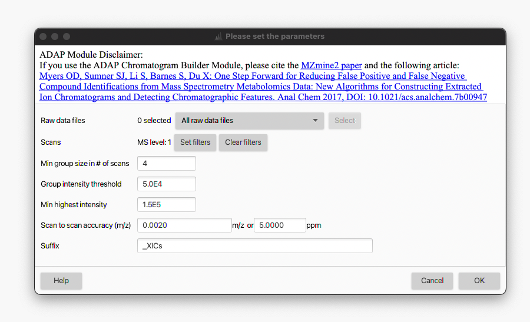

# **ADAP chromatogram builder**

## **Description**

:material-menu-open: **Feature detection → LC-MS → ADAP chromatogram builder**

The _ADAP chromatogram builder_ module is one of the LC-MS feature detection algorithms provided by MZmine 3. The module essentially builds an [EIC](../../../terminology/general-terminology.md#extracted-ion-chromatogram) for each _m/z_ value that was detected over a minimum number of consecutive scans in the LC-MS run.
Each data file is processed individually. The [mass list](../../../terminology/general-terminology.md#mass-list) associated to each MS1 scan in a data file (see [Mass detection](../../featdet_mass_detection/mass-detection.md) module) are taken as input and a [feature list](../../../terminology/general-terminology.md#feature-list) is returned as output. Since a mass list must be available, the _Mass detection_ module must be run first.

The _ADAP chromatogram builder_ algorithm operates as follows:

+ Only MS1 scans are processed. 
+ All the data points are extracted from all the MS1 scans in a data file and sorted in order of decreasing intensity. 
+ The processing starts from the most intense data point. Since no EICs have yet been created, a new EIC is initialized and associated to the corresponding _m/z_ value.
+ The processing proceeds with the second-highest data point. The corresponding _m/z_ is checked to determine if it "belongs" to the existing EIC (based on the user-defined tolerance, _i.e._ "Scan to scan accuracy (m/z)" parameter). 
+ If yes, then the data point is added to the EIC and the EIC-associated _m/z_ is updated. Otherwise, a new EIC is initialized.
+ The process repeats iteratively until all the data points have been processed and a set of EICs has been created. 
+ Finally, the EICs are checked according to the user-defined parameters (_i.e._ minimum number of data points and intensity). The EICs matching the requirements are retained in the _feature list_, whereas the rest are discarded. 

The so-built EICs can then be resolved into individual features by one of the deconvolution algorithms provided by MZmine 3 (_e.g._ [Local minimum resolver](../../featdet_resolver_local_minimum/local-minimum-resolver.md) module).

## Parameters

#### **Raw data files**
Select the input raw data files for chromatogram building. Mass lists associated with the data files will be automatically selected. See option descriptions in [Mass detection](../../featdet_mass_detection/mass-detection.md#parameters) module.

#### **Scans**
Select (or filter out) the MS scans to be processed. Although setting the _MS level = 1_ is usually sufficient for this module, several filters are available (see option descriptions in [Mass detection](../../featdet_mass_detection/mass-detection.md#parameters) module). For example, specific RT ranges (_e.g._ dead volume, equilibration time, calibration segments, _etc._) can be excluded from the processing by setting the corresponding filter.

#### **Min group size in number of scans**
Minimum number of consecutive MS1 scans where a _m/z_ must be detected with a non-zero intensity in order for the corresponding EICs to be considered valid and retained in the feature list.

:material-lightbulb: This parameter largely depends on the chromatographic system setup (_e.g._ HPLC vs UHPLC) and the acquisition rate (_a.k.a._ MS scan speed) of the mass spectrometer. The best way to optimize this setting is by manually inspecting the raw data and determining the typical minimum number of data points of the LC peaks. Usually, no less than 4-5 should be used.

#### **Group intensity threshold**

Minimum signal intensity that the group scans (see previous parameter) must exceed in order for the corresponding EICs to be considered valid and retained in the feature list.

:material-lightbulb: A good starting point for this parameter is 3 times the noise level used in the [Mass detection](../../featdet_mass_detection/mass-detection.md), if the instrumental noise is used as cutoff. See also [How do I determine the noise level in my data?](../../featdet_mass_detection/mass-detection.md#how-do-i-determine-the-noise-level-in-my-data) for more details.

#### **Min highest intensity**

Minimum intensity that the highest point in the EIC must exceed in order for the corresponding trace to be considered valid and retained in the feature list. This parameter mainly depends on the mass spectrometer characteristics (_e.g._ Orbitrap instruments normally provides higher signal intensities than TOF devices) as well as the overall goal of the processing. Overly low intensity thresholds normally leads to a larger number of background signals being retained as features, extending the overall processing time. On the other hand, overly high thresholds may lead to low-intensity features being erroneously discarded.

:material-lightbulb: A good starting point for this parameter is 7-10 times the noise level used in the [Mass detection](../../featdet_mass_detection/mass-detection.md), **if** the instrumental noise is used as cutoff. See also [How do I determine the noise level in my data?](../../featdet_mass_detection/mass-detection.md#how-do-i-determine-the-noise-level-in-my-data) for more details.

#### **Scan to scan accuracy (m/z)**

Maximum allowed difference between an EIC-associated _m/z_ and a new data point to be added to the existing EIC trace. It is essentially the maximum allowed mass accuracy deviation between consecutive data points in the EICs. The tolerance can be specified as absolute tolerance (in _m/z_), relative tolerance (in ppm), or both. When both are specified, the tolerance range is calculated using the maximum between the absolute and relative tolerances.

:material-lightbulb: This is an [_m/z_ tolerance (scan-to-scan)](../../../terminology/general-terminology.md#mz-tolerances), and it depends on the mass accuracy, resolution and stability of the instrument. The best way to optimize this parameter is by manually inspecting the raw data and determining the typical fluctuation of the accurate mass measurement over consecutive scans. A good starting point is 0.002-0.005 _m/z_ and 5-10 ppm for Orbitrap instruments, while 0.005 _m/z_ and 10-15 ppm can be used for TOF devices.

#### **Suffix**

String added to the filename as suffix when creating the corresponding feature list.

{{ git_page_authors }}
