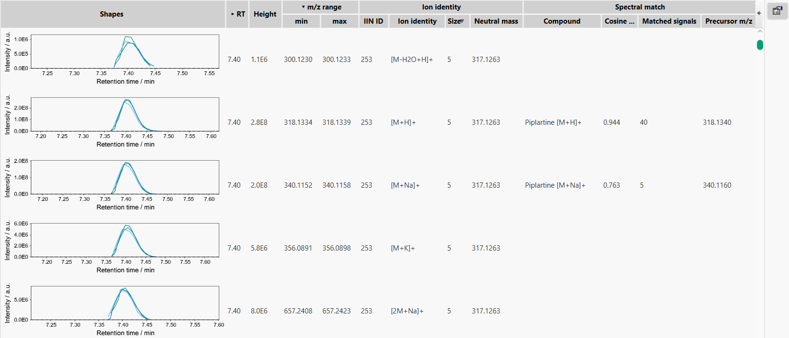

# **Results of the feature detection**

## **Feature table**

Columns in the table can be displayed or hidden on demand, using **"+"** button or **parameter menu** button in the right table corner.

Feature table includes several groups of columns:
- Manual annotation columns, 
- Parameters of specific feature,
- And parameters of chosen feature in a specific data file (filename is shown on top of the columns).

:material-lightbulb: State column describes the feature status in a chosen file using several color-coded options:

- Blue - a feature was found in a primary feature detection,
- Gray - a feature was found in a secondary feature detection (_e.g._, using Gap filling, after alignment),
- Orange - a feature was not found in this particular data file,
- Black - a feature was defined manually.

[//]: # (TODO ## **Statistical analysis of auto-picked features**)

[//]: # ()
[//]: # (Look into the tutorials)

## **Manual feature integration**

Sometimes it might be useful to perform manual integration of some selected peaks. To use this option a user can apply a right mouse click on a chosen feature table row and choose "Define manually"

[//]: # (Todo Describe when that might be useful)

