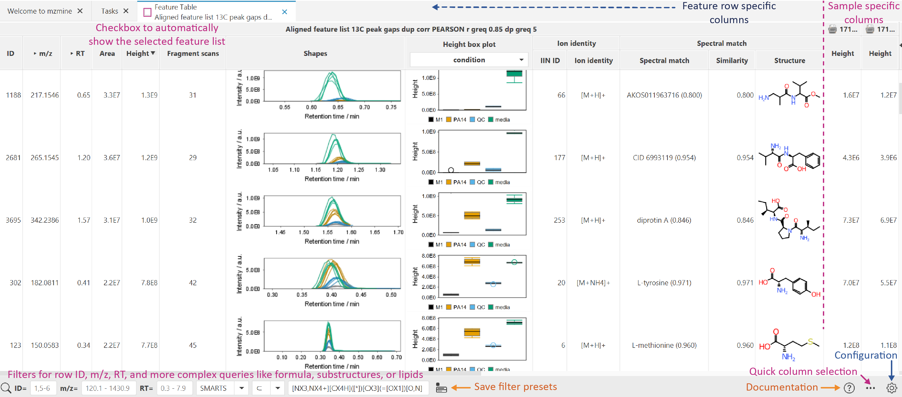
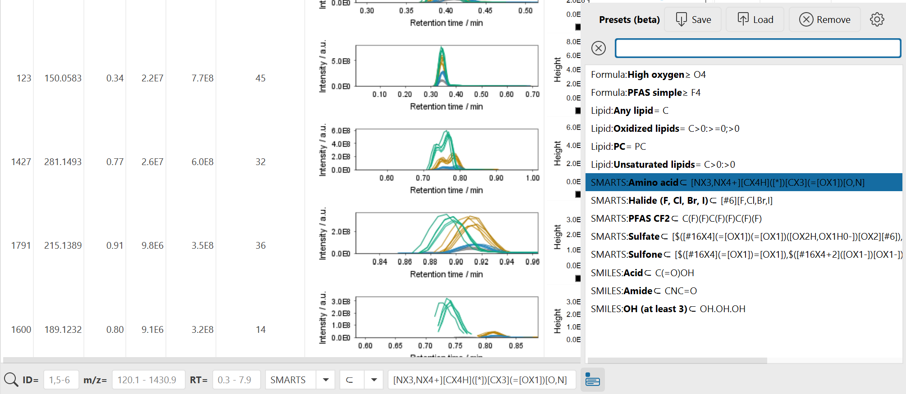

# **Feature table**

Columns in the table can be displayed or hidden on demand, using the quick column menu on the **"+"
** button on the top right or
the ... button in the lower right menu. More configuration options are available from the *
*parameter menu** button in the right lower corner.

!!! tip

    The shapes column shows the retention time feature shapes. This column and other graphic columns 
    may be hidden when opening larger tables with many samples. Activate any column from the quick 
    column menu or the configuration.   

The **Feature tables** include several groups of columns:

- **Feature summary columns**: All columns from left until the sample-specific columns. They define
  summary statistics for each feature list row like the unique ID, average m/z, maximum height,
  total number of fragment scans, spectral library matches, lipid matches, etc.
- **Sample-specific columns**: Have a sample icon and name on top and they might be hidden by
  default for large datasets. They can be accessed through the quick column selection (all columns
  with the Feature: prefix) or via configuration.
- Box plots are available based on height and area and add a dropdown selection to choose the
  metadata column for sample grouping. Double-click to reach the statistics dashboard.

!!! tip

    Double-click on different cells like an annotation structure, the box plots, or the shapes to 
    open other visualizers and tools.

:material-lightbulb: State column describes the feature status in a chosen file using several
color-coded options:

- Blue - a feature was found in a primary feature detection,
- Gray - a feature was found in a secondary feature detection (_e.g._, using Gap filling, after
  alignment),
- Black - a feature was defined manually.

## Configuration options

Quick column selection offers quick toggle buttons to show / hide groups of columns. Also the
**Compact table** button helps to get a standard smaller table.

The configuration dialog provides parameters to control the **Feature summary columns** and the
**Sample-specific columns**. Also, there are options for the default feature intensity and
chart-specific options.

## Right-click menu

Open a context menu by right-clicking on any cell in the table. The column cell may change the
available options depending if the column is a **Feature summary column** or
**Sample-specific column**. There are various visualizers and other tools available from this menu.

Check out the **Show/Feature overview IIMN networks** for a composition of annotations, networks,
and more.

## Feature list filters

In the bottom panel, there are multiple filters to focus on specific properties of your feature list
rows like annotations or retention time and m/z.

- **ID**: Filters rows by their ID column either by single ID, ranges (e.g., 1-10), lists (e.g.,
  1,2,3), or a mix 1,5-9.
- **m/z**: Filter the row m/z column. A single value is interpreted as a range with this
  significance like 200.1 will range from 200.1 - 200.2 and 200.15 will range 200.15-200.16. Or
  enter ranges directly like 200 - 500.
- **RT**: Filter the row retention time (RT) column. A single value is interpreted as a range with
  this significance like 1 will range from 1 - 2 and 2.5 will range 2.5-2.6. Or enter ranges
  directly like 1 - 10.

### Flexible feature list filter

This filter is defined by a search type, matching mode, and textual query. In general, annotation
search types will match against any annotation like spectral library match, lipid match, or other
feature annotations from other modules. All annotations are considered, this means that sometimes a
row will match the filter but the reason is not the primary annotation visible but a secondary one
that may be hidden in the list of, e.g., library matches.

This filter is also available in the
**[Feature list rows filter](../../feature_list_row_filter/feature_list_rows_filter.md)** module to
apply the filter to a feature list and retain its results.

#### Matching modes

Matching modes define either direct equality or unequality or define minima / maxima. A special case
is **⊂** ("contains") which is used for substructure matching and substring matches. This is usually
used for substring name matching where the whole substring needs to be contained, but there are also
other
substring matching modes in **all** and **any** that match each word in a query separated by space,
semicolon (;), or comma (,)
symbols.

**Substring ("contains") matching types:**

- **⊂**: The target contains the whole query string
- **all**: The target contains **all** **words** of the query, separated by space, semicolon, or
  comma symbols
- **any**: The target contains **any** **word** of the query, separated by space, semicolon, or
  comma symbols

#### Search types

- **Comment (row)**: Searches in the Comment column for each row. This column represents comments on
  the feature list row level. Useful for tag-based filtering in combination with substring search *
  *any** or **all** (see below).
- **Comment (row)**: Searches in the Comment column and additional **JSON** for each compound
  annotation. The comment and json columns can contain additional information like user-specific
  fields. This filter combines well with substring search **any** or **all**.
- **Ion identity ID**: Find all rows of the same ion identity ID
- **Ion type**: The adduct, in source fragment, or other ion type detected.
- **Compound name**: Any annotation's compound name matches, best to use a substring match
- **IUPAC name**: Any annotation's compound name matches, best to use a substring match
- **Formula**: Molecular formula, options to define a minimum formula
- **Formula range**: Molecular formula range by defining a minimum and maximum formula and the
  number of atoms need to be within these bounds. e.g., C6Br - OBr3 matches every formula that has
  at least 6C 1Br and at max 1O 3Br.
- **SMILES / InChI**: Matches exact structures or substructures defined by SMILES or InChI. For
  example, SMILES CNC=O matches amides
- **SMARTS**: Matches substructures and is more flexible than SMILES or
  InChI. [Theory](https://www.daylight.com/dayhtml/doc/theory/theory.smarts.html) [Examples](https://www.daylight.com/dayhtml_tutorials/languages/smarts/smarts_examples.html)
- **Lipid**: Lipid filter is designed for mzmine's rule-based lipid matching module but also works
  for other annotations like library matches, if the compound name uses the standard lipid short
  nomenclature. See examples below.
- **Fragment scans**: Filter for a minimum number of fragment scans in the fragment scans column,
  which all fragment scans across all samples.

#### Tag-based filtering

In the feature table, the **Comment** column provides the option to add comments or tags to each
row, describing the whole row instead of just a single compound annotation. This field can be used
to tag rows and the flexible feature filter below and in the feature table or in
the [Feature list rows filter](https://mzmine.github.io/mzmine_documentation/module_docs/feature_list_row_filter/feature_list_rows_filter.html)
can search for multiple tags in search modes **any** or **all**.

In the **any** or **all** search modes, the query is split into words (tags) by all space,
semicolon, and comma symbols.

!!! tip

    Enter tags into the **Comment** column to describe each feature table row. Use the Comment (row) 
    filter with mode **any** or **all** to match tags entered into the query field. Separate tags in 
    the query by spaces, commas, or semicolons.
    **Example:** Enter comment _media, impurity_ in a row column and then search for tags by entering 
    query: _impurity_ or _impurity, media_ (order of tags does not matter in modes any/all).

#### Lipid filter

Enter the following query to match specific lipid matches:

- C for any lipid class
- PC only define class
- C20:2 for 20 C and 2 double bonds
- PC20:2 also specifying the lipid class as PC
- C>20:2 for more than 20 C and exactly 2 double bonds
- C>20:>2 also more than 2 double bonds
- PC18:2_18:0 defining chains
- PC>18:>2_>18:0 defining ranges as well
- PC20:2 - PC40:6 defines ranges with min and max lipid

## **Manual feature integration**

!!! tip

    Manual integration was moved to the Integration dashboard that can be opened from the 
    quick module access (CTRL + F or hit double shift). The integration dashboard can also 
    be opened by right click on a feature list and then **Integration dashboard**.

The manual feature integration directly from the feature table is outdated and we advice to use the
**Integration dashboard**. The old dialog still works though. The old dialog can be found by opening
a feature table, right clicking on a cell that is within a specific sample (right side of the table)
and then **Define manually**.

{{ git_page_authors }}