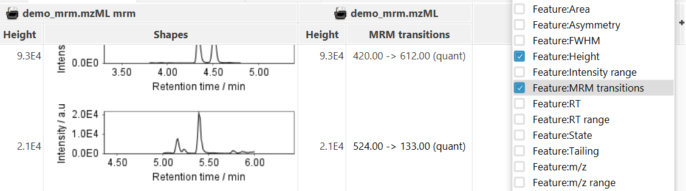

# Set MRM quantifiers

!!! warning
    To process multiple reaction monitoring (MRM) data, the MRM service of mzmine is required. This is
    included for PRO customers. Academics can reach out to info[at]mzio.io to request a free license.
    
:material-menu-open: **MRM → Set MRM quantifiers**

The [MRM to Scans module](../mrm_mrmtoscans/mrm-to-scans.md) automatically sets the most intense transition as the quantifier ion. However, some MRMs may be more challenging and shall be quantified by a different transition. Here, the Set MRM quantifiers module can help to select the specific ions needed for accurate quantification.

!!! tip
    You can look at the current quantifier ion mass by enabling the "Feature:MRM transitions" in the feature table by selecting the small "+" in the upper right corner of the feature table.
    

## Parameters

#### Feature lists

Select the feature lists in which the quantifier ion shall be re-set.

#### Quantifier ion list

Select a file that contains the necessary quantifier ion information in a tabular format (comma, tabulator, semicolon delimited). The file may contain additional columns that are not necessary here.

!!! tip
    Since the [quantifier ion list](#quantifier-ion-list) only selects the necessary information from the file, you can use the same file for the [Local compound database search](../id_prec_local_cmpd_db/local-cmpd-db-search.md) or in the MRM wizard.

#### Column headers

Set the column headers in the [quantifier ion list](#quantifier-ion-list) file. mzmine will search for the respective headers in the file and read the data from it. The file may contain additional columns that are not necessary here. All columns (Q1 _m_/_z_, Quantifier m/z, RT) are necessary.

#### RT tolerance

Set an RT tolerance between the entry in the [quantifier ion list](#quantifier-ion-list) and the detected RT in the feature list. This is the option to set different quantifiers to different features of the same precursor m/z.

#### m/z tolerance

Set an _m_/_z_ tolerance between the entry in the [quantifier ion list](#quantifier-ion-list) and the _m_/_z_ in the feature list. Usually, the _m_/_z_ is the set _m_/_z_ in the acquisition software and does not fluctuate as it would in HRMS, where the actual _m_/_z_ value is part of the detection.

