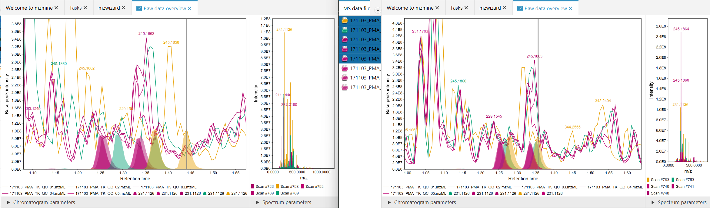
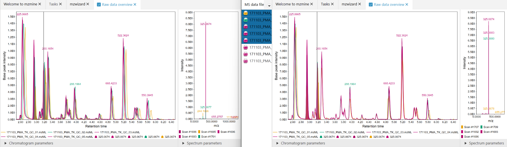
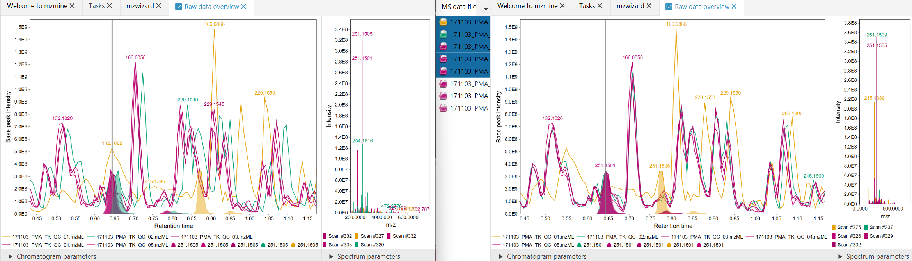

# Retention time correction o scans

!!! note

    This module is currently in beta phase.

Corrects retention time drifts by searching for standards across selected samples and corrects
retention time drifts between samples by changing the scan retention times.

### Implications and restrictions

Correcting retention times of scans instead of features has certain implications and up- and
downsides.

#### Pros:

- All visualizations in mzmine will use the calibrated retention times to visualize.
    - this means that e.g.
      the [Raw data overview](../../visualization_modules/raw_data_overview/raw_data_overview.md) or
      the [feature table](../lc-ms_featdet/featdet_results/featdet_results.md) will visualize
      corrected chromatograms
- Gap filling will use the corrected retention times, which may lead to less misalignments during
  gap filling of complex samples

#### Cons:

- Corrected scan retention times must still be in strongly monotonous order (cannot swap scans)
    - This means that large RT shifts cannot be mitigated
- Irregular shifts cannot be corrected: If feature A at RT 5.4 is shifted to higher RT and feature B
  at RT 5.4 is shifted to lower RT the effects may cancel each other out
    - Such shifts may happen if the stationary phase is damaged/overloaded or the pH of the eluent
      changes and thus affects compounds with different pKs differently
- All files must start at 0.0 min, no negative RTs possible.

!!! Tip

    The retention time correction may be applied multiple times to correct larger shifts.

### Exemplary results

Figure 1: Before (left), After (right). Significantly better alignment was achieved for the orange
data file.

Figure 2: Before (left), After (right). Significantly better alignment was achieved for the orange
data file.

Figure 3: Before (left), After (right). Large retention time shift of the orange signal. After
correction, the signals move closer together, but the large shift cannot be corrected completely due
to the mentioned [restrictions](#cons).

### Standard selection

The calibration module will look for features that appear in all feature lists that are selected
as [reference samples](#reference-samples). Ambiguity will be avoided during standard selection by
also examining the same [mz tolerance](#mz-tolerance) but three times
the [RT tolerance](#retention-time-tolerance) window around a potential standard. If the extended
window contains more matching features in **any sample**, a high MS2 similarity is required or the
feature will not be used as a standard.

## Parameters

#### Feature lists

The feature lists whose data files shall be corrected. Each feature list may only contain a single
raw data file. Visualizers will need to be reopened to show the result.

It is recommended to
use [resolved feature lists](../../terminology/general-terminology.md) for this step. Since the
scans are corrected, all other (e.g. prior) feature lists using the same data file will be affected
as well, once a new processing step is applied (RTs are not recalculated
automatically for old feature lists).

#### Reference samples

Select the sample types (from the metadata table) that shall be used as reference to search
standards.
The created calibration will be interpolated onto the other data files by weighting the nearest two
standard files by their acquisition date.

#### mz tolerance

Maximum mz deviation for potential standards.

#### Retention time tolerance

Maximum RT tolerance for potential standards.

#### Minimum standard intensity

The minimum required intensity of a feature to be considered a standard for RT calibration.

#### RT standard calculation

Select if the corrected standard value to which the samples shall be calibrated to shall be chosen
as average or median. 

#### Correction method

Select the method which shall be used for correction.

##### Multi linear correction 
- Calculate difference of [standard](#rt-standard-calculation) and specific RT in a sample.
- Smooth difference using a moving average of num_standards * bandwidth points. 
- Apply asymmetric least squares regression (ALS) on the smoothed differences
- Apply loess interpolation on current retention times (domain values) vs the ALS result (range values)
- calculate potential new differences (= correction values) from the loess fit
- ensure monotonicity of the new fit
- create a final loess fit of the corrected differences
- apply correction to original scan RTs
 
###### Interpolation bandwith
Define a percentage of standards for moving average calculation.
