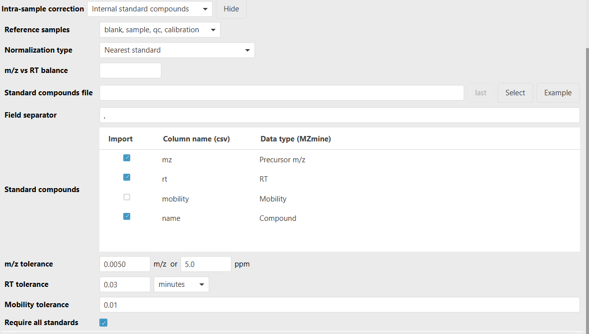

# **Standard compound normalizer**

:material-menu-open: **Feature list methods -> Normalization -> Intensity normalizer -> Intra-sample correction -> Internal standard compounds**

## **Description**

!!! info

    The internal standard normalizer is configured as step 2 in the [**Intensity normalizer**](../norm_intensity/norm_intensity.md), so it can be combined with metadata normalization and QC drift correction in one sequence.

The standard compound normalizer applies an internal standard correction to each feature
individually. Internal standards are loaded from a CSV or TSV file, matched to rows in the feature
list, and used as reference points at their measured m/z and RT positions. Each feature abundance is
then corrected by either the nearest internal standard or by a weighted contribution of all matched
standards.

This correction is useful for compensating sample-specific extraction efficiency and matrix effects.
The selected internal standards must be detected in the feature list and, depending on the
**Require all standards** setting, in every reference raw file used for the correction.

:warning: Feature lists must be aligned before normalization.

---

## **Parameters**



#### Standard compounds file

CSV or TSV file containing one row per expected internal standard compound. The file must contain a
header row. By default, mzmine expects columns named `mz`, `rt`, and `name`; the column names can be
changed in **Standard compounds**.

Example:

```csv
name,mz,rt,mobility
Caffeine-d9,203.1234,5.42,1.23
Reserpine-d9,618.4430,8.91,1.56
```

The m/z and RT columns are required for matching. The RT values should use the same minute-based RT
scale as the feature list. Mobility is optional and is only used when the mobility column is
selected.

#### Field separator

Character used to split the standard compounds file. The default is `,` for CSV files. Use `\t` for
tab-separated TSV files.

#### Standard compounds

Column mapping for the standards file. Select the columns to import and enter their corresponding
header names from the file. m/z and RT must be selected. The name column is selected by default for
readable annotations, and the mobility column can be selected when ion mobility should be part of the
matching step.

#### m/z tolerance

Maximum allowed m/z difference when an imported standard is matched to feature-list rows. The default
is `0.005 m/z` or `5 ppm`.

#### RT tolerance

Maximum allowed retention-time difference when an imported standard is matched to feature-list rows.
The default is `0.03 min`.

#### Mobility tolerance

Maximum allowed mobility difference when matching imported standards. This tolerance is only applied
when the mobility column is selected in **Standard compounds**.

#### Normalization type

How the correction factor is derived from the available matched standards:

- **Nearest standard**: uses the internal standard with the shortest distance to the feature being normalized.
- **Weighted contribution of all standards**: uses an inverse-distance weighted average of all standards. If a feature has the same m/z and RT as one or more standards, those direct matches are averaged directly.

#### m/z vs RT balance

Multiplier applied to the m/z difference when computing the distance between a feature and an
internal standard. Increase this value to weight m/z similarity more strongly relative to RT
similarity.

#### Reference samples

Sample types whose internal-standard signal is used to build the correction model. Other samples are
corrected by interpolation in acquisition order through the Intensity normalizer. This allows using
internal standards from QC or standard injections to estimate the correction for nearby samples.

#### Require all standards

When enabled, normalization fails if any matched standard is missing from a raw file or has an invalid
or zero abundance. Disable this option to continue with the standards that are available in each file.
Even when disabled, each file still needs at least one usable standard.

---

## Algorithm {#algorithm}

1. The standards file is read with the selected field separator and column mapping.
2. Each imported standard is matched to the best feature-list row within the m/z and RT tolerances.
   If mobility is selected, the mobility tolerance is also applied.
3. The matched standard rows are added as compound annotations and used as reference points with
   their average m/z, average RT, and selected abundance measure.
4. For each feature, the normalizer calculates the distance to each matched standard:

$$distance = MZvsRT_{Balance} * MZ_{difference} + RT_{difference}$$

5. The selected **Normalization type** determines the standard abundance used for that feature.
6. The normalization factor is the inverse of the selected standard abundance:

$$factor = 1 / standardAbundance$$

The Intensity normalizer multiplies this factor with any other enabled normalization steps and stores
the resulting normalization functions with the feature list.

---

{{ git_page_authors }}
